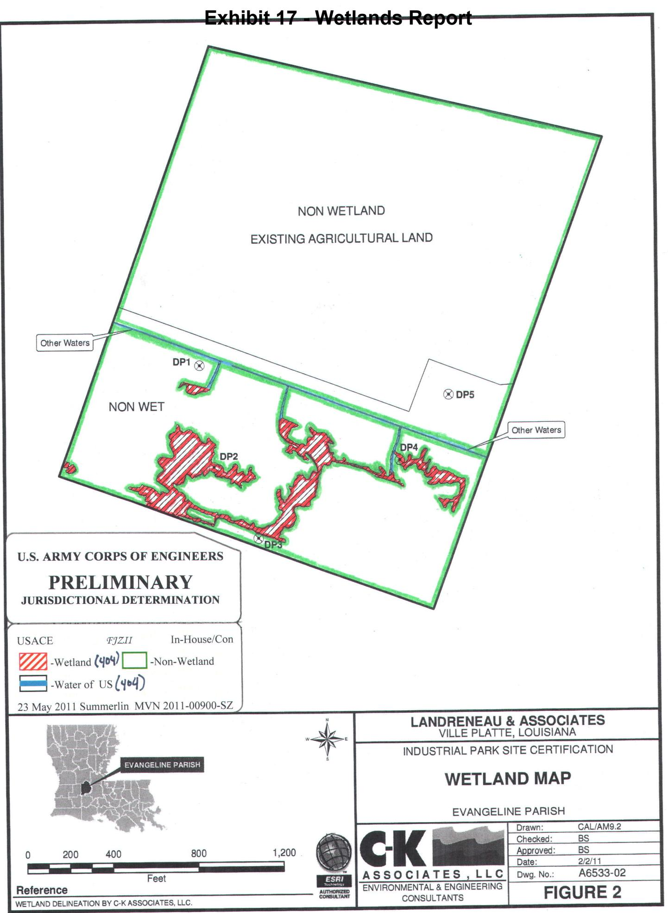

by Shane G. Pickett and Paul D. Bundy, RPA

Prepared for

# J. Ronald Landreneau & Associates, Inc.

and

LA SHPO

Prepared by

Kentucky | West Virginia | Ohio | Wyoming | Illinois | Indiana | Louisiana | Tennessee | New Mexico | Virginia | Colorado | Maryland

Contract Publication Series LA11-20

# A NEGATIVE FINDINGS CULTURAL RESOURCE SURVEY OF THE PROPOSED LOUISIANA ECONOMIC DEVELOPMENT CERTIFIED SITE IN EVANGELINE PARISH, LOUISIANA

By Shane G. Pickett and Paul D. Bundy, RPA

Prepared for

Justin G. Fontenot, E.I.
J. Ronald Landreneau & Associates. Inc.
Consulting Engineers & Land Surveyors
801 West Main Street
Ville Platte, Louisiana 70586
Phone (337) 363-7035

Prepared by

Cultural Resource Analysts, Inc.
636 East Kings Highway
Shreveport, Louisiana 71105
Phone: (318) 213-1385
Fax: (318) 213-0289
Email: bundypauld@crai-ky.com
CRA Project No.: L11J001

Paul Bundy, RPA
Principal Investigator

June 21, 2011

"Final Report"

Lead Agency: SHPO

# ABSTRACT

Cultural Resource Analysts, Inc. (CRA) personnel completed a records review and cultural resource survey for a proposed Louisiana Economic Development (LED) Certified Site in Evangeline Parish, Louisiana. This work was conducted at the request of Justin Fontenot of J. Ronald Landreneau & Associates, Inc. The records review for this project was conducted on May 13, 2011. Fieldwork was conducted on May 16-17 and June 15, 2011. The project area is located northeast of the city of Ville Platte along both sides of Maxie Rae Road and just west of Industrial Road. The area investigated consisted of approximately 40.7 hectares (100.0 acres) located in the E½ of the W½ of Section 45 and E½ of the W½ of Section 45, T4S, R2E, Ville Platte Township, Evangeline Parish.

The records review consisted of a file search using information provided by the Louisiana Office of Cultural Development, Division of Archaeology, to identify cultural resources or cultural resource investigations documented in the area. The records review indicated that no previous survey and no cultural resources were documented within the current project area.

Field investigation consisted of an intensive pedestrian survey supplemented with screened shovel tests. This work yielded no cultural resources within the project area. The southern portion of the project area had evidence of heavy disturbance and episodes of intermittent inundation. Based on the findings of the records review and cultural resource survey, no archaeological sites or historic properties listed in, or recommended eligible for, the National Register of Historic Places (NRHP) will be affected by the proposed construction activities. CRA recommends no further work and cultural resource clearance for the proposed project area.

# TABLE OF CONTENTS

* [ABSTRACT](#abstract)
* [LIST OF FIGURES](#list-of-figures)
* [I. INTRODUCTION](#i-introduction)
    * [Purpose of Study](#purpose-of-study)
    * [Project Description](#project-description)
    * [Summary of Findings](#summary-of-findings)
    * [Report Organization](#report-organization)
    * [Project Personnel](#project-personnel)
* [II. ENVIRONMENTAL](#ii-environmental)
    * [Physiography](#physiography)
    * [Soils](#soils)
    * [Vegetation](#vegetation)
    * [Description of the Project Area](#description-of-the-project-area)
* [III. PREVIOUS RESEARCH](#iii-previous-research)
    * [Map Data](#map-data)
        * [1960 USGS](#1960-usgs)
        * [1983 USGS](#1983-usgs)
    * [Survey Predictions](#survey-predictions)
* [IV. METHODS](#iv-methods)
* [V. RESULTS](#v-results)
    * [Depositional Context](#depositional-context)
* [VI. CONCLUSIONS AND RECOMMENDATIONS](#vi-conclusions-and-recommendations)
* [REFERENCES CITED](#references-cited)
* [APPENDIX A. SCOPE OF WORK](#appendix-a-scope-of-work)

## LIST OF FIGURES

* Figure 1. Map showing the location of Evangeline Parish in the state of Louisiana.
* Figure 2. Topographic map showing the location of the project area.
* Figure 3. Project location depicted on the 2005 Aerial map.
* Figure 4. Overview of northern portion of project area, facing east.
* Figure 5. Overview of southern portion of project area, facing west.

# I. INTRODUCTION

Cultural Resource Analysts, Inc. (CRA) personnel completed a file search on May 13, 2011, and fieldwork on May 16-17 and June 15, 2011, for the proposed Louisiana Economic Development (LED) Certified Site in Evangeline Parish, Louisiana (Figure 1). This file search and cultural resource survey was conducted at the request of Justin G. Fontenot of J. Ronald Landreneau & Associates, Inc., to meet the requirements of the LED certification program. The proposed project area consisted of approximately 40.7 hectares (100.0 acres) of mixed agricultural field and grassland. The file search, using information provided by the Louisiana Office of Cultural Development, Division of Archaeology (State Historic Preservation Office [SHPO]), was conducted by Justin B. Morrison. Fieldwork for the project was completed by Shane G. Pickett and Justin B. Morrison in approximately 30 person-hours. The cultural resource survey was supervised by Shane G. Pickett. A copy of the scope of work is provided as Appendix A.

## Purpose of Study

The study was conducted to comply with requirements set forth by the LED Certified Sites Program. This program is designed to make Louisiana more competitive for economic development deals by certifying sites that have the ability to break ground within 90 days because all rights to build are in place. SHPO reviewed data concerning the project as part of the program. Upon review of the project information, they requested a Phase I archaeological survey prior to any construction in the area. All work associated with this investigation was conducted pursuant to standards set forth by the SHPO and those outlined by the National Historic Preservation Act (NHPA) of 1966, as amended (36 CFR 800) for properties listed on the National Register of Historic Places (NRHP). Louisiana's Comprehensive Archaeological Plan (LCAP) was referred to for guidance throughout this investigation (Smith et al. 1983). All fieldwork activities and reporting were completed with reference to federal (NHPA) guidelines.

**Figure 1.** Map showing the location of Evangeline Parish in the state of Louisiana.

The purpose of this assessment was to 1) locate, describe, evaluate, and to make appropriate recommendations for the future treatment of any historic or prehistoric archaeological properties that may be affected by proposed construction activities, and 2) to assess the potential for archaeological sites requiring preservation in place. Field notes, records, and site photographs will be curated at the CRA office in Shreveport, Louisiana.

## Project Description

J. Ronald Landreneau & Associates, Inc., is proposing to acquire an LED certification for the survey area (Figures 2 and 3). Certification of this property is intended to promote development at the location. The proposed project area is approximately 40.7 hectares located in the E½ of the W½ of Section 45 and E½ of the W½ of Section 45, T4S, R2E, Ville Platte Township, Evangeline Parish. More specifically, the project area extends to the north and south of Maxie Rae Road and measures approximately 647.3 m (2,123.7 ft) in length. The width runs approximately 578.9 m (1,899.6 ft) east to west.

## Summary of Findings

The records review conducted using data available from the LA SHPO indicated that no portion of the project area had been previously surveyed, and no sites were recorded within the area.

No cultural resources were located during fieldwork. No features or structures were observed at this location. The lack of archaeological deposits or historic structures suggests limited research potential for the project area. For these reasons, the area of potential effect (APE) for the proposed construction activities is not recommended for further work. Therefore, cultural resource clearance is recommended.

## Report Organization

This report is organized into six numbered chapters and one appendix. Chapter I provides an overview of the project and summarizes the results of the archaeological investigation.  Chapter II is an overview of the geomorphology and environmental setting of the project area. Chapter III presents the previous investigations and background records search of the project area. Chapter IV details the methodological approach and research design of the archaeological investigation. Chapter V discusses the results of the current archaeological investigation. Report summary and recommendations regarding future work in the project area are presented in Chapter VI. The appendix contains the scope of work developed for the current archaeological investigation.

## Project Personnel

Paul Bundy, M.A., RPA, served as principal investigator. Shane G. Pickett, M.A., served as field supervisor and report author. Justin B. Morrison completed site file research and assisted with the fieldwork as an archaeological technician. Final report production was completed by the CRA CAD and publications departments.

# II. ENVIRONMENTAL

This section of the report provides a description of the modern environment and considers those aspects of the physical environment that may have influenced the location and methods for finding archaeological sites. The discussion of the modern environment specifically provides information regarding the physiography, soils, vegetation, and climate.

## Physiography

The project area is located in Evangeline Parish, Louisiana, which is part of the West Gulf Coastal Plain physiographic region. This region is part of the Gulf and Atlantic Coastal Plain province of North America (Murray 1961). This is a belt of Pleistocene coastwise terraces that stretch along the Gulf Coast. The APE is situated on the Prairie Complex, the youngest of the terraces that constitute the coastwise terrace belt (Kniffen 1968).

**Figure 2.** Topographic map showing the location of the project area.

**Figure 3.** Project location depicted on the 2005 Aerial map.

Local drainage networks on this complex are poorly developed. This results in high groundwater levels and moderate to severe seasonal flooding. Drainage is controlled by abandoned channels of the Red or Calcasieu Rivers, which are Holocene or late Pleistocene in age (Autin et al. 1991).

Evangeline Parish has three distinct physiographic regions, including level to nearly level terraces of the Prairie Formation in the southern part of the parish, gently sloping terraces of the Bentley and Montgomery Formations in the northern portion of the parish, and level to nearly level Red River bottomland of recent floodplains in the northeast corner of the parish (Touchet et al. 1974). Elevation within the project area varies little, ranging from approximately 21.3 to 22.9 m (70.0 to 75.0 ft) above sea level, and lies on nearly level terraces of the Prairie Formation in the east-central region of the parish (Touchet et al. 1974:1). Soils contained within the Prairie Formation consist of silty soils high in natural fertility, and landforms entail floodplain, meander-belt, and backswamp deposits of the middle Pleistocene ancestral Mississippi River, Red River, local fluvial equivalents of tributary streams, and coastal plain streams. The parent material of the region is clay, silty clay loam, or sandy clay loam that grades to sand and gravel (Louisiana Geologic Survey [LGS] 2002). The drainages within the project area empty towards the west and southwest along an intermittent drainage of Bayou Joe Marcel, located approximately 2.7 km (1.7 mi) to the west.

## Soils

Soils within the project area were identified utilizing the Web Soil Survey online database maintained by the Natural Resource Conservation Service (NRCS 2011).  Two soil complexes were identified within the project area: Wrightsville-Vidrine complex (0-1 percent slope) on the western and central areas and Patoutville-Crowley complex (0-1 percent slope) on the eastern side (NRCS 2011). These soil associations are poorly drained and are very slowly to slowly permeable. They also reside on broad drainage divides (Touchet et al. 1974). Occurring in the native grassland areas and around the APE along the eastern edge of the terrace, they are influenced by post-Prairie age loess and have light and dark colored loamy and clayey subsoil. The Wrightsville-Vidrine association is predominantly Wrightsville soil mixed with Vidrine, Acadia, Calhoun, and Crowley soils. Surface soils of this association tend to be thick, gray and light-gray (10YR 6/1; 10YR 7/1) silt loam with a subsoil of grayish brown mottled with yellowish brown, red, and yellow silty clay. Surface soils can range up to 45.7 cm (18.0 in) in thickness. The Patoutville-Crowley association is made up primarily by Patoutville soil with a mix of Crowley, Jeanerette, Midland, Mowata, and Vidrine soils. Surface soils of this association tend to be gray-brown (10YR 5/2) silt loam with a subsoil of dark grayish brown mottled with yellowish brown, red, and silty clay. Surface soils can range up to 17.8 cm (7.0 in) in thickness. The Wrightsville-Vidrine complex is found in and along depressions, while the Patoutville-Crowley complex is located along low terraces and micro-ridges (NRCS 2011).

## Vegetation

The West Gulf Coastal Plain physiographic region is located within the Southern Pine Forests of the lower Mississippi Valley. It should be noted that within the last 150 years this area has undergone massive changes due to excessive logging that has taken place throughout this region. Much of the bottomland hardwood and upland mixed forests have been converted into commercial pine forest (Jeter and Williams 1989). Their composition and relative abundance vary greatly from place to place. In addition to the longleaf pine, the southern pine forests in the area also include extensive areas of slash pine, loblolly, and shortleaf pine, most of which have been introduced more extensively with the vast increase in logging in the last 100 years.

## Description of the Project Area

The proposed project area is approximately 40.7 hectares located in the E½ of the W½ of Section 45 and E½ of the W½ of Section 45, T4S, R2E, Ville Platte Township, Evangeline Parish. The APE is generally located 3.08 km (1.90 mi) to the northeast of Ville Platte, Louisiana. The project area is situated along Maxie Rae Road running north and south and extends approximately 409.4 m (1,343.2 ft) north and 245.0 m (803.8 ft) south. The width reaches approximately 578.9 m (1,899.6 ft) east to west. The eastern border of the APE is approximately 127.9 m (419.6 ft) west of Industrial Road. This area is referred to as the Prairie Complex region and is comprised of nearly flat low terraces (Kniffen 1968).

The majority of this area is currently row crops in an agricultural field, and the remainder is in marsh and prairie grasses (Figures 4 and 5). Within the APE, sediments in the agricultural field generally had a shallow or truncated brown (10YR 4/3) Ap horizon with a maximum depth of 15 cm, overlying a brown (10YR 5/3) mottled with dark yellowish brown (10YR 3/4) silty clay Bw-horizon. Where undisturbed, sediment profiles of the grassland field had a shallow or truncated brown (10YR 4/3) Ap horizon having a maximum depth of 10 cm, overlying a brown (10YR 5/3) mottled with dark yellowish brown (10YR 3/4) and yellowish brown (10YR 5/6) silty clay Bw-horizon. Subsoils also held heavy inclusions of manganese. These profiles generally conform to the description of the soils mapped in the area.

**Figure 4.** Overview of northern portion of project area, facing east.

**Figure 5.** Overview of southern portion of project area, facing west.

# III. PREVIOUS RESEARCH

On May 13, 2011, a search of records maintained by the NRHP (available online at: http://www.nr.nps.gov/nrloc1.htm) and the SHPO was conducted to: 1) determine if the project area had been previously surveyed for archaeological resources; 2) identify any previously recorded archaeological sites that were situated within the project area; 3) provide information concerning what archaeological resources could be expected within the project area; and 4) provide a context for any archaeological resources recovered within the project area. The examination of SHPO data consisted of a review of professional survey reports and records of archaeological sites for an area encompassing a 1-mile radius of the project. The review of professional survey reports and archaeological site data in the area provided information on the basic types of archaeological resources that were likely to occur within the project area and the landforms that were most likely to contain these resources. The results are discussed below.

SHPO records revealed that no previous archaeological sites or surveys have been conducted or recorded within the project area and no previous archaeological sites or surveys have been delineated within 1 mile of the APE.

## Map Data

In addition to the file search, a review of available maps was conducted to help identify any historic structures that may be located within the project area. The following maps were reviewed:

1. 1960 Ville Platte, Louisiana, 15-minute series topographic quadrangle (United States Geological Survey [USGS]);
2. 1983 Ville Platte, Louisiana, 15-minute series topographic quadrangle (USGS).

The reviewed maps indicated no structures older than 50 years in age in or adjacent to the project area. This area has experienced some landscape modification over time, and any structures, modern or historic in age, have been demolished or removed. The results of the map review for each map are presented below.

### 1960 USGS

This map indicates no historic structures or cemeteries present in or adjacent to the APE.

### 1983 USGS

This map indicates four modern structures just east of the project area (Figure 2). These structures were not present on the 1960 USGS map and do not meet the age requirement for historic properties. No other structural elements or cemeteries were observed in the area.

## Survey Predictions

Considerable effort has been directed toward the development of predictive models aimed at archaeological site probability over the last 25 years, specifically in central Louisiana (e.g., Anderson et al. 1988, 1999; Anderson and Smith 2003; Campbell and Weed 1986; Hillman 1980; Johnson 1984a, 1984b; Johnson et al. 1986; Phillips and Willingham 1990; Servello 1983; Thomas et al. 1982; and Willingham and Phillips 1987). The end result of this work suggests a correlation between the probability of finding prehistoric sites and the distance from water or wet environments. Ridges or landforms within 200.00 m (656.71 ft) of a water source are considered to have a high probability for containing prehistoric archaeological sites.

Incorporating data from the known distribution of sites in the parish, the available information on site types recorded, and the nature of the present project area, certain predictions were possible regarding the kinds of sites that might be encountered within the project area. The nearest natural water source, Mill Creek, is located approximately 1.8 km (1.1 mi) from the APE. This suggests that the project area is located in an area with a low probability of containing prehistoric sites. For this reason, prehistoric open habitations were considered unlikely in the area. Historic sites were considered possible due to the region's connection with agricultural and lumber enterprises; however, a review of historic maps indicated no historic structures or cemeteries within the project area.

# IV. METHODS

Although the APE is situated in an area of low archaeological site probability, both prehistoric and historic archaeological sites are possible, and the area was systematically investigated. The entire project area was subjected to an intensive pedestrian survey supplemented by shovel test probes (STPs). In areas with excellent ground surface visibility (GSV), 50 m (164 ft) intervals were used. In areas with inadequate GSV (less than 25 percent), shovel test intervals were tightened along transects to maximize coverage (Figure 3).

In all cases, STPs measured not less than 30 cm in diameter and extended well into the subsoil, which was very shallow. All fill removed from the tests was screened through 0.64 cm (0.25 in) mesh hardware cloth, and the sidewalls and bottoms were examined for cultural material and features. No archaeological deposits were uncovered by STPs. All areas adjacent to, but outside of, the project area were visually inspected to determine if any cultural resources may have been present; however, none were observed.

Universal Transverse Mercator (UTM) coordinates were recorded with a MobileMapper 6 Global Positioning System (GPS) unit manufactured by Magellan to verify locations within the project area. All UTM positions recorded by the GPS unit during the project were taken under sunny conditions, with typically three to five satellites being tracked. This unit is capable of accuracy to less than 3 m.

# V. RESULTS

This survey consisted of a combination of intensive pedestrian survey and shovel testing. The majority of the project area consisted of recently planted row crops in an agricultural field. Intensive pedestrian survey supplemented with screened STPs was conducted throughout the entire project area.

The northern two-thirds of the APE consisted of a recently planted agricultural field of row crops. The GSV was excellent at 80-90 percent (Figure 4). The surface soil was truncated (0-15 cm deep) and only held a plow zone above the subsoil. The southeastern corner of the northern portion, however, was groomed as an athletic field and had inadequate GSV (less than 25 percent). The surface soil in this area had been mechanically stripped and leveled, leaving only subsoil.

The southern portion of the APE resides below Maxie Rae Road and is overlain by marsh and prairie grasses (Figure 5). Overall, the southern third of the APE below Maxie Rae Road was heavily disturbed with truncated surface soils (0-10 cm in depth), and it showed evidence of periodic inundation by intermittent drainage along the southwestern border (Figure 3). Along the southern border, two large push piles were within the APE. A large dump and a borrow area associated with road and construction projects exist near the road. The southern portion of the APE also held visual subsurface disturbances utilized for drainage relief of the field area.

## Depositional Context

Profiles observed within the APE were typical of the soil series mapped for the area (Wrightsville-Vidrine and Patoutville-Crowley silty loam associations). Shovel tests revealed sediments in the agricultural field generally had a shallow or truncated brown (10YR 4/3) Ap horizon overlying a brown (10YR 5/3) mottled with dark yellowish brown (10YR 3/4) silty clay Bw-horizon. In the areas of undisturbed grassland field, the sediment profiles had a shallow or truncated brown (10YR 4/3) Ap horizon overlying a brown (10YR 5/3) mottled with dark yellowish brown (10YR 3/4) and yellowish brown (10YR 5/6) silty clay Bw-horizon. Subsoils also held heavy inclusions of manganese. These profiles generally conform to the description of the soils mapped in the area.

# VI. CONCLUSIONS AND RECOMMENDATIONS

CRA personnel completed a records review and cultural resource survey for a proposed LED Certified Site in Evangeline Parish, Louisiana. The proposed project area is approximately 40.7 hectares located in the E½ of the W½ of Section 45 and E½ of the W½ of Section 45, T4S, R2E, Ville Platte Township, Evangeline Parish. The records review referenced cultural resource data maintained by the SHPO to identify any cultural resources or cultural resource investigations documented in the area. This work indicated that no surveys or sites were documented in the current project area.

Field investigation consisted of an intensive pedestrian survey supplemented with screened shovel tests executed at 50 m intervals except in areas with inadequate GSV, where transects were conducted along tighter intervals. No cultural material or structures were identified, observed, or recorded by this cultural resource survey.

Based on the findings of the records review and cultural resource survey, no archaeological sites or historic properties listed in, or recommended eligible for, the National Register of Historic Places will be affected by the proposed activities. CRA makes the following recommendations: 1) the APE is recommended for no further work and 2) cultural resource clearance is recommended for the APE.

Note that a principal investigator or field archaeologist cannot grant clearance to a project. Although the decision to grant or withhold clearance is based, at least in part, on the recommendations made by the field investigator, clearance may be obtained only through an administrative decision made by the LA SHPO.

If any previously unrecorded archaeological materials are encountered during activities in the project area, the SHPO should be notified immediately. If human skeletal material is discovered, the construction activities should cease, SHPO should be contacted immediately, and SHPO guidelines should be followed.

# REFERENCES CITED

* **Anderson, David G. and Steven D. Smith**
    * 2003 *Archaeology, History, and Predictive Modeling Research at Fort Polk, 1972-2002*. The University of Alabama Press, Tuscaloosa, Alabama.

* **Anderson, David G., J.W. Joseph, and Mary Beth Reed**
    * 1988 *Fort Polk Historic Preservation Plan Technical Synthesis of Cultural Resource Investigations, Fort Polk, Louisiana*. Garrow and Associates. Atlanta, Georgia

* **Anderson, David G., J.W. Joseph, Mary Beth Reed, and Steven D. Smith**
    * 1999 *JRTC and Fort Polk Historic Preservation Plan. Prehistory and History in Western Louisiana: A Technical Synthesis of Cultural Resource Investigations*. Southeast Archaeological Center, National Park Service, Tallahassee, Florida.

* **Autin, Whitney J., Scott F. Burns, Bobby J. Miller, Roger T. Saucier, and John I. Snead**
    * 1991 Quaternary Geology of the Lower Mississippi Valley. *Quaternary Nonglacial Geology, Conterminous U.S.*, edited by R.B. Morrison, 547-582, The Geology of North America, v. K-2, Geological Society of America, Boulder.

* **Campbell, L. Janice, and Carol S. Weed**
    * 1986 *Cultural Resources Investigations in the Proposed Multipurpose Range Complex Area, Fort Polk, Vernon Parish, Louisiana*. New World Research. Report of Investigations 85-6, Pollock, Louisiana. Contract No. CX5000-5-0015 to Archaeological Services Branch, National Park Service, Southeast Regional Office, Atlanta, Georgia.

* **Hillman, Mitchell M.**
    * 1980 *Archaeological Survey, Kisatchie National Forest, Summer 1979*. Ms. on file. Kisatchie National Forest. Pineville, Louisiana.

* **Jeter, Marvin D. and G. Ishmael Williams**
    * 1989 Environmental Setting and Variability. In *Archeology and Bioarcheology of the Lower Mississippi Valley and Trans-Mississippi South in Arkansas and Louisiana*. Marvin D. Jeter, Jerome C. Rose, G. Ishmael Williams, Jr., and Anna M. Harmon. Contract No. DACW63-84-C-0149, Arkansas Archeological Survey, Fayetteville, Arkansas.

* **Johnson, David M.**
    * 1984a *Cultural Resources Survey on the Kisatchie National Forest, F.Y. 1983*. Kisatchie National Forest, Pineville, Louisiana.
    * 1984b *Cultural Resources Survey on the Kisatchie National Forest, F.Y. 1984*. Kisatchie National Forest, Pineville, Louisiana.

* **Johnson, David M., James R. Morehead, Timothy Phillips, and James P. Whelan, Jr.**
    * 1986 *The Winnfield Tornado: Cultural Resources Survey and Predictive Modeling in the Kisatchie National Forest, Winn Parish, Louisiana*. Kisatchie National Forest, Pineville, Louisiana.

* **Kniffen, Fred B.**
    * 1968 *Louisiana, Its Land and People*. Louisiana State University Press, Baton Rouge, Louisiana.

* **Louisiana Geologic Survey (LGS)**
    * 2002 *Ville Platte 30 x 60 Minute Geologic Quadrangle*.  [http://www.lgs.lsu.edu/pubs/Ville%20Platte%20100K.pdf](http://www.lgs.lsu.edu/pubs/Ville%20Platte%20100K.pdf) (accessed May 23, 2011).

* **Murray, G.E.**
    * 1961 *Geology of the Atlantic and Gulf Coastal Province of North America*. Harper & Brothers, New York.

* **Natural Resources Conservation Service**
    * 2011 Web Soil Survey. [http://websoilsurvey.nrcs.usda.gov](http://websoilsurvey.nrcs.usda.gov) (accessed May 16, 2011).

* **Phillips, Timothy P., and Charles G. Willingham**
    * 1990 *Cultural Resources Survey on the Kisatchie National Forest, FY 1986*. Report on file with the Louisiana Division of Archaeology, Baton Rouge, Louisiana.

* **Servello, A. Frank**
    * 1983 The Generation of a Replicable Stratification System for Upland Slope Geomorphic Surfaces. In *U.S.L. Fort Polk Archaeological Survey and Cultural Resources Management Program*, 2 volumes, edited by A. Frank Servello, pp. 205-224. University of Southwestern Louisiana, Lafayette.

* **Smith, Steven D., Philip G. Rivet, Kathleen M. Byrd, and Nancy W. Hawkins**
    * 1983 *Louisiana's Comprehensive Archaeological Plan*. State of Louisiana, Department of Culture, Recreation and Tourism. Office of Cultural Development, Division of Archaeology.

* **Thomas, Prentice M., Jr., Steven Shelly, L. Janice Campbell, Mark T. Swanson, Carol S. Weed, and John P. Lenzer**
    * 1982 *Cultural Resources Investigations at the Fort Polk Military Reservation, Natchitoches, Vernon, Sabine, and New Parishes, Louisiana*. New World Research, Report of Investigations 69, Pollock, Louisiana.

* **Touchet, B. Arville, Henry L. Clark, Carl M. Redlich, A.J. Roy, Billy J. Griffis, Steve J. Zaumbrecher, and Richard M. Hollier**
    * 1974 *Soil Survey of Caddo Parish, Louisiana*. U.S. Department of Agriculture, Natural Resource Conservation Service, Soil Survey Division, Washington, D.C.

* **United States Geological Survey (USGS)**
    * 1960 *Ville Platte, Louisiana, 15-minute series topographic quadrangle*. United States Department of the Interior, Washington, D.C.
    * 1983 *Ville Platte, Louisiana, 7.5-minute series topographic quadrangle*. United States Department of the Interior, Washington, D.C.

* **Willingham, Charles G. and Timothy Phillips**
    * 1987 *Cultural Resources Surveys on the Kisatchie National Forest, Louisiana, FY 1985*. Kisatchie National Forest Investigations Report No. 2. Kisatchie National Forest, Pineville, Louisiana.

# APPENDIX A. SCOPE OF WORK

## Scope of Services

The survey area consists of approximately 100 acres associated with the proposed LED "Certified Site" location. The Phase I archaeological investigations for the proposed project can be initiated within five working days of the notice to proceed, and a detailed report of findings can be submitted to J. Ronald Landreneau & Associates, Inc., within 15–25 business days of the completion of fieldwork, depending on the number and types of resources encountered, if any.

This work will be conducted in accordance with current specifications for conducting fieldwork and preparing a Phase I cultural resources survey report issued by the Louisiana SHPO.

## File Search/Archival Research/APE

A review of the archaeological site files maintained by the LA SHPO will be conducted for the proposed project area plus a 1-mile buffer. The result of this review will be summarized in the report.

## Field Research

The field investigation will consist of an intensive survey of the proposed area following standard archaeological methods (i.e., pedestrian and shovel test survey). The portions of the project area that cross terrain with good surface visibility (for example, plowed/cultivated fields) or characterized by steep slopes (creek bank) will be subject to pedestrian survey. This entails a walking, visual inspection of the ground surface to identify historic and prehistoric artifacts. Portions of the project that are located on relatively flat terrain with poor surface visibility will be shovel tested. This assessment method requires the excavation of screened shovel tests measuring 30 x 30 cm at intervals of 30 m. All archaeological sites and historic structures discovered within the intensive survey area will be recorded following current LA SHPO specifications.

## Deliverables

The results of the archival and field investigation will be documented in a detailed written report. The report will conform to the specifications of the LA SHPO. The report will describe all cultural resources located during the investigation and make recommendations for their treatment in relation to potential impacts. In addition, site survey forms and historic structure forms will be prepared for each archaeological site and historic structure recorded, with this data submitted to the proper agency. If a letter report is all that is needed, a PDF will be submitted electronically. Five copies of the report will be submitted to J. Ronald Landreneau & Associates, Inc., for distribution to reviewing agencies. CRA will make any necessary revisions to the report requested by the reviewing agencies.

# Louisiana Certified Sites Program Application

| Site name | Evangeline Ward One Industrial Park Expansion |
|||
| Street Address or other physical location | Maxie Rae Boulevard |
| City/town(nearest), State, and Zipcode | Ville Platte, LA 70586 |
| Parish | Evangeline |
| Contact person and title (owner, Director, etc.) | Eric Soileau |
| Organization | Evangeline Parish Police Jury |
| Address | 200 Court St, Suite 207 |
| City/State/Zip | Ville Platte, LA 70586 |
| Telephone | Office: 337-365-5651 | Cell: |
| E-mail | rebeccas@teamacadiana.org |

## Statement of Affirmation

I have examined this application and all accompanying materials, and to the best of my knowledge, the information provided herein is correct and complete. I will notify Louisiana Economic Department in writing of any subsequently discovered errors in the information provided and will clarify, amend or supplement any information as requested by the department.

In submitting this application, I do freely participate in the Louisiana Certified Sites Program. Certification of the site by Louisiana Economic Development is made at its sole discretion and its decision is not appealable.

I therefore request certification pursuant to this application.

|  | Director | February 22, 2012 |
||||
| Signature | Title | Date |

## Table of Contents

* Instructions
* Minimum Criteria Check List
* I. Verification of Site Availability
    * A. Site Identification
    * A. Site Identification (continued) - Owner #1 information
    * A. Site Identification (continued) - Owner #2 information
    * A. Site Identification (continued) - Owner #3 information
    * A. Site Identification (continued) - Owner #4 information
    * B. Option to Purchase Site (if applicable)
    * C. Site Zoning, Tax Assessment, and Special Economic Development Districts
    * D. Existing Structures on-site
    * E. Land Transferability and Encumbrances
    * F. Fire Protection Rating and Proximity to Emergency Medical Care
* II. Utilities and Infrastructure
    * A. Potable Water Infrastructure
    * B. Wastewater Infrastructure
    * C. Electricity Infrastructure
    * D. Natural Gas Infrastructure
    * E. Local Product Pipelines
    * F. Telecommunications Infrastructure
    * G. Roadway Transportation Infrastructure
    * H. Air Transportation Infrastructure
    * I. Rail Infrastructure
    * J. Water Transportation Infrastructure
    * K. Geography and Geological Assessment
    * L. Environmental Assessment
* Required Documents Check List

## Instructions

This is a "protected form." Please enter all data into the white spaces provided. Do not enter data into the gray spaces, which are reserved for LED use only.

Pressing the TAB key will automatically take the user from blank to blank.

All attachments submitted with the questionnaire should be CLEARLY labeled as exhibits: Exhibit A, Exhibit B, etc. All exhibits should also have a title: "Exhibit A – Property Boundary Survey," preferably at the top of the page. The Exhibit labels (both exhibit number and title) need to be placed at the top of the page on the document itself. Exhibit labels should be in **BOLD** font and at least 16-points in size if the document allows.

*Note:* To accomplish the above, may require the applicant to purchase a copy of Adobe Acrobat (not to be confused with Adobe Reader.) Adobe Acrobat (~$99) allows the user to edit PDF documents and place text at the top of any PDF file. So, if the user has a scanned PDF document of a letter from the Corps or a survey boundary, the user can label it properly to reflect the Exhibit number and title.

Lastly, all exhibits should be referenced in the application at least once.

It is the intent of the department to send an electronic copy to prospective purchasers. For that reason, LED is asking that all documents be submitted in both hard copy and electronic form. In addition to 16-point exhibit names on the top page of each document (discussed above), all files submitted electronically should have a similar filename. That is, the "Exhibit A – Property Boundary Survey", when submitted electronically, should have a filename similar to: "Exhibit A – Property File Survey."

*Note:* It is critical that the documents in electronic form be clearly labeled: the titles ("filenames") of the electronic files must contain 1) exhibit numbers and 2) document contents AND the document when opened, should have the 1) Exhibit number and 2) title prominently (16-point or larger as mentioned above) at the top of the page.

## Minimum Criteria for Entry into the Louisiana Certified Sites Program

*Note:* A site does not have to be certified to have its profile published on Louisiana Economic Development's interactive sites and building website.

* Size: At least 10 contiguous, buildable acres, free of impediments to development such as soil contaminants, wetlands, floodplain, protected species and/or cultural resources.
* Price per Acre: A price per acre or leasing price is required to certify and publish a site.
* Property Control/Ownership: Control of the site through option, purchase, or other legally binding agreement must be obtained and maintained as a condition of certification. It is required that the property can be obtained free and clear of encumbrances.
* Zoning: The site must be zoned or otherwise cleared for industrial applications. If zoned, a zoning district description and map are required.
* Flood: At least 10 contiguous, buildable acres must be above the 100-year floodplain. Alternatively, the applicant may provide a plan by which construction footprints can be elevated above the plain and meet FEMA standards.
* Potable Water: Delivery within 180 days of notification, either by line or by well, a minimum of 50,000 gallons of potable water per day. If an existing source of potable water is not available (existing line is more than 2,500 feet from the site), certification will require submission of a formal cost estimate, construction plan, and funding source to meet the minimum level of service within a timetable of 180 days or less.
* Sanitary Sewer: Provide a minimum of 50,000 gallons per day of available sanitary sewer capacity within 180 days of notification. If existing capacity is not available (existing line is more than 2,500 feet from the site), certification will require submission of a formal cost estimate, construction plan, and funding source to meet the minimum level of service within a timetable of 180 days or less.
* General Road Access: The roads accessing the site must be able to support vehicles with a maximum gross weight of 83,400 pounds, such as semi-trucks and trailers.
* Electricity: Identify service provider or providers that can deliver 3-Phase service to the site within 180 days of execution. If existing capacity is not available at the site, certification will require submission of a formal cost estimate, construction plan, and funding source to meet the minimum level of service within a timetable of 180 days or less.
* Natural Gas: Natural gas must be available within 2,500 ft of the site or available within 180 days of notification. If natural gas is not available (existing line is more than 2,500 feet from the site), certification will require submission of a formal cost estimate, construction plan, and funding source to meet the minimum level of service within a timetable of 180 days or less.
* Listing: The property owner must agree to have the site published by the Louisiana Economic Development on its interactive sites and building website.
* Phase I Environmental Assessment: The site must have undergone a Phase I environmental assessment as a prerequisite for being considered for participation in the certification process. The Phase 1 Environmental Assessment must be less than 10 years old from the date of submission for non-active sites (agricultural, fallow, or forested lands) and less than 5 years old for sites engaged in active commerce within the last five years.
* Remediated Sites: If there are unresolved environmental issues, the site cannot be certified until a No Further Action letter or its equivalent from the Louisiana Department of Environmental Quality (DEQ) is provided or remediation efforts have been completed and documented according to DEQ standards.

## Minimum Criteria Check List

| Criteria | Minimum Requirement | Yes/No |
||||
| Acres above 100-yr floodplain | 10 acres or greater | Yes |
| Price per acre | Price/Lease quoted in writing | Yes |
| Control of property | Ownership/Option/Other | Yes |
| Use classification (zoning) | Zones for industrial use and, if zoned, a zoning map is attached | N/A |
| Potable water | 50,000 gpd or greater is available on site within 180 days. If the water source is greater than 2,500 ft from site, a construction plan and cost estimate is attached. | Yes |
| Wastewater | 50,000 gpd or greater is available at the site within 180 days. If the nearest sewer line is greater than 2,500 ft away, a construction plan and cost estimate is attached. | Yes |
| Electricity | 3-phase on site or a construction plan and cost estimate is attached. | Yes |
| Environmental | Phase I (less than 10-yr old for agricultural, forestry and fallow sites; less than 5 years old for others)   Phase II may be required if Phase I indicates issues exist on the property. | Yes |
| Highway access | Capable of supporting 83,400 pounds gross weight | Yes |

## I. Verification of Site Availability

### A. Site Identification

|  |  |
|||
| 1. Site name | Evangeline Parish Ward One Industrial Park Expansion |
| 2. Address or physical location | Maxie Rae Boulevard, Ville Platte, LA 70586 (include accurate latitude/longitude if available) (30.717547, -92.268956) |
| 3. City/town (nearest), state/zipcode | Ville Platte, LA 70586 |
| 4. Parish | Evangeline |
| 5. Contact person and title | Eric Soileau |
| 6. Address | 200 Court St, Suite 207 |
| 7. City/State/Zip | Ville Platte, LA 70586 |
| 8. Telephone | Office: 337-363-5651  |  Cell: |
| 9. E-mail Contact(s) | eppj@centurytel.net |
| 10. Total contiguous developable acreage (above the 100-year floodplain) | 96.5 |
| 11. Number of parcels making up acreage | 2 |
| 12. Number of owners | 1 |
| 13. Total acreage selling price ($) | $15,000/Acre |
| 14. Total acreage annual lease ($) |  |
|  | Is there a lease-purchase option? (YES/NO) | No |
| 15. | If yes, description/comment on lease-purchase option: | N/A |
|  | Is there a right-of-first-refusal feature? (YES/NO) | No |
| 16. | If yes, description/comment on right-of-first refusal option: | N/A |

| 17. | Has a title abstract been submitted with this application? (YES/NO) | Yes |
|||
|  | If YES, Exhibit # and name of document? | Exhibit 7 - Title Abstract |
| 18. | Is the acreage sub-divisible? If yes, complete box 18a. (YES/NO) | Yes |
| Parcel description | Acres | Lease or price per acre ($) | Total Lease or selling price ($) |
|||||
| Tract 1 | 62.1 | $15,000 | $931,500 |
| Tract 2 | 34.4 | $15,000 | $516,000 |

### A. Site Identification (continued) - Owner #1 information

|  |  |
|||
| 1. Site name | Evangeline Parish Ward One Industrial Park Expansion |
| 2. Owner name | Evangeline Parish Police Jury |
| 3. Contact person | Eric Soileau |
| 4. Address | 200 Court St, Suite 207 |
| 5. City/State/Zip | Ville Platte, LA 70586 |
| 6. Telephone | Office: 337-363-5651 | Cell: |
| 7. E-mail |  |
| 8. Total acres within the site owned by this owner | 96.5 |
| 9. Total selling price of this acreage ($) | $1,447,500 |
| 10. Total annual lease price of this acreage ($) |  |
| 11. | Has an "intent to sell" letter from this owner regarding this acreage been included with this application? (YES/NO) | Yes |
|  | If YES, please include Exhibit# and title of document. | Exhibit 27 - Letter-intent to sell   Exhibit 28 - Letter-sale price |
| 12. | Comments regarding the immediate availability of this parcel: | Site is immediately available for purchase/development |

### A. Site Identification (continued) - Owner #2 information

|  |  |
|||
| 1. Site name |  |
| 2. Owner name |  |
| 3. Contact person |  |
| 4. Address |  |
| 5. City/State/Zip |  |
| 6. Telephone | Office: | Cell: |
| 7. E-mail |  |
| 8. Total acres within the site owned by this owner |  |
| 9. Total selling price of this acreage ($) |  |
| 10. Total annual lease price of this acreage ($) |  |
| 11. | Has an "intent to sell" letter from this owner regarding this acreage been included with this application? (YES/NO) |  |
|  | If YES, include Exhibit# and name of document. |  |
| 12. | Comments regarding the immediate availability of this parcel: |  |

### A. Site Identification (continued) - Owner #3 information

(Table structure same as Owner #2)

### A. Site Identification (continued) - Owner #4 information

(Table structure same as Owner #2)

### B. Option to Purchase Site (if applicable)

(Table structure same as Owner #2, but with relevant fields for purchase options)

### C. Site Zoning, Tax Assessment, and Special Economic Development Districts

### C. Site Zoning, Tax Assessment, and Special Economic Development Districts (Continued)

|  |  |
|||
| 1. | Is site within incorporated municipal limits? (YES/NO) | No |
|  | If so, what municipality? | N/A |
|  | Is the site within a zoning district? (YES/NO) | No |
|  | If YES, contact name, agency name, address and phone of zoning authority. | N/A |
| 2. | If zoned, briefly describe the property's current zoning classification? | No Zoning |
|  | If zoned, has a copy of the zoning regulation been attached? (YES/NO) | N/A |
|  | If zoning regulation is attached, include Exhibit# and name of document. | N/A |
| 3. | Are there any restrictions on noise level? (YES/NO) | No |
|  | If YES, please describe: | N/A |
| 4. | Are there any height restrictions? (YES/NO) | No |
|  | If YES, please describe: | N/A |
| 5. | Describe any land use restrictions (e.g., hours of operation) | None |
| 6. | Can any required city/parish re-zoning permits or other required permits be issued within 180 days? (YES/NO) | Yes |
| 7. | Are adjacent properties zoned the same as the site? (YES/NO) | Adjacent properties are not zoned |
| 8. | Please describe previous and current uses of the adjacent sites and planned projects. Please note any nearby schools, churches, or residential developments.   North: Agricultural   East: Industrial Park   South: Agricultural   West: Agricultural |  |
| 9. | What is the current property tax millage applied to the site? Include units (per acre, etc.) | 67.96 |
| 10. | What is the current assessed valuation of the site? | $2,570 |
| 11. | Has a copy of the latest assessment been provided with this application? (YES/NO) | Yes |
|  | If YES, include Exhibit# and name of document. | Exhibit 8 - Letter-tax assessor |
| 12. | Is the site located within a Foreign Trade Zone? (YES/NO) | No |
| 13. | Is the site located within a Renewal Community? (YES/NO) | No |
| 14. | Is the site located within a Louisiana Enterprise Zone? (YES/NO) | No |

### D. Existing Structures on-site

|  | Buildings | Size (sq ft) | Year Built | Latest use | Included in sale (YES/NO) |
|||||||
| 1. | None |  |  |  |  |
| 2. | Paved surfaces   Maxie Rae Boulevard | 3.5 Acres | 2005 |  |  |
| 3. | Fences | None |  |  |  |
| 4. | Are there any cemeteries located on the site? (YES/NO) |  |  |  | No |
|  | If YES, please describe. | N/A |  |  |  |
| 5. | Can any structures not included in the sale be removed within 180 days? (YES/NO) | N/A |  |  |  |
|  | If current and existing structures will be removed, does a 180-day work plan exist to remove structures? (YES/NO) | N/A |  |  |  |
|  | If YES, include Exhibit# and name of document. |  |  |  |  |

### E. Land Transferability and Encumbrances

|  |  |
|||
| 1. | Has the required copy of the deed been included with this application? (YES/NO)   If YES, include Exhibit# and name of document. | Yes   Exhibit 6 - Deed |
| 2. | Has the required boundary/property survey been included with this application? (YES/NO)   If YES, include Exhibit# and name of document. | Yes   Exhibit 3 - Boundary Survey |
| 3. | List and describe rights-of-way (include property survey indicating rights-of-way). Feel free to attach as a separate Exhibit if lengthy.   Include Exhibit # and name of document if attached as a separate document. | Maxie Rae Boulevard which bisects the two tracts |
| 4. | List and describe other easements (include property survey indicating easements)   Include Exhibit # and name of document if attached as a separate document. | None |
| 5. | List and describe any liens against the property.   Include Exhibit # and name of document if attached as a separate document. | None |
| 6. | List and describe any judgments impacting development of the site.   Include Exhibit # and name of document if attached as a separate document. | None |
| 7. | List and describe any restrictive covenants. Include Exhibit # and name of document if attached as a separate document. | None |
| 8. | List and describe other encumbrances.   Include Exhibit # and name of document if attached as a separate document. | None |

### F. Fire Protection Rating and Proximity to Emergency Medical Care

### F. Fire Protection Rating and Proximity to Emergency Medical Care (Continued)

|  |  |
|||
| 1. | Is fire service available at the site? (YES/NO) | Yes |
| 2. | Name of agency or other provider of fire protection services to the site | Ville Platte Fire Department |
| 3. | Rating of fire service provider | 5 |
|  | Distance to fire station (miles) | 1.6 miles |
| 4. | Name of Fire Station providing services to the site | Lincoln Road Station |
|  | Distance to emergency medical care (miles) | 2.1 Miles |
| 5. | Name and brief description of nearest emergency medical care facility: | Mercy Regional Medical Center - Ville Platte - 95-bed acute care facility   - 24-hour Emergency Dept   - Intensive Care Services   - Medical & surgical care   - Comprehensive Imaging / Radiology dept |

## II. Utilities and Infrastructure

### A. Potable Water Infrastructure

|  |  |
|||
| 1. | Has a site map indicating the location of all existing water utilities been provided with this application? (YES/NO)   If YES, please include Exhibit# and title of document. | Yes   Exhibit 10 - Site Infrastructure |
| 2. | Company/agency name, address, and phone of provider of potable water | Evangeline Parish Police Jury, 200 Court Street, Suite 207, Ville Platte, LA 70586   337-363-5651 |
| 3. | Distance to the closest potable water line to service the site (feet)   *(Note: The line must be within 2,500 feet of the site or a construction plan and cost estimate must be attached to this application.)* | 450 feet |
| 4. | Size of potable water line closest to the site (inches in diameter) | 12 |
| 5. | Static and residual pressures of the potable water line closest to the site | Static: 60-62 psi   Residual: Not specified |
| 6. | Source of potable water (lake, well, other source) | Wells |
| 7. | Total potable water system capacity (millions of gallons per day) | 0.43 mgd |
| 8. | Current average daily use (millions of gallons per day) | 0.08 mgd |
| 9. | Peak load (millions of gallons per day) | 0.18 mgd |
| 10. | Excess capacity (millions of gallons per day) | 0.25 mgd |
| 11. | Has a letter from the provider confirming the excess capacity been provided with this application? (YES/NO)   If YES, include Exhibit# and name of document. | Yes   Exhibit 20 - Water Availability |
| 12. | Distance to closest elevated potable water storage tank (miles) | Adjacent to site |
| 13. | Capacity of closest elevated potable water storage tank (gallons) | 250,000 |
| 14. | Distance to the appropriate booster station (miles) | Adjacent |
| 15. | Is or will there be adequate pressure and flow at site to combat fires? (YES/NO) | Yes |
| 16. | Has a plan to improve or upgrade the existing potable water system (including construction budget and schedule) been provided with this application? (YES/NO)   If YES, include Exhibit# and name of document.   If YES, can this plan be executed within 180 days? (YES/NO)   If the plan can be implemented within 180 days, what is the basis for this assertion? DISCUSSIONS with water company? Engineering schedule? Contractor discussions? | No   N/A   N/A   N/A |

### B. Wastewater Infrastructure

### B. Wastewater Infrastructure (Continued)

|   |                                                                                                                             |
||--|
| 1. | Has a site map indicating the location of all existing wastewater utilities been provided with this application? (YES/NO)   If YES, please include Exhibit# and title of document. | Yes   Exhibit 10 - Site Infrastructure |
| 2. | Provider of sewer service (company name, municipal name, etc.). Include name, address, phone number and contact name, as appropriate. | Evangeline Parish Police Jury, 200 Court Street, Suite 207, Ville Platte, LA 70586   337-363-5651 |
| 3. | Distance to the closest wastewater line to service the site (feet)   *(Note: Line must be within 2,500 ft or a construction plan and cost estimate must be attached.)* | 450 feet |
| 4. | Size of wastewater line closest to the site (inches diameter) | 8 Inch |
| 5. | Is there a force main at or near the site? (YES/NO) | No |
| 6. | Capacity of nearest lift station (gallons/day) | 25,000 gpd |
| 7. | NPDES permit number of sewer provider | LAG 560101 |
| 8. | Total capacity of wastewater system (gallons/day) | 37,500 |
| 9. | Current average daily use of wastewater system (gallons/day) | 28,000 |
| 10. | Peak load on wastewater system (gallons/day) | 28,500 |
| 11. | Excess capacity of wastewater system (gallons/day) | 9,000 |
| 12. | Has a letter from the provider confirming the excess capacity been provided with this application? (YES/NO)   If YES, include Exhibit# and name of document. | Yes   Exhibit 21A - Letter-Wastewater service availability |
| 13. | What are the pre-treatment requirements to discharge to the wastewater system? If lengthy, please include the pretreatment requirements as a separate attachment.   If included as a separate document, please include Exhibit# and title of document here. | None |
| 14. | Has a plan to improve or upgrade the existing wastewater system (including construction budget and schedule) been provided with this application? (YES/NO)   If YES, please include Exhibit# and title of document.   If YES, can this plan be executed within 180 days? (YES/NO) | Yes   Exhibit 21 - Wastewater Improvement Plan   Yes |
| 15. | Has a plan to establish an on-site wastewater treatment facility been provided with this application? (YES/NO)   If YES, please include the Exhibit# and title of document. | No |

### C. Electricity Infrastructure

### C. Electricity Infrastructure (Continued)

|   |                                                                                                                                                               |
|||
| 1. | Has a site map indicating the location of all existing electrical lines been provided with this application? (YES/NO)   If YES, please include Exhibit# and title of document. | Yes   Exhibit 10 - Site Infrastructure |
| 2. | Local provider of electrical power (company name, address, phone and contact person, as appropriate)                                                         | Cleco Power   Mike Sibley, 2900 E Causeway Approach, Mandeville, LA 70048 - 985-624-3236 |
| 3. | Distance to provider's nearest line (feet)                                                                                                                     | Adjacent |
| 4. | Size of provider's nearest distribution line (kV)                                                                                                              | 34.5 |
| 5. | Distance to nearest transmission line equal to or greater than 69 kV (miles)                                                                                   | 0.5 miles |
| 6. | Is 3-phase service available? (YES/NO)   *(Note: If existing 3-phase service is not available at the site, certification will require submission of a formal cost estimate, construction plan and funding source to meet the minimum level of service within a timetable of 180 days or less.)*   If 3-Phase is NOT available at the site, include Exhibit# and title of document containing the plan to install 3-phase.   What additional services are to be included with this upgrade.   Can these plans be executed within 180 days? (YES/NO) | Yes   N/A   N/A   N/A |
| 7. | Is 2-way feed available? (YES/NO)                                                                                                                           | Yes, with system upgrade |
| 8. | Peak load capacity available at site (MW)?                                                                                                                    | 20 MW |
| 9. | Distance to nearest substation to serve the site (miles)                                                                                                      | 2 miles |
| 10.| Distance to the next closest substation to serve the site (miles)                                                                                             | 2 miles |

### D. Natural Gas Infrastructure

|   |                                                                                                                                                                                                   |
|||
| 1. | Has a site map indicating the location of all existing natural gas lines been provided with this application? (YES/NO)   If YES, please include Exhibit# and title of document.                       | Yes   Exhibit 10 - Site Infrastructure |
| 2. | Local supplier of natural gas (Company/agency name, address, phone and contact name, as appropriate)                                                                                               | City of Ville Platte, City Hall, 126 West Main Street, Ville Platte, LA 70586   337-363-4505 |
| 3. | Distance to nearest distribution service line (NOT transmission line)                                                                                                                             | 450 feet |
| 4. | Size of distribution service line (inches)                                                                                                                                                         | 2 inch |
| 5. | Pressure of distribution service line (psi)                                                                                                                                                          | 40 PSI |
| 6. | If the distribution line is not on or immediately adjacent to the site, has a plan to extend the line (including construction budget and schedule) been provided with this application? (YES/NO)   If YES, please include Exhibit# and title of document.   If the line needs to be extended to the site, can this plan be executed within 180 days? (YES/NO)   What is your basis for asserting that the plan can be completed in 180 days? Engineering/construction estimate? Letter from natural gas supplier? etc. | No   N/A   Yes   Extension of existing pipeline 450 feet in existing right-of-way. |
| 7. | Transmission provider of natural gas                                                                                                                                                             | Crosstex Energy/ Columbia Gulf Pipeline |
| 8. | Distance to nearest transmission line (NOT distribution line)                                                                                                                                      | 6,800 / 7,350 Feet |
| 9. | Size and pressure of transmission line (inches and PSI)                                                                                                                                             | 12/36 Inch   900 PSI |
| 10.| Are any known transmission or distribution upgrades or infrastructure improvements planned that will impact service to the site? (YES/NO)   List and describe services to be upgraded or improved.   Can these plans be executed within 180 days? (YES/NO)   If so, what is the basis for this assertion? | No   N/A   N/A |

### E. Local Product Pipeline Crossings

### E. Local Product Pipeline Crossings (Continued)

| | |
|||
| 1. | Do any pipelines cross the site? (YES/NO)   If YES, has a site map indicating the location of any existing or proposed underground (or above-ground) product pipelines been provided with this application? (YES/NO)   If YES, please include Exhibit# and title of document. | No |
| 2. | Pipeline owner   Primary contents of pipeline | N/A |
| 3. | Pipeline owner   Primary contents of pipeline | N/A |
| 4. | Pipeline owner   Primary contents of pipeline | N/A |
| 5. | Pipeline owner   Primary contents of pipeline | N/A |
| 6. | Pipeline owner   Primary contents of pipeline | N/A |

### F. Telecommunications Infrastructure

| | |
|||
| 1. | Has a site map indicating the location of all existing telecommunications lines been provided with this application? (YES/NO)   If YES, please include Exhibit# and title of document. | No |
| 2. | Local provider of telecommunications services (Company, name, address, phone and contact name, as appropriate) | CenturyTel, 216 Harvey Lebas Drive, Ville Platte, LA 70586   337-363-2291 |
| 3. | Distance to provider's nearest line | Adjacent |
| 4. | Distance to nearest central office (CO) serving the site | 3 miles |
| 5. | Is digital switching available for the site? (YES/NO) | Yes |
| 6. | Is fiber optic cable available for the site? (YES/NO) | Yes |
| 7. | Are T-1 lines available for the site? (YES/NO) | Yes |
| 8. | Are T-3 lines available for the site? (YES/NO) | Yes |
| 9. | Is cellular or PCS wireless service available at the site? (YES/NO) | Yes |
| 10. | Is satellite or commercial grade with an unobstructed view of the sky available at the site? (YES/NO) | Yes |
| 11. | If a plan is underway to improve telecommunications at/near the site, has a copy of the plan to improve the existing telecom lines or systems (including construction budget and schedule) been provided with this application? (YES/NO)   If YES, please include Exhibit# and title of document.   If a plan has been developed, which services are to be included:   Can these plans be executed within 180 days? (YES/NO)   If YES, what is the basis for this assertion? | N/A |

### G. Roadway Transportation Infrastructure

| | | | | |
||||||
| 1. | Has the required site map indicating the location of all existing roadways abutting or crossing the site been provided with this application? (YES/NO)   If YES, please include Exhibit# and title of document. | Yes   Exhibit 9 - Roadway Map   Exhibit 9A - Evangeline Industrial Park Roadway Map | | |
| 2. |  | Distance from site (road miles) | Number of lanes | Width of lanes |
| | Roadway number |  |  |  |
| | Parish road | Adjacent | 2 | 12 |
| | State highway 29 | 1.7 miles | 2 | 12 |
| | U.S. highway 165 | 3.7 miles | 2/4 | 12 |
| | Interstate highway   North-south I-49 | 9 miles |  |  |
| | Interstate highway   East-west I-10 | 42 miles |  |  |
| 3. | Can parish road sustain HS20 capacities (3-4 axle vehicles, such as semi-trucks and trailers)? (YES/NO) | Yes | | |
| 4. | What is the weight limit of the parish road? | 88,000 | | |
| 5. | Can state highway sustain HS20 capacities (3-4 axle vehicles, such as semi-trucks and trailers)? (YES/NO) | Yes | | |
| 6. | What is the weight limit of the state highway? | 88,000 | | |
| 7. | Is access to site controlled by a traffic light? (YES/NO) | No | | |
| 8. | Are there any known improvements planned for local roadways? (YES/NO). If YES, please complete the blocks below.   *Description of improvement. Local roadway to be improved*   *Including controlling or funding authority*   *Schedule* | No | | | |
| 9. | Are there any known road improvements planned that will impact access to the Interstate highway? (YES/NO)   If YES, how long will access to the interstate be impacted? | No   N/A | | |
| 10. | Are any roadway improvements required to access the site? (YES/NO)   If YES, please describe required improvements.   If YES, is there a state or local commitment to making these improvements? (YES/NO) | No   N/A   N/A | | |
| 11. | Do any rights-of-way need to be obtained to access the site? (YES/NO)   If YES, please describe Right-of-Way needs.   If YES, what is the time schedule for obtaining these rights-of-way? | No   N/A   N/A | | |

### H. Air Transportation Infrastructure

### H. Air Transportation Infrastructure (Continued)

|   |   |
|||
| 1. | Name and address of nearest commercial airport with scheduled passenger service | Lafayette Regional Airport, 200 Terminal Drive, Lafayette, LA 70508 |
| 2. | Distance in road miles to the nearest commercial airport | 46 |
| 3. | Average travel time to nearest commercial airport | 1 Hour |
| 4. | Number of air carriers serving nearest commercial airport | 3 |
| 5. | Is direct international passenger service available? (YES/NO) | No |
| 6. | Is international passenger service available within a two-hour flight? (YES/NO) | Yes |
| 7. | Is international cargo service available? (YES/NO) | Yes |

### I. Rail Infrastructure

|   |   |
|||
| 1. | Is the site currently served by rail? (YES/NO) (Is there a rail spur currently on the site or adjacent to the site?) | No |
| 2. | Name of nearest freight railroad line | Acadiana Rail |
| 3. | Distance to the nearest freight railroad line | 0.5 miles |
| 4. | Second closest freight railroad line | Union Pacific |
| 5. | Distance to the second closest freight railroad line | 18 Miles |
| 6. | Location of nearest intermodal rail yard | Port of Iberia, New Iberia, LA |
| 7. | Distance in rail miles to nearest intermodal rail yard | 68 Miles |
| 8. | If rail does not serve the site, has a plan to provide service (including construction budget, construction plan, and source of funding) been attached? (YES/NO)   If YES, please include Exhibit# and title of document. | No   N/A |
|  | In what time frame (number of months) can rail service to the site be provided?   What is the basis for this assertion? Engineering estimate? Letter from rail company? etc. | N/A |
| 9. | Do rights-of-way exist for extension of line to site? (YES/NO) | N/A |
| 10. | Do rights-of-way cross federal, state, or parish roadways? (YES/NO) | N/A |
| 11. | What party is responsible for ongoing maintenance of line extended to the site? | N/A |

### J. Water Transportation Infrastructure

|   |   |
|||
| 1. | Name, address, phone, and contact name (as appropriate) of nearest shallow draft port | Gary Soileau   P. O. Box 155   Port of Krotz Springs   Krotz Springs, LA 70750   337-566-8867 |
| 2. | Name of waterway at shallow draft port | Atchafalaya River |
| 3. | What water depth is maintained at the port? | 12 Feet |
| 4. | Distance in road miles to nearest shallow draft port | 40 Miles |
| 5. | Does the site currently have barge docking facilities? (YES/NO) | Yes |
| 6. | Name, address, phone, and contact name (as appropriate) of nearest deepwater port | Port of Greater Baton Rouge   Jay Hardman, Executive Director   P. O. Box 380   Port Allen, LA 70767   225-342-1660 |
| 7. | Name of body of water at deepwater port | Mississippi River |
| 8. | Distance in road miles to nearest deepwater port | 80 Miles |
| 9. | Does the site currently have deepwater vessel docking facilities? (YES/NO) | Yes |

### K. Geography and Geological Assessment

|   |   |
|||
| 1. | Has a U.S. Geological Survey quad map with the site outlined been provided with this application? (YES/NO)   If YES, please include Exhibit# and title of document. | Yes   Exhibit 1 - Quad Map |
| 2. | Has a Soils Conservation Service (SCS) map which includes the site been provided with this application? (YES/NO)   If YES, please include Exhibit# and title of document. | Yes   Exhibit 11 - Soils Map   Exhibit 11A - Soils Report |
| 3. | Has a National Wetlands Inventory (NWI) map which includes the site been provided with this application? (YES/NO)   If YES, please include Exhibit# and title of document. | Yes   Exhibit 12 - National Wetlands Inventory |
| 4. | Has a FEMA 100-year floodplain map which includes the site been provided with this application? (YES/NO)   If YES, please include Exhibit# and title of document. | Yes   Exhibit 13 - FEMA Flood Map |
| 5. | Minimum topographical elevation (ft) | 76 |
| 6. | Maximum topographical elevation (ft) | 74 |
| 7. | Topographical variation (maximum elevation minus minimum elevation) (ft) | 2 |
| 8. | Indicate the general grade or percentage slope of the site. | 0.1% |
| 9. | Describe the general terrain of the site (e.g., flat, gently rolling, greatly sloping, etc.). | Flat |
| 10. | Describe the general type of vegetation on the site. | Grass/Agricultural crops |
| 11. | Identify any bodies of water or wetlands on or abutting the site. | None |
|  | Identify authority with jurisdiction over water body. | N/A |
| 12. | Has a copy of a preliminary geotechnical study been provided with this application? (YES/NO)   If YES, please include Exhibit# and title of document. | Yes   Exhibit 14 - Geotechnical Study |
|  | If YES, does the geotechnical study indicate that the site is compatible with industrial development? (YES/NO) | Yes |
| 13. | Groundwater depth (ft) | 14-25 feet below the surface |
| 14. | Suitability of soil for building and roadway substrate | Suitability is very good. Site is located within an industrial park with large manufacturing facilities/plants nearby. |
| 15. | Is soil augmentation required? (YES/NO) | No |
| 16. | Has a color aerial photo from the past 12 months been provided with this application? (YES/NO)   If YES, please include Exhibit# and title of document. | Yes   Exhibit 2 - Aerial Photo |

### L. Environmental Assessment

|   |   |
|||
| 1. | Has the required copy of the Phase I Environmental Assessment been included with this application? (YES/NO)   If YES, please include Exhibit# and title of document. | Yes   Exhibit 15 - Environmental Phase 1 |
| 2. | Was the result from Phase I "No Further Action"? (YES/NO)   If NO. what additional recommendations were made?   Do the findings of Phase I require a Phase II? (YES/NO)   If YES, has a Phase II environmental assessment been completed? (YES/NO)   If a Phase II has been completed, has a copy of the Phase II assessment executive summary been provided with this application? (YES/NO)   If YES, please include Exhibit# and title of document.   Was the result from Phase II "No Further Action"? (YES/NO) | Yes   N/A   No   N/A   N/A   N/A |
| 3. | Has the LA Dept. of Fish and Wildlife determined that development will not impact any endangered species? (YES/NO) | Yes   Exhibit 16 - Endangered Species |
| 4. | Has the LA Dept. of Fish and Wildlife approved a plan to avoid impact to these species during development? (YES/NO) | N/A |
| 5. | Has a wetlands delineation/determination been conducted for this site? (YES/NO)   If a wetlands determination has been conducted, has a copy of the wetland delineation/ determination been provided with this application? (YES/NO)   If a copy has been included, please include Exhibit# and title of document.   If a wetlands determination has been conducted, did it indicate the presence of jurisdictional wetlands and/or other waterways on site? (YES/NO) | Yes   Yes   Exhibit 17 - Wetlands Report   Yes |
| 6. | If jurisdictional wetlands are present, will they be excluded from the property to be certified or will they otherwise remain undeveloped? (YES/NO)   Alternatively, will the jurisdictional wetlands be mitigated? (YES/NO) | No   Yes |
| 7. | Has the Louisiana Office of Culture, Recreation and Tourism (CRT), Division of Historic Preservation (the federally-designated State Historic Preservation Office (SHPO)), determined that archeological or historical resources are present on the site? (YES/NO)   Has the State Historical Preservation Officer (SHPO) letter regarding the presence of historical or cultural artifacts on the site been provided with this application? (YES/NO)   If YES, please include Exhibit# and title of document. | No   Yes   Exhibit 18 - Archaeological Acceptance |

## Required Documents/Exhibits Check List

1. U.S. Geological Survey quad map with the site outlined
2. Color aerial photo from the past 12 months with the site outlined
3. Boundary survey (including rights-of-way and easements)
4. Topographical map with the site outlined
5. Roster of owners
6. Copy of the deed
7. Copy of title abstract (if available)
8. Copy of the latest property assessment from the parish assessor
9. Site map, with the site outlined, indicating the location of all existing roadways abutting and/or crossing the site
10. Site map, with the site outlined, indicating location of existing water, wastewater, electrical, natural gas, telecommunications utilities lines
11. Soils Conservation Service (SCS) map with the site outlined
12. National Wetlands Inventory (NWI) map with the site outlined
13. FEMA flood plain map with the site outlined
14. Copy of a geotechnical study
15. Phase I environmental assessment (must be within the last 5 years for active sites and no older than 10 ten years for sites with no prior use other than agriculture/farming.)
16. La. Dept. of Fish and Wildlife determination that development will not impact any endangered species?
17. Copy of the wetland determination
18. State Historical Preservation Officer letter regarding the presence of historical or cultural artifacts on the site
19. If applicable, a plan to improve or upgrade the existing potable water system to meet 50 thousand gal./day certification threshold (including construction budget & schedule)
20. Letter from the local water provider confirming excess potable water capacity.
21. If applicable, a plan to improve or upgrade the existing wastewater system to meet 50 thousand gal./day certification threshold (including construction budget & schedule)
22. If applicable, a plan to extend existing electrical lines, or upgrade current system, to meet 3-phase certification threshold (including construction budget & schedule)

- 23. If applicable, a plan to extend the natural gas line (including construction budget & schedule)
- 24. If applicable, a plan to extend and/or improve the existing telecom lines or systems to meet certification threshold (including construction budget & schedule)
- 25. If applicable, a plan to provide service rail service to the site (including construction budget and schedule)
- 26. If applicable, a copy of a Phase II assessment

## Exhibit 10 - Site Infrastructure

*   Ward One Industrial Park Expansion
*   Water Tanks
*   Water Wells
*   Water Lines
*   34.5 KV Power Lines
*   Wastewater Treatment Plant
*   Sewer Lines
*   Natural Gas Lines

United States Department of Agriculture

Natural Resources Conservation Service

A product of the National Cooperative Soil Survey, a joint effort of the United States Department of Agriculture and other Federal agencies, State agencies including the Agricultural Experiment Stations, and local participants

## Custom Soil Resource Report for Evangeline Parish, Louisiana

### Evangeline Ward One Site

## Preface

Soil surveys contain information that affects land use planning in survey areas. They highlight soil limitations that affect various land uses and provide information about the properties of the soils in the survey areas. Soil surveys are designed for many different users, including farmers, ranchers, foresters, agronomists, urban planners, community officials, engineers, developers, builders, and home buyers. Also, conservationists, teachers, students, and specialists in recreation, waste disposal, and pollution control can use the surveys to help them understand, protect, or enhance the environment.

Various land use regulations of Federal, State, and local governments may impose special restrictions on land use or land treatment. Soil surveys identify soil properties that are used in making various land use or land treatment decisions. The information is intended to help the land users identify and reduce the effects of soil limitations on various land uses. The landowner or user is responsible for identifying and complying with existing laws and regulations.

Although soil survey information can be used for general farm, local, and wider area planning, onsite investigation is needed to supplement this information in some cases. Examples include soil quality assessments (http://soils.usda.gov/sqi/) and certain conservation and engineering applications. For more detailed information, contact your local USDA Service Center (http://offices.sc.egov.usda.gov/locator/app?agency=nrcs) or your NRCS State Soil Scientist (http://soils.usda.gov/contact/state_offices/).

Great differences in soil properties can occur within short distances. Some soils are seasonally wet or subject to flooding. Some are too unstable to be used as a foundation for buildings or roads. Clayey or wet soils are poorly suited to use as septic tank absorption fields. A high water table makes a soil poorly suited to basements or underground installations.

The National Cooperative Soil Survey is a joint effort of the United States Department of Agriculture and other Federal agencies, State agencies including the Agricultural Experiment Stations, and local agencies. The Natural Resources Conservation Service (NRCS) has leadership for the Federal part of the National Cooperative Soil Survey.

Information about soils is updated periodically. Updated information is available through the NRCS Soil Data Mart Web site or the NRCS Web Soil Survey. The Soil Data Mart is the data storage site for the official soil survey information.

The U.S. Department of Agriculture (USDA) prohibits discrimination in all its programs and activities on the basis of race, color, national origin, age, disability, and where applicable, sex, marital status, familial status, parental status, religion, sexual orientation, genetic information, political beliefs, reprisal, or because all or a part of an individual's income is derived from any public assistance program. (Not all prohibited bases apply to all programs.) Persons with disabilities who require alternative means for communication of program information (Braille, large print, audiotape, etc.) should contact USDA's TARGET Center at (202) 720-2600 (voice and TDD). To file a complaint of discrimination, write to USDA, Director, Office of Civil Rights, 1400 Independence Avenue, S.W., Washington, D.C. 20250-9410 or call (800) 795-3272 (voice) or (202) 720-6382 (TDD). USDA is an equal opportunity provider and employer.

## Contents

*   [Preface](#preface)
*   [How Soil Surveys Are Made](#how-soil-surveys-are-made)
*   [Soil Map](#soil-map)
*   [Soil Map](#soil-map-1)
*   [Legend](#legend)
*   [Map Unit Legend](#map-unit-legend)
*   [Map Unit Descriptions](#map-unit-descriptions)
*   [Evangeline Parish, Louisiana](#evangeline-parish-louisiana)
    *   [Pc-Patoutville-Crowley complex](#pc-patoutville-crowley-complex)
    *   [Wv-Wrightsville-Vidrine complex.](#wv-wrightsville-vidrine-complex)
*   [References](#references)

## How Soil Surveys Are Made

Soil surveys are made to provide information about the soils and miscellaneous areas in a specific area. They include a description of the soils and miscellaneous areas and their location on the landscape and tables that show soil properties and limitations affecting various uses. Soil scientists observed the steepness, length, and shape of the slopes; the general pattern of drainage; the kinds of crops and native plants; and the kinds of bedrock. They observed and described many soil profiles. A soil profile is the sequence of natural layers, or horizons, in a soil. The profile extends from the surface down into the unconsolidated material in which the soil formed or from the surface down to bedrock. The unconsolidated material is devoid of roots and other living organisms and has not been changed by other biological activity.

Currently, soils are mapped according to the boundaries of major land resource areas (MLRAs). MLRAs are geographically associated land resource units that share common characteristics related to physiography, geology, climate, water resources, soils, biological resources, and land uses (USDA, 2006). Soil survey areas typically consist of parts of one or more MLRA.

The soils and miscellaneous areas in a survey area occur in an orderly pattern that is related to the geology, landforms, relief, climate, and natural vegetation of the area. Each kind of soil and miscellaneous area is associated with a particular kind of landform or with a segment of the landform. By observing the soils and miscellaneous areas in the survey area and relating their position to specific segments of the landform, a soil scientist develops a concept, or model, of how they were formed. Thus, during mapping, this model enables the soil scientist to predict with a considerable degree of accuracy the kind of soil or miscellaneous area at a specific location on the landscape.

Commonly, individual soils on the landscape merge into one another as their characteristics gradually change. To construct an accurate soil map, however, soil scientists must determine the boundaries between the soils. They can observe only a limited number of soil profiles. Nevertheless, these observations, supplemented by an understanding of the soil-vegetation-landscape relationship, are sufficient to verify predictions of the kinds of soil in an area and to determine the boundaries.

Soil scientists recorded the characteristics of the soil profiles that they studied. They noted soil color, texture, size and shape of soil aggregates, kind and amount of rock fragments, distribution of plant roots, reaction, and other features that enable them to identify soils. After describing the soils in the survey area and determining their properties, the soil scientists assigned the soils to taxonomic classes (units). Taxonomic classes are concepts. Each taxonomic class has a set of soil characteristics with precisely defined limits. The classes are used as a basis for comparison to classify soils systematically. Soil taxonomy, the system of taxonomic classification used in the United States, is based mainly on the kind and character of soil properties and the arrangement of horizons within the profile. After the soil scientists classified and named the soils in the survey area, they compared the

individual soils with similar soils in the same taxonomic class in other areas so that they could confirm data and assemble additional data based on experience and research.

The objective of soil mapping is not to delineate pure map unit components; the objective is to separate the landscape into landforms or landform segments that have similar use and management requirements. Each map unit is defined by a unique combination of soil components and/or miscellaneous areas in predictable proportions. Some components may be highly contrasting to the other components of the map unit. The presence of minor components in a map unit in no way diminishes the usefulness or accuracy of the data. The delineation of such landforms and landform segments on the map provides sufficient information for the development of resource plans. If intensive use of small areas is planned, onsite investigation is needed to define and locate the soils and miscellaneous areas.

Soil scientists make many field observations in the process of producing a soil map. The frequency of observation is dependent upon several factors, including scale of mapping, intensity of mapping, design of map units, complexity of the landscape, and experience of the soil scientist. Observations are made to test and refine the soil-landscape model and predictions and to verify the classification of the soils at specific locations. Once the soil-landscape model is refined, a significantly smaller number of measurements of individual soil properties are made and recorded. These measurements may include field measurements, such as those for color, depth to bedrock, and texture, and laboratory measurements, such as those for content of sand, silt, clay, salt, and other components. Properties of each soil typically vary from one point to another across the landscape.

Observations for map unit components are aggregated to develop ranges of characteristics for the components. The aggregated values are presented. Direct measurements do not exist for every property presented for every map unit component. Values for some properties are estimated from combinations of other properties.

While a soil survey is in progress, samples of some of the soils in the area generally are collected for laboratory analyses and for engineering tests. Soil scientists interpret the data from these analyses and tests as well as the field-observed characteristics and the soil properties to determine the expected behavior of the soils under different uses. Interpretations for all of the soils are field-tested through observation of the soils in different uses and under different levels of management. Some interpretations are modified to fit local conditions, and some new interpretations are developed to meet local needs. Data are assembled from other sources, such as research information, production records, and field experience of specialists. For example, data on crop yields under defined levels of management are assembled from farm records and from field or plot experiments on the same kinds of soil.

Predictions about soil behavior are based not only on soil properties but also on such variables as climate and biological activity. Soil conditions are predictable over long periods of time, but they are not predictable from year to year. For example, soil scientists can predict with a fairly high degree of accuracy that a given soil will have a high water table within certain depths in most years, but they cannot predict that a high water table will always be at a specific level in the soil on a specific date.

After soil scientists located and identified the significant natural bodies of soil in the survey area, they drew the boundaries of these bodies on aerial photographs and identified each as a specific map unit. Aerial photographs show trees, buildings, fields, roads, and rivers, all of which help in locating boundaries accurately.

## Soil Map

The soil map section includes the soil map for the defined area of interest, a list of soil map units on the map and extent of each map unit, and cartographic symbols displayed on the map. Also presented are various metadata about data used to produce the map, and a description of each soil map unit.

## Legend

### Map Unit Legend

| Map Unit Symbol | Map Unit Name                       | Acres in AOI | Percent of AOI |
| :-------------- | :---------------------------------- | -----------: | -------------: |
| Рс              | Patoutville-Crowley complex         |         46.3 |          42.3% |
| WV              | Wrightsville-Vidrine complex        |         63.3 |          57.7% |
| **Totals for Area of Interest** |  |      **109.6** |       **100.0%** |

## Map Unit Descriptions

The map units delineated on the detailed soil maps in a soil survey represent the soils or miscellaneous areas in the survey area. The map unit descriptions, along with the maps, can be used to determine the composition and properties of a unit.

A map unit delineation on a soil map represents an area dominated by one or more major kinds of soil or miscellaneous areas. A map unit is identified and named according to the taxonomic classification of the dominant soils. Within a taxonomic class there are precisely defined limits for the properties of the soils. On the landscape, however, the soils are natural phenomena, and they have the characteristic variability of all natural phenomena. Thus, the range of some observed properties may extend beyond the limits defined for a taxonomic class. Areas of soils of a single taxonomic class rarely, if ever, can be mapped without including areas of other taxonomic classes. Consequently, every map unit is made up of the soils or miscellaneous areas for which it is named and some minor components that belong to taxonomic classes other than those of the major soils.

Most minor soils have properties similar to those of the dominant soil or soils in the map unit, and thus they do not affect use and management. These are called noncontrasting, or similar, components. They may or may not be mentioned in a particular map unit description. Other minor components, however, have properties and behavioral characteristics divergent enough to affect use or to require different management. These are called contrasting, or dissimilar, components. They generally are in small areas and could not be mapped separately because of the scale used. Some small areas of strongly contrasting soils or miscellaneous areas are identified by a special symbol on the maps. If included in the database for a given area, the contrasting minor components are identified in the map unit descriptions along with some characteristics of each. A few areas of minor components may not have been observed, and consequently they are not mentioned in the descriptions, especially where the pattern was so complex that it was impractical to make enough observations to identify all the soils and miscellaneous areas on the landscape.

The presence of minor components in a map unit in no way diminishes the usefulness or accuracy of the data. The objective of mapping is not to delineate pure taxonomic classes but rather to separate the landscape into landforms or landform segments that have similar use and management requirements. The delineation of such segments on the map provides sufficient information for the development of resource plans. If intensive use of small areas is planned, however, onsite investigation is needed to define and locate the soils and miscellaneous areas.

An identifying symbol precedes the map unit name in the map unit descriptions. Each description includes general facts about the unit and gives important soil properties and qualities.

Soils that have profiles that are almost alike make up a soil series. Except for differences in texture of the surface layer, all the soils of a series have major horizons that are similar in composition, thickness, and arrangement.

Soils of one series can differ in texture of the surface layer, slope, stoniness, salinity, degree of erosion, and other characteristics that affect their use. On the basis of such differences, a soil series is divided into soil phases. Most of the areas shown on the detailed soil maps are phases of soil series. The name of a soil phase commonly indicates a feature that affects use or management. For example, Alpha silt loam, 0 to 2 percent slopes, is a phase of the Alpha series.

Some map units are made up of two or more major soils or miscellaneous areas. These map units are complexes, associations, or undifferentiated groups.

A complex consists of two or more soils or miscellaneous areas in such an intricate pattern or in such small areas that they cannot be shown separately on the maps. The pattern and proportion of the soils or miscellaneous areas are somewhat similar in all areas. Alpha-Beta complex, 0 to 6 percent slopes, is an example.

An association is made up of two or more geographically associated soils or miscellaneous areas that are shown as one unit on the maps. Because of present or anticipated uses of the map units in the survey area, it was not considered practical or necessary to map the soils or miscellaneous areas separately. The pattern and relative proportion of the soils or miscellaneous areas are somewhat similar. Alpha-Beta association, 0 to 2 percent slopes, is an example.

An undifferentiated group is made up of two or more soils or miscellaneous areas that could be mapped individually but are mapped as one unit because similar interpretations can be made for use and management. The pattern and proportion of the soils or miscellaneous areas in a mapped area are not uniform. An area can be made up of only one of the major soils or miscellaneous areas, or it can be made up of all of them. Alpha and Beta soils, 0 to 2 percent slopes, is an example.

Some surveys include miscellaneous areas. Such areas have little or no soil material and support little or no vegetation. Rock outcrop is an example.

## Evangeline Parish, Louisiana

### Pc—Patoutville-Crowley complex

#### Map Unit Setting

*   Elevation: 10 to 80 feet
*   Mean annual precipitation: 55 to 65 inches
*   Mean annual air temperature: 61 to 70 degrees F
*   Frost-free period: 235 to 350 days

#### Map Unit Composition

*   Patoutville and similar soils: 60 percent
*   Crowley and similar soils: 30 percent

#### Description of Patoutville

##### Setting

*   Landform: Terraces
*   Down-slope shape: Linear
*   Across-slope shape: Linear

##### Properties and qualities

*   Slope: 0 to 1 percent
*   Depth to restrictive feature: More than 80 inches
*   Drainage class: Somewhat poorly drained
*   Capacity of the most limiting layer to transmit water (Ksat): Moderately low to moderately high (0.06 to 0.20 in/hr)
*   Depth to water table: About 6 to 36 inches
*   Frequency of flooding: None
*   Frequency of ponding: None
*   Available water capacity: Very high (about 12.1 inches)

##### Interpretive groups

*   Land capability (nonirrigated): 2w

##### Typical profile

*   0 to 7 inches: Silt loam
*   7 to 40 inches: Silty clay loam
*   40 to 57 inches: Silt loam

#### Description of Crowley

##### Setting

*   Landform: Meander scrolls
*   Landform position (three-dimensional): Rise
*   Down-slope shape: Convex
*   Across-slope shape: Linear

##### Properties and qualities

*   Slope: 0 to 1 percent
*   Depth to restrictive feature: More than 80 inches
*   Drainage class: Somewhat poorly drained
*   Capacity of the most limiting layer to transmit water (Ksat): Very low to moderately low (0.00 to 0.06 in/hr)
*   Depth to water table: About 6 to 18 inches
*   Frequency of flooding: None

*   Frequency of ponding: None
*   Available water capacity: Very high (about 12.6 inches)

##### Interpretive groups

*   Land capability (nonirrigated): 3w

##### Typical profile

*   0 to 20 inches: Silt loam
*   20 to 40 inches: Silty clay
*   40 to 60 inches: Silty clay loam

### Wv—Wrightsville-Vidrine complex

#### Map Unit Setting

*   Elevation: 10 to 250 feet
*   Mean annual precipitation: 45 to 60 inches
*   Mean annual air temperature: 61 to 70 degrees F
*   Frost-free period: 200 to 300 days

#### Map Unit Composition

*   Wrightsville and similar soils: 65 percent
*   Vidrine and similar soils: 30 percent

#### Description of Wrightsville

##### Setting

*   Landform: Depressions
*   Down-slope shape: Concave
*   Across-slope shape: Linear
*   Parent material: Silty over clayey alluvium

##### Properties and qualities

*   Slope: 0 to 1 percent
*   Depth to restrictive feature: More than 80 inches
*   Drainage class: Poorly drained
*   Capacity of the most limiting layer to transmit water (Ksat): Very low to moderately low (0.00 to 0.06 in/hr)
*   Depth to water table: About 6 to 18 inches
*   Frequency of flooding: None
*   Frequency of ponding: None
*   Available water capacity: High (about 11.1 inches)

##### Interpretive groups

*   Land capability (nonirrigated): 3w

##### Typical profile

*   0 to 18 inches: Silt loam
*   18 to 46 inches: Silty clay
*   46 to 65 inches: Silty clay loam

#### Description of Vidrine

##### Setting

*   Landform: Flats
*   Microfeatures of landform position: Pimple mounds
*   Down-slope shape: Linear
*   Across-slope shape: Convex
*   Parent material: Loamy eolian deposits over clayey fluviomarine deposits of Pleistocene age

##### Properties and qualities

*   Slope: 0 to 2 percent
*   Depth to restrictive feature: More than 80 inches
*   Drainage class: Somewhat poorly drained
*   Capacity of the most limiting layer to transmit water (Ksat): Moderately low to moderately high (0.06 to 0.20 in/hr)
*   Depth to water table: About 12 to 24 inches
*   Frequency of flooding: None
*   Frequency of ponding: None
*   Available water capacity: Very high (about 12.1 inches)

##### Interpretive groups

*   Land capability (nonirrigated): 2e

##### Typical profile

*   0 to 24 inches: Silt loam
*   24 to 46 inches: Silty clay
*   46 to 54 inches: Silty clay loam
*   54 to 72 inches: Silty clay loam

## References

*   American Association of State Highway and Transportation Officials (AASHTO). 2004. *Standard specifications for transportation materials and methods of sampling and testing*. 24th edition.
*   American Society for Testing and Materials (ASTM). 2005. *Standard classification of soils for engineering purposes*. ASTM Standard D2487-00.
*   Cowardin, L.M., V. Carter, F.C. Golet, and E.T. LaRoe. 1979. *Classification of wetlands and deep-water habitats of the United States*. U.S. Fish and Wildlife Service FWS/OBS-79/31.
*   Federal Register. July 13, 1994. *Changes in hydric soils of the United States*.
*   Federal Register. September 18, 2002. *Hydric soils of the United States*.
*   Hurt, G.W., and L.M. Vasilas, editors. Version 6.0, 2006. *Field indicators of hydric soils in the United States*.
*   National Research Council. 1995. *Wetlands: Characteristics and boundaries*.
*   Soil Survey Division Staff. 1993. *Soil survey manual*. Soil Conservation Service. U.S. Department of Agriculture Handbook 18. http://soils.usda.gov/
*   Soil Survey Staff. 1999. *Soil taxonomy: A basic system of soil classification for making and interpreting soil surveys*. 2nd edition. Natural Resources Conservation Service, U.S. Department of Agriculture Handbook 436. http://soils.usda.gov/
*   Soil Survey Staff. 2006. *Keys to soil taxonomy*. 10th edition. U.S. Department of Agriculture, Natural Resources Conservation Service. http://soils.usda.gov/
*   Tiner, R.W., Jr. 1985. *Wetlands of Delaware*. U.S. Fish and Wildlife Service and Delaware Department of Natural Resources and Environmental Control, Wetlands Section.
*   United States Army Corps of Engineers, Environmental Laboratory. 1987. *Corps of Engineers wetlands delineation manual*. Waterways Experiment Station Technical Report Y-87-1.
*   United States Department of Agriculture, Natural Resources Conservation Service. *National forestry manual*. http://soils.usda.gov/
*   United States Department of Agriculture, Natural Resources Conservation Service. *National range and pasture handbook*. http://www.glti.nrcs.usda.gov/
*   United States Department of Agriculture, Natural Resources Conservation Service. *National soil survey handbook*, title 430-VI. http://soils.usda.gov/
*   United States Department of Agriculture, Natural Resources Conservation Service. 2006. *Land resource regions and major land resource areas of the United States, the Caribbean, and the Pacific Basin*. U.S. Department of Agriculture Handbook 296. http://soils.usda.gov/
*   United States Department of Agriculture, Soil Conservation Service. 1961. *Land capability classification*. U.S. Department of Agriculture Handbook 210.

## Exhibit 12 - National Wetlands Inventory

## Exhibit 13 - FEMA Flood Map

# GEOTECHNICAL INVESTIGATION FOR EVANGELINE PARISH, WARD I INDUSTRIAL PARK VERIFICATION VILLE PLATTE, LOUISIANA REPORT NO. 02-11-016

Prepared For:

Ronald Landreneau & Associates, Inc.
Consulting Engineers and Land Surveyors
801 West Main Street
Ville Platte, Louisiana 70586

## Prepared By:

GeoConsultants, LLC of Louisiana
226 Parkwood Drive
Alexandria, Louisiana 71301

©February 2011

#### TABLE OF CONTENTS

*   [Introduction](#introduction)
*   [Project Authorization](#project-authorization)
*   [Project Description](#project-description)
*   [Site and Subsurface Conditions](#site-and-subsurface-conditions)
    *   [Subsurface Stratigraphy](#subsurface-stratigraphy)
    *   [Groundwater Conditions](#groundwater-conditions)
*   [Foundation Recommendations](#foundation-recommendations)
    *   [Shallow Foundations](#shallow-foundations)
    *   [Deep Foundations](#deep-foundations)
    *   [Drilled Shaft Considerations](#drilled-shaft-considerations)
*   [Pavements](#pavements)
    *   [Subgrade](#subgrade)
    *   [Lime Treatment](#lime-treatment)
    *   [Cement Treatment](#cement-treatment)
    *   [Traffic and Design Data](#traffic-and-design-data)
    *   [Asphaltic Pavement Materials](#asphaltic-pavement-materials)
    *   [Portland Cement Concrete](#portland-cement-concrete)
    *   [Recommended Pavement Sections](#recommended-pavement-sections)
*   [Limitations](#limitations)

#### APPENDIX

*   Plan of Borings
*   Boring Logs and Test Results
*   GeoConsultants, LLC of Louisiana

## GEOTECHNICAL INVESTIGATION FOR EVANGELINE PARISH, WARD I INDUSTRIAL PARK VERIFICATION VILLE PLATTE, LOUISIANA REPORT NO. 02-11-016

## Introduction:

This report transmits the findings of a geotechnical investigation performed for the above-referenced project. The purpose of this investigation was to define and evaluate the general subsurface conditions in the immediate vicinity of a proposed new industrial complex. Specifically, the study was planned to determine the following:

*   Subsurface stratigraphy within the limits of our exploratory borings.
*   Classification, strength, and compressibility characteristics of the foundation strata.
*   Suitable foundation systems and allowable soil bearing pressures.

The purpose of this report is to provide the owner, structural engineer, architect, civil engineer, and other design team professionals with recommendations for the design and construction of the proposed project. This report should not be used by the contractor in lieu of project plans and specifications.

## Project Authorization:

Formal authorization to perform the work was provided by Mr. Ronald Landreneau, Parish Engineer for the Evangeline Parish Police Jury (client), by accepting our March 4, 2010 written proposal. Authorization to proceed was provided on November 2, 2010. Field procedures were conducted between February 8 and 15, 2011. The delay between the project authorization and the field investigation was due to a combination of boring placement and inclement weather. To accomplish the intended purposes, a three-phase study program was conducted which included:

*   a field investigation consisting of five exploratory test borings with samples obtained at selected intervals;
*   a lab testing program designed to evaluate the expansive and strength characteristics of the subsurface soils; and,
*   an engineering analysis of the field and laboratory test data for preliminary foundation design recommendations.

No additional analysis was requested. A brief description of the field and laboratory test procedures are provided in the Appendix.

## Project Description:

The project will be the development of an industrial park site for the Evangeline Parish Police Jury. We understand that the industrial park could consist of a number of structures varying from one (1) story to four (4) stories in height. Preliminary structural information is not available. The proposed buildings should consist of either steel or wood framing and may be supported on either shallow foundations, or on drilled shafts bearing at depths sufficient to resist the anticipated loadings. The pavements will most likely consist of light-duty pavements for passenger cars and pickup trucks and heavy-duty pavements for tractor-trailer trucks.

For the purpose of this report, we have assumed that column loads could be between 25 and 150 kips, and that maximum continuous wall loads will be between one (1) and four (4) kips per linear foot. Maximum uniform and isolated concentrated floor loads are expected to be 125 psf and five (5) kips, respectively. Grade changes are expected to be nominal with no more than two (2) to three (3) feet of cut or fill.

Information pertaining to anticipated traffic loads and volumes was not available. For the purposes of this report, we assume that the industrial traffic could consist of up to 500 repetitions of light passenger cars and pick-up trucks, 50 medium-sized delivery trucks and vans, and up to 50 heavy tractor-trailer trucks per day.

If any of this information should change significantly or be in error, it should be brought to our attention so that we may review recommendations made in this report.

## Site and Subsurface Conditions:

The project site is situated within a tract of land located northwest of the intersection of Industrial Road and Industrial Park Road in Evangeline Parish, Ville Platte, Louisiana. Maxie Rae Boulevard is oriented east-to-west through the southern portion of the site. The site was noted to be relatively level with estimated maximum elevation differences of no more than one (1) to two (2) feet. The site was vegetated with weeds and grass at the time of drilling. A pile of construction debris was noted south of Maxi Rae Boulevard. An overhead power line was oriented north-to-south through the approximate center of the site. The drilling rig experienced moderate difficulty moving about the site. Heavy equipment was required to access Borings B-3 through B-5.

### Subsurface Stratigraphy:

In accordance with your request, subsurface conditions at the anticipated building sites were explored by drilling a total of five (5) borings to a depth of approximately 50 feet. The borings were located in the field by the drilling crew by measuring approximate distances from existing features as shown on the Plan of Borings included in the Appendix of this report.

The stratification of the soils encountered during field drilling operations is presented on the boring logs in the Appendix. The stratification of the subsurface materials shown on the boring logs represents the subsurface conditions encountered at the actual boring locations and variations may occur across the site. The lines of demarcation represent the approximate boundary between the soil types, but the actual transition may be gradual. The following subsurface descriptions are of a generalized nature to highlight the major stratification features. The boring logs should be reviewed for more detailed information.

In order of increasing depth, the borings generally encountered the following soil strata beneath the surface: silty lean clay (CL), fat clay (CH), lean to fat clay (CL/CH), silt (ML), and silty sand (SM).

### Groundwater Conditions:

Seepage was observed at depths of 14.5 to 19 feet during advancement of the test borings. Groundwater was measured at depths of 14 to 25 feet below existing ground surface upon completion of the borings. The subsurface water regime is subject to change with variations in climatic conditions. Future construction activities may also alter the surface and/or subsurface drainage patterns of this site. Therefore, groundwater conditions should be explored at the start of construction by others. If there is a noticeable variance from the observations reported herein, then GeoConsultants should be notified immediately to review the effect, if any, such data may have on the design recommendations. It is not possible to predict future ground water conditions based upon short-term observations.

## Foundation Recommendations:

The soil parameters presented below are based on single borings placed at irregular intervals across the site. The deviations between the boring locations indicate variable subsurface conditions across the site and should not be assumed as representative of the individual borings. Thus, the findings presented herein should be considered preliminary in nature and should be confirmed through further investigation prior to development of the subject parcel. Prior to developing any section of the tract, a specific subsurface investigation should be obtained and tailored to the individual project. This report should not be used in lieu of a final geotechnical investigation addressing site-specific needs for the intended projects.

Based on the size and type of anticipated structures, as well as the findings from this investigation, a system of shallow footings with an on-grade floor slab, in conjunction with the recommended subgrade preparation, is believed to be the most practical and economical means of support. However, heavier building loads could result in the use of deep foundations. Recommendations for both foundation types are discussed separately below.

Potential Vertical Rise (PVR) values were estimated to vary between less than one (1) inch and 1.75 inches for this site. One (1) inch of PVR is generally accepted as the maximum allowable value for design and construction in the geographical area. The surficial soils encountered by the borings are considered to be moderately to highly expansive.

### Shallow Foundations:

To remediate variable soil conditions in the surficial zone, provide a consistent subgrade for slab support, and reduce the potential for active soils to affect the foundations where active clays are present at the surface, GeoConsultants recommends that a uniform layer of density-approved select fill be provided beneath the floor slabs. The select fill for the building pads should extend at least five (5) feet beyond the perimeter of the buildings. The table below indicates the estimated undercut and select fill pad thickness to limit the PVR to a value of one (1) inch or less for the individual building pads in the vicinity of the boring locations.

| Boring No. | Estimated PVR (inches) | Estimated Thickness of Select Fill Pad (feet) |
| :--------- | :--------------------- | :--------------------------------------------- |
| 1          | < 1                   |                                                |
| 2          | < 1                   |                                                |
| 3          | 1.25                  |                                                |
| 4          | < 1                   |                                                |
| 5          | 1.75                  | 2                                              |

The fill should be used to elevate the building pads so that positive drainage is provided away from the buildings. Where feasible, elevating the building pads with fill is generally desirable because this aids in providing positive drainage away from the floor slabs and foundations and helps prevent water from collecting in the filled areas.

Shallow foundations may utilize individual or continuous footings bearing within the upper five (5) feet of the surficial zone. The provision of at least one (1) to two (2) feet of select fill should be anticipated to be necessary to provide a suitable subgrade for the structures. Typical bearing capacity values for shallow spread footings may vary from between approximately 1,500 psf to 2,500 psf for soils with consistencies of medium dense or medium stiff. Strip footings for continuous wall loads may be estimated between 1,150 and 2,000 pounds per linear foot.

Fill areas may be required to provide a level building pad for the proposed structures. These fill areas should be composed of density-controlled select fill (compacted to 95% Standard Proctor ASTM D-698). These constructed fills, even though placed in a density-controlled and monitored manner, can be expected to settle between 1% and 2% throughout the fill thickness. This contribution to settlement can be significant on sites with constructed fill depths exceeding three (3) or four (4) feet and should be accounted for in the design of the building. Usually, the most effective means to minimize deleterious effects of this settlement is to simply provide a relatively constant fill thickness or accommodate a gradual transition from cut to fill.

Construction of select fill as specified herein beneath the building should result in the development of a modulus of subgrade reaction (ks) to range between 125 and 150 pounds per cubic inch based upon empirical equations that estimate the results of a plate load test. For warehouse slabs exposed to forklift loads, the subgrade modulus may be increased to between 250 and 300 pci by placing eight (8) inches of crushed limestone base or equal below the slab.

### Deep Foundations:

We understand that deep foundations may be considered for use at this site if required due to special equipment or building loads. The table below presents preliminary estimates for drilled, cast-in-place concrete shafts. These values are based on the average conditions encountered within the borings. Therefore, prior to developing any structure within this tract of land, we strongly recommend a specific site investigation to determine the actual soil parameters for deep foundations.

Shafts should be founded at a minimum estimated depth of 30 feet and should not extend below a depth of 50 feet below the existing ground surface. The table below presents the estimated allowable single shaft capacities for an 18-inch diameter shaft founded at depths between 30 and 50 feet below present ground surface.

| Diameter of Shaft (inches) | Depth of Shaft (feet) | Allowable Single Shaft Capacity (kips) |   |
| :------------------------ | :-------------------- | :--------------------------------- | - |
|                           |                       | Compressive                          | Uplift |
| 18                        | 30                    | 50                                 | 40     |
|                           | 35                    | 65                                 | 50     |
|                           | 40                    | 75                                 | 60     |
|                           | 45                    | 85                                 | 70     |
|                           | 50                    | 95                                 | 80     |

The factor of safety for these calculations is estimated to be 2.0. Shafts should have a minimum diameter of 18 inches even if the actual bearing pressure is less than the design value. Groundwater will most likely be encountered in the drilled shafts. Casing for installing drilled shafts is always a possible necessity when dealing with the unknowns inherent with subsurface conditions. It is prudent for contract documents to include this option.

### Drilled Shaft Considerations

Due to the presence of a shallow groundwater table with a hydrostatic head, consideration should be given to installing the drilled shafts using a slurry method which maintains a constant slurry level equal to or slightly above the hydrostatic water level. If the shafts can be sealed from water intrusion using casing, the slurry option may be eliminated.

GeoConsultants, LLC of Louisiana

It is recommended that the design and construction of drilled piers should generally follow methods outlined in the manual titled *Drilled Shafts: Construction Procedures and Design Methods* (Publication No: FHWA-IF-99-025, August 1999).

We emphasize that close engineering supervision is essential during installation of the drilled pier foundations in order to assure that construction is performed in accordance with the plans and specifications. Also, to insure proper construction of the drilled piers at this site, close coordination between the drilling and concreting operations is considered to be of great importance. Detailed inspection of drilled shaft construction should be made to verify that the shafts are vertical and founded in the proper bearing stratum and to verify that all loose materials have been removed prior to concrete placement.

## Pavements:

Information for this pavement analysis is inferred from the building borings. Our scope of services did not include extensive sampling and CBR testing of existing subgrade or potential sources of imported base material for the specific purpose of a detailed pavement analysis. Instead, we have assumed pavement-related design parameters that are considered to be typical for the area soil types. It has been assumed that the constructed pavement subgrade will consist of well-compacted soils. Based on experience, it is anticipated that the compacted native subgrade will yield a California Bearing Ratios (CBR) of between 3.0 and 5.0.

The satisfactory performance of pavements for parking and drive areas depends upon several factors including (1) the characteristics of the supporting soil; (2) the magnitude and frequency of wheel load applications; (3) quality of construction materials; (4) the contractor's placement and workmanship abilities, (5) good drainage, and (6) the desired period of design life.

The general pavement design information presented in this report is based on subsurface conditions inferred by the test borings, information published by The Asphalt Institute, the Portland Cement Association, and past experience in the locale. The published information was utilized in conjunction with the available field and laboratory test data to develop general pavement designs based on the AASHTO structural numbering system.

Pavements to be utilized by light vehicular traffic may be either flexible or rigid pavement sections supported on well-compacted subgrade or select fill. However, Portland cement concrete pavements should be utilized where large loads (i.e. waste disposal containers, etc.) are located. Both flexible and rigid pavement sections have been designed using general engineering design criteria referenced above.

### Subgrade:

It is paramount to the satisfactory performance of pavements that the subgrade be stable under loads and compacted prior to deployment of flexible base or concrete. All pavement subgrade should be proof-rolled prior to beginning placement of pavement section materials. Stable subgrade is especially critical to the successful performance of flexible pavement sections. The surficial soils within the proposed paving limits should be tested to determine the average plasticity index (PI) value. If the average PI of the subgrade is above a value of 20, the upper eight (8) inches of subgrade should be either removed and replaced with select fill or treated with lime to reduce the PI to an acceptable limit.

Subgrade may be, or become, wet and unstable under paving areas, depending on several factors, including construction season, groundwater fluctuations, contractor's maintenance of positive drainage, routing of equipment, weather, and scheduling constraints. Flexible base and concrete should be placed only on subgrade that has passed both stability and compaction requirements. Also, it is prudent for contract documents to accommodate over-excavation and replacement as needed or, more typically, to anticipate such remedial activity through the change order process. In any event, the owner should be advised that this risk is inherent in practically every construction project that involves site work.

### Lime Treatment:

A review of the boring logs indicates that the subgrade below some areas of the pavements could consist of highly plastic clays. Normally, these materials are considered to have poor support characteristics for pavements unless they are chemically treated to improve their engineering properties. Generally, soils with a PI value greater than 20 should be either removed to a depth of eight (8) inches and replaced with density-approved select fill or lime-treated as discussed below.

Clayey soils with excessive plasticity are subject to loss in support value with increases in moisture, as well as volumetric changes (shrinking and swelling) accompanying moisture changes. They chemically react with hydrated lime, becoming more stable. Clayey soils should be free of organics and other deleterious materials. Lime treatment should be performed in accordance with the applicable provisions of Section 304 of the *Louisiana Standard Specifications for Roads and Bridges, 2006 Edition*.

The lime-treated clay soil should have a maximum liquid limit value of 40 and a maximum plasticity index of 22 based on a dry method of sample preparation per ASTM D 421. If the above values cannot be obtained, the optimum lime content should be determined using a pH meter as outlined in ASTM C 977. A minimum of five (5) percent lime by dry weight of soil should be used even if a lesser percentage appears feasible based on the test data. In addition, consideration should be given to the potential for non-uniformity of soils, spillage, and other losses such as dusting when selecting the percentage lime required for treatment.

If dusting of dry hydrated lime is anticipated to be problematic, whether due to loss of lime or due to local air emissions restrictions, the lime may be slurried with water and applied if soil conditions are dry. In wet weather, pelletized quick lime may be used if appropriate worker safety precautions are followed. The use of quick lime will reduce the amount of lime required by about 20% on a weight basis, as compared to hydrated lime.

The lime-treated clay should be compacted at a moisture content not less than optimum, nor more than four (4) percent above the optimum as defined by ASTM D 698 (Standard Proctor). Compaction should be at least 95 percent of the maximum dry density defined by this standard. The required moisture content and density of the compacted material should be maintained until construction is complete.

## Cement Treatment:

A bulk sample of the silty lean clay subgrade was submitted to the laboratory to determine its suitability for use for cement treatment. The results of those tests indicate that the subgrade soils at this site are not suitable for use in cement treatment. A copy of the *Determination of Usable Materials for Cement Treatment* is included in the Appendix of this report.

## Traffic and Design Data:

Commercial pavement sections presented herein are based upon minimum material thickness as recommended by the Asphalt Institute and the Portland Cement Association. These sections are not based upon anticipated traffic loads as these were not available at the time this report was prepared. As previously discussed, we assume that the industrial traffic could consist of up to 500 repetitions of light passenger cars and pick-up trucks, 50 medium-sized delivery trucks and vans, and up to 50 heavy tractor-trailer trucks per day.

#### Asphaltic Pavement Materials:

Surface or wearing course asphaltic concrete should consist of Item 501, Type 3. Surface course asphalt should be compacted to a minimum of 95 percent of the density of the laboratory-molded specimen or a minimum of 92% of the maximum theoretical density. The placement temperature and compacted thickness of Hot Mix Asphaltic Concrete (HMAC) should be determined during placement. Samples for extraction and gradation analysis should be obtained at the rate of at least one sample for each day's operation, for each pavement course, with at least one sample for each 600 tons.

Granular base should be compacted to 95 percent of the maximum density defined by the Modified Proctor (ASTM D-1557). Cohesive (clay) subgrade soils should be compacted to a minimum of 95% of maximum density defined by the Standard Proctor (ASTM D-698). Non-cohesive (sand) subgrade soils should be compacted to 100% of maximum density defined by the Standard Proctor (ASTM D-698).

#### Portland Cement Concrete:

Concrete compressive strength should be a minimum of 3,000 psi at 28 days. The concrete should be designed with 5 percent (± 1 percent) entrained air to improve workability and durability. Subgrade (and subbase, if specified) should be compacted to a minimum of 95% of the maximum density defined by the Standard Proctor (ASTM D-698). The design of steel reinforcement, if advised by the structural engineer, should be in accordance with local or accepted codes. (Although reinforcement is not normally required by design, it is customary to provide minimum reinforcement of 6 x 6 x No. 6 welded wire flat mesh or No. 3 deformed steel bars spaced on 18-inch centers each way.)

Proper finishing of concrete pavement requires appropriate construction joints to reduce the potential for cracking. Construction joints ("weakened planes") should be designed in accordance with current Portland Cement Association guidelines. It is recommended that such "weakened plane" joints be spaced no more than 15' c-c, or as specified by the structural engineer. Depth of such joints should be 1/3 of the pavement thickness. These joints should be cut as soon as the concrete will support the machinery. Joints should be sealed to reduce the potential for water infiltration into pavement joints and subsequent infiltration into the supporting soils.

#### Recommended Pavement Sections:

The table below presents a summary of both rigid and flexible pavement sections for standard and heavy-duty applications. It should be noted that the pavement sections as presented below are minimums. If it is desired to reduce potential cracking, greater thickness of select fill and/or greater pavement section thickness could be utilized. In addition, long-term pavement performance requires good drainage and performance of periodic maintenance activities. Refer to the text for qualification of the designs and further discussion and limitations.

| MINIMUM PAVEMENT RECOMMENDATIONS \* |                                        |                                        |
| --------------------------------- | -------------------------------------- | -------------------------------------- |
| Pavement Type                     | Light Duty                             | Heavy Duty                             |
|                                   | (Parking Lot Entries & Drives)        | (Truck Entries & Drives)              |
| Portland Cement Concrete          | 6.0" Portland Cement Concrete         | 7.0" Portland Cement Concrete         |
|                                   | 8.0" Lime Treated Subgrade or        | 8.0" Lime Treated Subgrade or        |
|                                   | Density Controlled Select Fill         | Density Controlled Select Fill         |
| Asphalt Over                      | 3.0" Item 501 Type 3 Surface          | 4.0" Item 501 Type 3 Surface          |
| Crushed Stone                     | 8.0" Item 1003.03 (b) Base             | 14.0" Item 1003.03 (b) Base             |
| Base                              | 8.0" Lime Treated Subgrade or        | 8.0" Lime Treated Subgrade or        |
|                                   | Density Controlled Select Fill         | Density Controlled Select Fill         |
| \*Materials shall meet general requirements of the Louisiana DOTD Standard Specifications for |                                        |                                        |
| Construction of Roads & Bridges, and specific requirements listed herein. |                                        |                                        |

The pavement section for the parking stalls may consist of either five (5) inches of Portland cement concrete, or two (2) inches of HMAC over six (6) inches of compacted stone base. Concrete thickness at trash receptacles should be a minimum of seven (7) inches. All paving recommendations are based on stable subgrade. Subgrade areas which are unstable should be over-excavated and replaced, or otherwise rendered stable prior to proceeding with base material placement.

## Limitations:

The exploration and analysis of the site conditions reported herein are considered preliminary in detail and scope and are not intended to form a basis for foundation design. The information submitted is based on the available soil information only and not on design details for the intended projects.

The findings, recommendations or professional advice contained herein have been made after being prepared in accordance with generally accepted professional engineering practice in the fields of foundation engineering, soil mechanics, and engineering geology. No other warranties are implied or expressed.

The scope of services did not include any environmental assessment for the presence or absence of wetlands or hazardous or toxic materials in the soil, surface water, groundwater, or air, on or below or around this site. Any statements in this report or on the boring logs regarding odors, colors, or unusual or suspicious items or conditions are strictly for the information of the client. Prior to purchase or development of this site, an environmental assessment is advisable.

The scope of services did not include a geologic investigation to address any faults, large scale subsidence, or other macro geologic features not specifically addressed in this report or the agreement between GeoConsultants and the client.

After plans are more complete, it is recommended that the soils and foundation engineer be retained to provide a subsurface investigation tailored to meet the specific needs of the project.

This report has been prepared for the exclusive use of our client for the general application for the referenced project. GeoConsultants cannot be responsible for interpretations, opinions, or recommendations made by others based on the data contained in this report.

This report was prepared for general purposes only and should not be considered sufficient for purposes of preparing accurate plans for construction. Contractors reviewing this report are advised that the discussions and recommendations contained herein were provided exclusively to and for use by the project owner.

# EVANGELINE PARISH POLICE JURY

# REPORT For

# PHASE 1 ENVIRONMENTAL ASSESSMENT

# Undeveloped Property (100 acres)

Ville Platte, Louisiana

January 2010

# PHASE 1 ENVIRONMENTAL ASSESSMENT

Undeveloped Property (100) Maxie Rae Blvd
Ville Platte, Louisiana

Prepared For
Evangeline Parish Police Jury

January 18, 2010

Prepared by:

A&M Associates, Inc.
616 North Parkerson Ave.
Crowley, La. 70526

January 21, 2008

Mr. Doug Deville
Evangeline Parish Police Jury
200 Court Street, Suite 207
Ville Platte, Louisiana 70586

Reference:

Phase I Environmental Site Assessment
Undeveloped Property (100 acres)
Maxie Rae Blvd.
Ville Platte, Louisiana

Dear Mr. Deville:

This letter presents the results of the A&M Associates, Inc. Phase I Environmental Site Assessment, conducted for the Subject Site located on 100 acres off of Maxie Rae Road in Ville Platte, Louisiana. The findings herein are based upon an on-site inspection conducted on January 9, 2008, by A&M Associates, Inc personnel; various interviews with local and state officials; a search of available historic information sources; and a regulatory database search.

This environmental site assessment was prepared under the requirements and parameters as defined under ASTM 1527-05. ASTM standards have been designed to clarify and streamline Phase I Environmental Site Assessments and to provide a working framework for investigating a Subject Site. The ASTM standards are generally accepted as an industry standard. Any third party necessarily has different interests, purposes, and motives than the client with regard to this assessment. Thus, use of this report by any third party is expressly prohibited without written authorization from Evangeline Parish Police Jury, and A & M Associates and the third party's written agreement to accept the limitations on liability and indemnification that were part of the agreement to perform the study and prepare this report.

Mr. Deville and Ms Katie Chaisson
Ville Platte, Louisiana

January 18, 2010
EPPJ Document 207200809

#### EXECUTIVE SUMMARY

*   The Subject Site is located on 100 acres off of Maxie Rae Blvd. in Ville Platte, Louisiana. The Subject Site is composed of 100 acres of undeveloped property next to the industrial park north of Ville Platte, Louisiana. The Subject Site is surrounded by undeveloped property to the north, Maxie Rae Road, then undeveloped property to the south, commercial property to the east and undeveloped property to the west. The Subject Site has approximate GPS coordinates of North 30.7170° and West 92.2678°.
*   No site contact was provided to interview.
*   Based on an interview with Chief Ted Demoruelle of the Ville Platte Fire Department, the Subject Site is composed of undeveloped property. Mr. Demoruelle said that he was not aware of environmental concerns in association with the Subject Site. The interview revealed no recognized environmental conditions in connection with the Subject Site or the immediate area.
*   The Subject Site is located in Evangeline Parish, which has no zoning.
*   A phone interview was conducted of the Evangeline Parish Clerk of Court to determine if any environmental liens were held against the Subject Site. After a search and review, it was determined that no environmental liens existed for the Subject Site.
*   An interview was conducted with Ms. Melinda Molieri from the Department of Environmental Quality to determine if any DEQ files existed regarding environmental concerns over the Subject Site. Ms. Molieri indicated there are no DEQ files related to the Subject Site.
*   The following historical sources were not used as they were not reasonably ascertainable or, based on experience, not likely to be sufficiently useful, accurate or complete in terms of identifying all obvious uses of the Subject Site: Chain of Title; Property Tax Files. City Directories were not researched due to the rural location of the Subject Site. An EDR search of the Sanborn Fire Insurance Maps catalog indicates no maps exist for the Subject Site.
*   The following sources were used to determine past and current uses of the Subject Site and adjoining properties: Aerial Photographs; Historical Topographic Maps; Fire Department Interview; Clerk of Court Interview; DEQ Interview.
*   According to EDR, Historical Topographic maps from 1983 and 1986 were available. The maps indicate the Subject Site is not developed as of 1986. No environmental concerns were noted with the Subject Site. The maps are available for review in Appendix C.

Mr. Deville and Ms Katie Chaisson
Ville Platte, Louisiana

January 18, 2010
EPPJ Document 207200809

*   Aerial photographs for the years 1950, 1974, 1994 and 2007 were obtained from the NRCS, USGS TerraServer and Map Quest. The photographs revealed that the Subject Site was not developed and no environmental concerns were noted. The photographs are available for review in Appendix C.
*   Based on the site inspection and the interview, no visible indicators of underground storage tanks (USTs) such as piping or vents protruding from the ground were observed on the Subject Site. No ASTs were noted at the Subject Site.
*   Based on the inspection of the Subject Site and adjoining properties, visual observations show no obvious indications of contamination from the use of hazardous substances, such as stressed vegetation; noxious odors, pools of liquid, standing surface water, pools or pits, cisterns, drums, cesspools or similar receptacles likely to contain hazardous substances. A&M Associates, Inc.'s site inspector did not observe any pits, ponds or lagoons used in connection with waste disposal and likely to contain hazardous substances on the Subject Site or adjoining properties; any wastewater discharges into a drain, ditch or stream on the Subject Site and adjoining properties.
*   Based on the site inspection, no visible evidence of dumping of hazardous waste exists at the Subject Site. The generation, storage, treatment or disposal of hazardous wastes does not appear to currently occur or to have occurred on the Subject Site, nor does there appear to be any history of such activities.
*   Based on the site inspection, there are no transformers at the Subject Site.
*   Based on the site inspection, the DEQ interview and the review of EDR reports, the Subject Site does not hold any environmental permits.
*   Based on the information obtained during the site inspection, the interviews, the historic review and the review of the EDR reports, A&M Associates, Inc. finds no recognized environmental concerns for the Subject Site located at Maxie Rae Blvd. in Ville Platte, Louisiana.

U.S. Fish and Wildlife Service
Louisiana Ecological Services Field Office
646 Cajundome Boulevard
Suite 400
Lafayette, Louisiana 70506

Attn: Mr. Brad Rieck

Cleco Corporation. Threatened and Endangered Species Assessment Request
Re:

Dear Sir:

On behalf of our client, Cleco Power, LLC (Cleco), Eagle Environmental Services, Inc. (Eagle) respectfully requests a letter of concurrence regarding the following matter. Cleco has requested a threatened and endangered species survey for a certain tract of land in Evangeline Parish, Louisiana. Maps showing the location and current condition of the land are attached for your review. The 100-acre property, located at latitude/longitude 30° 43′ 2.89″ N, 92° 16′ 7.48″ W, is to be developed for commercial use.

Cleco wishes to commence construction activities as soon as possible, and respectfully requests a determination from the United States Fish and Wildlife Services. If any additional information is needed, please contact me at (225) 757-0870. Thank you for your continued assistance.

Sincerely,

Madeline Murphy, CPG
Eagle Environmental Services, Inc.

DEPARTMENT OF THE ARMY
NEW ORLEANS DISTRICT, CORPS OF ENGINEERS
NEW ORLEANS, LOUISIANA 70160-020

JUN 0 1 2011

Operations Division
Surveillance and Enforcement Section

Mr. Ben Summerlin
C-K Associates, LLC
17170 Perkins Road
Baton Rouge, Louisiana 70810

Dear Mr. Summerlin:

Reference is made to your request, on behalf of J. Ronald Landreneau & Associates, for a U.S. Army Corps of Engineers' (Corps) jurisdictional determination on property located in Sections 45 and 46, Township 4 South, Range 2 West, Evangeline Parish, Louisiana (enclosed map). Specifically, this property is identified as a 95.3-acre tract on and west of Industrial Park Road.

Based on review of recent maps, aerial photography, soils data, and the information provided with your request, we have determined that part of the property is wetland and may be subject to Corps' jurisdiction. The approximate limits of the wetland are designated in red on the map. A Department of the Army permit under Section 404 of the Clean Water Act will be required prior to the deposition or redistribution of dredged or fill material into wetlands that are waters of the United States. Additionally, a DA permit will be required if you propose to deposit dredged or fill material into other waters subject to Corps' jurisdiction. Other waters that may be subject to Corps' jurisdiction are indicated in blue on the map.

You and your client are advised that this preliminary jurisdictional determination is valid for a period of 5 years from the date of this letter unless new information warrants revision prior to the expiration date or the District Commander has identified, after public notice and comment, that specific geographic areas with rapidly changing environmental conditions merit re-verification on a more frequent basis.

Should there be any questions concerning these matters, please contact Mr. Furcy Zeringue at (504) 862-2099 and reference our Account No. MVN 2011-00900-SZ. If you have specific questions regarding the permit process or permit applications, please contact our Western Evaluation Section at (504) 862-1950. The New Orleans District Regulatory Branch is committed to providing quality and timely service to our customers. The New Orleans District Regulatory Branch is committed to providing quality and timely service to our customers. In an effort to improve customer service, please complete and return the enclosed Customer Service Survey.

Sincerely,

Pete J. Serio
Chief, Regulatory Branch

Enclosures

# J. RONALD LANDRENEAU & ASSOCIATES, INC

# EVANGELINE PARISH WARD 3 INDUSTRIAL PARK SITE CERTIFICATION WETLAND DATA REPORT APPROXIMATE 100 ACRE TRACT EVANGELINE PARISH, LOUISIANA

## FEBRUARY 2011

Prepared by:

C-K ASSOCIATES, LLC
17170 PERKINS RD.
BATON ROUGE, LA 70810
(225) 755-1000

C-K Associates' Project No. 6533

## EVANGELINE PARISH WARD 3 INDUSTRIAL PARK SITE CERTIFICATION WETLAND DATA REPORT APPROXIMATE 95 ACRE TRACT EVANGELINE PARISH, LOUISIANA

#### 1.0 INTRODUCTION

C-K Associates, LLC (C-K) is pleased to report the findings of a preliminary wetland delineation conducted for J. Ronald Landreneau & Associates, Inc. The project is located on an approximate 95-acre site, herein defined as the project area. The project area is located between Louisiana Highway 3042 and Louisiana Highway 1171 on Maxie Ray Blvd, north of Ville Platte in Evangeline Parish, Louisiana. More specifically, the project area is centered at latitude 30°42'59.70"N and longitude 92°16'07.87"W (Figure 1). The purpose of the preliminary wetland delineation and this report is to identify areas that contain potential wetlands and other "Waters of the United States" as defined in 33 CFR 328.3.

Waters of the United States are aquatic areas that are either navigable or have a significant nexus to a navigable water. These areas are regulated by the United States Army Corps of Engineers (USACE). Navigable waters are "those waters that are subject to the ebb and flow of the tide and/or are presently used, or have been used in the past, or may be susceptible for use to transport interstate or foreign commerce" (33 CFR 329.4). Any area below the ordinary high water mark [33 CFR 328.3(e)] may fall under Federal jurisdiction as a navigable water.

Waters of the United States, regardless of navigability, can generally be categorized as either: 1) deepwater aquatic habitats, 2) special aquatic sites, or 3) other waters of the United States. Deepwater aquatic habitats are "areas that are permanently inundated at mean annual water depths greater than 6.6 feet or permanently inundated areas, less than or equal to 6.6 feet in depth that do not support rooted-emergent or woody plant species". Special aquatic sites include: 1) sanctuaries and refuges, 2) wetlands, 3) mudflats, 4) vegetated shallows, 5) coral reefs and 6) riffle and pool complexes. Other waters of the United States include, but are not limited to: 1) isolated wetlands and lakes, 2) intermittent streams, 3) prairie potholes and 4) other waters that are not part of a tributary system to interstate waters or navigable waters of the United States (USACE 1987).

Wetlands are classified as a special aquatic site and are defined as "areas that are inundated or saturated at a frequency and duration sufficient to support, and that under normal circumstances do support, a prevalence of vegetation typically adapted for life in saturated soil conditions" (USACE 1987). These areas are referred to as "wetlands" throughout this report whereas deepwater aquatic habitats, special aquatic sites and other waters of the United States are referred to as "other waters" in this report.

indicators and soil profiles were documented at each data point (Attachment A). Digital photographic documentation of each data point and general site photographs are included in Attachment B.

Dominant vegetative species accounting for greater than 20% of vegetation present in each data plot were recorded for each vertical stratum: tree canopy or individual trees, sapling layer, shrub layer, herbaceous layer, and woody vine layer. Percent cover for each dominant species was determined by ocular estimation. Plant communities met hydrophytic vegetation criteria if greater than 50% of the dominant species from all strata were classified as obligatory, facultative-wet, or facultative species (USACE 2008).

Wetland hydrology criteria were based on the observation of primary and secondary field indicators. Wetland hydrology criteria were met if one primary field indicator was observed or at least two secondary indicators were observed.

Soil samples were obtained by excavating an approximate 16-inch soil pit. Soil color was recorded by matching soil samples throughout the profile to color chips contained in a Munsell® soil color chart. Hydric soil criteria were met when soil samples indicated a matrix chroma of two or less in mottled soils or a matrix chroma of one or less in unmottled soils.

Data points, other waters, and wetland areas were mapped utilizing a Trimble® GeoXH® differential global positioning system (DGPS) utilizing real-time corrections. Acreage was obtained by exporting the data from the DGPS unit into ESRI® ArcMap Version 9.3 drafting software.

#### 4.0 RESULTS

Five data points were collected during the field investigation (Figure 2). DP2 and DP4 indicated the presence of wetlands by containing hydrophytic vegetation, wetland hydrology indicators, and field characteristics of hydric soils. DP1, DP3 and DP5 contained either hydric soil characteristics or hydrophytic vegetation, however, these points lacked wetland hydrology indicators. Based on the field observations there was one other "waters of the U.S." identified in the project area. Much of the acreage within the project, primarily the area north of the road, is currently in agriculture and had recently been plowed during the site visit. A summary of data collected by C-K is provided below.

#### 4.1 Vegetation

The project area is currently dominated by two habitats: 1) agricultural fields and 2) mowed/maintained fields. The agricultural fields are located north of the road and make up the largest portion of the project area. The mowed fields are located to the south of the road. The agricultural fields had been recently plowed prior to C-K's field investigation and were void of vegetation. Typical dominant vegetation in the mowed fields included: common carpetgrass (*Axonopus*

#### 6.0 LITERATURE CITED

*   Natural Resources Conservation Service [NRCS]. 2006. *Field Indicators of Hydric Soils in the United States, A Guide for Identifying and Delineating Hydric Soils, Version 5.0.* G.W. Hurt and L.M. Vasilas (eds.). U.S. Department of Agriculture, Natural Resources Conservation Service, Ft. Worth, Texas, U.S.A.
*   Natural Resources Conservation Service [NRCS]. 2010a. *National Hydric Soils List by State.* U.S. Department of Agriculture, Natural Resources Conservation Service, Soil Survey Staff. <http://websoilsurvey.nrcs.usda.gov/app/>. Accessed 3 February, 2011.
*   Natural Resource Conservation Service [NRCS]. 2010b. *Official Soil Series Descriptions*. U.S. Department of Agriculture, Natural Resource Conservation Service. <http://soils.usda.gov/technical/classification/osd/index.html>. Accessed 3 February, 2011.
*   Natural Resource Conservation Service [NRCS]. 2010c. *PLANTS Database*. U.S. Department of Agriculture, Natural Resource Conservation Service. <http://plants.usda.gov/index.html>. Accessed 3 February, 2011.
*   Natural Resources Conservation Service [NRCS]. 2010d. *Web Soil Survey*. U.S. Department of Agriculture, Natural Resources Conservation Service, Soil Survey Staff. <http://websoilsurvey.nrcs.usda.gov/app/>. Accessed 3 February, 2011.
*   Soil Conservation Service [SCS]. 1974. *Soil Survey of Evangeline Parish*. U.S. Department of Agriculture Soil Conservation Service. August 1974.
*   U.S. Army Corps of Engineers. 1987. *Corps of Engineers Wetland Delineation Manual*. Wetland Research Program Technical Report Y-87-1, Waterways Experiment Station, Environmental Laboratory, Vicksburg, MS.
*   U.S. Army Corps of Engineers [USACE]. 2008. *Interim Regional Supplement to the Corp of Engineers Wetland Delineation Manual: Atlantic and Gulf Coastal Plain Region*. U.S. Army Engineer Research and Development Center, Vicksburg, Mississippi, U.S.A.

# ATTACHMENTS

## WETLAND DETERMINATION DATA FORM – Atlantic and Gulf Coastal Plain Region

| Project/Site: Industrial Park 100-acre Delineation                     | City/County: Evangeline                 | Sampling Date: 1/20/2011             |
| :--------------------------------------------------------------------- | :-------------------------------------- | :----------------------------------- |
| Applicant/Owner: J. Ronald Landreneau & Associates, Inc.               | State: LA                               | Sampling Point: Dr 1                |
| Investigator(s): B. Summerlin                                        | Section, Township, Range:               |                                      |
| Landform (hillslope, terrace, etc.): Terrace                            | Local relief (concave, convex, none): HOHe | Slope (%): U 70                      |
| Subregion (LRR or MLRA): LRR T                                        | Lat: 30°43′03.38″N                      | Long: 92 16 13.93 W                  |
| Soil Map Unit Name: Wrightsville-Vidrine Complex                       |                                         | Datum: VV 2504                       |
| Are climatic / hydrologic conditions on the site typical for this time of year? | Yes                                 | NWI classification: N/A              |
| Are Vegetation Soil or Hydrology significantly disturbed?              |                                         | (If no, explain in Remarks.)         |
| Are Vegetation _ Soil or Hydrology naturally problematic?              |                                         | Are "Normal Circumstances" present? Yes No |
|                                                                        |                                         | (If needed, explain any answers in Remarks.) |
| SUMMARY OF FINDINGS ~ Attach site map showing sampling point locations, transects, important features, etc. |                                         |                                      |
| Hydrophytic Vegetation Present? Yes No                               |                                         | Is the Sampled Area within a Wetland? No |
| Hydric Soil Present? Yes No                                           |                                         |                                      |
| Wetland Hydrology Present? Yes No                                     |                                         |                                      |
| Remarks:                                                               |                                         |                                      |
| Plot located in mowed area south of road.                              |                                         |                                      |
| HYDROLOGY                                                              |                                         |                                      |
| Wetland Hydrology Indicators:                                          | Secondary Indicators (minimum of two required) |                                      |
| Primary Indicators (minimum of one is required; check all that apply) | Surface Soil Cracks (B6)                 |                                      |
| Surface Water (A1) Water-Stained Leaves (B9)                          | Sparsely Vegetated Concave Surface (B8)  |                                      |
| High Water Table (A2) Aquatic Fauna (B13)                             | Drainage Patterns (B10)                  |                                      |
| Saturation (A3) Marl Deposits (B15) (LRR U)                            | Moss Trim Lines (B16)                    |                                      |
| Water Marks (B1) Hydrogen Sulfide Odor (C1)                           | Dry-Season Water Table (C2)               |                                      |
| Sediment Deposits (B2) Oxidized Rhizospheres on Living Roots (C3)    | Crayfish Burrows (C8)                   |                                      |
| Drift Deposits (B3) Presence of Reduced Iron (C4)                     | Saturation Visible on Aerial Imagery (C9) |                                      |
| Algal Mat or Crust (B4) Recent Iron Reduction in Tilled Soils (C6)    | Geomorphic Position (D2)                 |                                      |
| Iron Deposits (B5) Thin Muck Surface (C7)                             | Shallow Aquitard (D3)                    |                                      |
| Inundation Visible on Aerial Imagery (B7) Other (Explain in Remarks)   | FAC-Neutral Test (D5)                    |                                      |
| Field Observations:                                                    |                                         |                                      |
| No Depth (inches): IVA Surface Water Present? Yes                     |                                         |                                      |
| Water Table Present? Depth (inches): Y es No                           |                                         |                                      |
| Saturation Present? Depth (inches): N/A                                | Wetland Hydrology Present? Yes          |                                      |
| Yes No                                                                 |                                         |                                      |
| (includes capillary fringe) Describe Recorded Data (stream gauge, monitoring well, aerial photos, previous inspections), if available: |                                         |                                      |
| Aerial photographs do not indicate wetland signature at plot location. |                                         |                                      |
| Remarks:                                                               |                                         |                                      |
| Plot was taken in a slightly higher portion of the site.              |                                         |                                      |

| SOIL                                                                                                                                                                                                                                    | Sampling Point: UF I                                                                                                                                                                                            |
| :------------------------------------------------------------------------------------------------------------------------------------------------------------------------------------------------------------------------------------------ | :-------------------------------------------------------------------------------------------------------------------------------------------------------------------------------------------------------------- |
| Profile Description: (Describe to the depth needed to document the indicator or confirm the absence of indicators.)                                                                                                                         |                                                                                                                                                                                                                 |
| Depth (inches) | Matrix Color (moist) | % | Color (moist) | % | Type | Loc | Texture | Remarks |                                                                                                                                                                                                                |
| 0-10           | 10YR 4/3              | 100 |               |   |      |     | silt loam |         |                                                                                                                                                                                                                |
| 10-16          | 10YR 5/2              | 80  | 10YR 4/6      | 20 | C    | M   | silt loam |         |                                                                                                                                                                                                                |
|                |                       |   |               |   |      |     |           |         |                                                                                                                                                                                                                |
|                |                       |   |               |   |      |     |           |         |                                                                                                                                                                                                                |
|                |                       |   |               |   |      |     |           |         |                                                                                                                                                                                                                |
|                |                       |   |               |   |      |     |           |         |                                                                                                                                                                                                                |
|                |                       |   |               |   |      |     |           |         |                                                                                                                                                                                                                |
|                |                       |   |               |   |      |     |           |         |                                                                                                                                                                                                                |
|                |                       |   |               |   |      |     |           |         |                                                                                                                                                                                                                |
|                |                       |   |               |   |      |     |           |         |                                                                                                                                                                                                                |
|                |                       |   |               |   |      |     |           |         |                                                                                                                                                                                                                |
| 1Type: C=Concentration, D=Depletion, RM=Reduced Matrix, CS=Covered or Coated Sand Grains.                                                                                                                                                  | 2Location: PL=Pore Lining, M=Matrix.                                                                                                                                                                         | Hydric Soil Indicators:                                           | Indicators for Problematic Hydric Soils 3: |
| Histosol (A1)                                                                                                                                                                                                                          | Polyvalue Below Surface (S8) (LRR S, T, U)                                                                                                                                                                  | 1 cm Muck (A9) (LRR O)                    |
| Histic Epipedon (A2)                                                                                                                                                                                                                      | Thin Dark Surface (S9) (LRR S, T, U)                                                                                                                                                                        | 2 cm Muck (A10) (LRR S)                  |
| Black Histic (A3)                                                                                                                                                                                                                        | Loamy Mucky Mineral (F1) (LRR O)                                                                                                                                                                            | Reduced Vertic (F18) (outside MLRA 150A,B) |
| Hydrogen Sulfide (A4)                                                                                                                                                                                                                     | Loamy Gleyed Matrix (F2)                                                                                                                                                                                    | Piedmont Floodplain Soils (F19) (LRR P, S, T) |
| Stratified Layers (A5)                                                                                                                                                                                                                   | Depleted Matrix (F3)                                                                                                                                                                                        | Anomalous Bright Loamy Soils (F20)        |
| Organic Bodies (A6) (LRR P, T, U)                                                                                                                                                                                                         | Redox Dark Surface (F6)                                                                                                                                                                                         | (MLRA 153B)                               |
| 5 cm Mucky Mineral (A7) (LRR P, T, U)                                                                                                                                                                                                     | Depleted Dark Surface (F7)                                                                                                                                                                                  | Red Parent Material (TF2)                 |
| Muck Presence (A8) (LRR U)                                                                                                                                                                                                               | Redox Depressions (F8)                                                                                                                                                                                      | Very Shallow Dark Surface (TF12) (LRR T, U) |
| 1 cm Muck (A9) (LRR P, T)                                                                                                                                                                                                                | Marl (F10) (LRR U)                                                                                                                                                                                          | Other (Explain in Remarks)                |
| Depleted Below Dark Surface (A11)                                                                                                                                                                                                         | Depleted Ochric (F11) (MLRA 151)                                                                                                                                                                            |                                             |
| Thick Dark Surface (A12)                                                                                                                                                                                                                  | Iron-Manganese Masses (F12) (LRR O, P, T)                                                                                                                                                                  | ³Indicators of hydrophytic vegetation and  |
| Coast Prairie Redox (A16) (MLRA 150A)                                                                                                                                                                                                      | Umbric Surface (F13) (LRR P, T, U)                                                                                                                                                                          | wetland hydrology must be present.        |
| Sandy Mucky Mineral (S1) {LRR 0, S)                                                                                                                                                                                                       | Delta Ochric (F17) (MLRA 151)                                                                                                                                                                               |                                             |
| Sandy Gleyed Matrix (S4)                                                                                                                                                                                                                  | Reduced Vertic (F18) (MLRA 150A, 150B)                                                                                                                                                                     |                                             |
| Sandy Redox (S5)                                                                                                                                                                                                                         | Piedmont Floodplain Soils (F19) (MLRA 149A)                                                                                                                                                                 |                                             |
| Stripped Matrix (S6)                                                                                                                                                                                                                      | Anomalous Bright Loamy Soils (F20) (MLRA 149A, 153C, 153D)                                                                                                                                                     |                                             |
| Dark Surface (S7) (LRR P, S, T, U)                                                                                                                                                                                                        |                                                                                                                                                                                                            |                                             |
| Restrictive Layer (if observed):                                                                                                                                                                                                         |                                                                                                                                                                                                            |                                             |
| Type: N/A                                                                                                                                                                                                                               | Denth (inches): IN/A                                                                                                                                                                                        | Hydric Soil Present?                       | Yes |
| Remarks:                                                                                                                                                                                                                                 | well drained area. No water in pit or on ground, despite recent heavy rains.                                                                                                                                |                                             |

| VEGETATION - Use scientific names of plants. |                                          |                                       | Sampling Point: DP2 |                    |
| :------------------------------------------- | :--------------------------------------- | :------------------------------------ | :------------------ | :----------------- |
| (Plot sizes: ___ _ _                         | Absolute % Cover                         | Dominant Indicator Species? Status    | Dominance Test worksheet: | Tree Stratum |
|                                              |                                          |                                       | Number of Dominant Species | 1. _ |
|                                              |                                          |                                       | 2 That Are OBL, FACW, or FAC: (A) |  |
|                                              |                                          |                                       | Total Number of Dominant | 2. |
|                                              |                                          |                                       | 2 Species Across All Strata: (в) | ဒ. |
|                                              |                                          |                                       | Percent of Dominant Species | ব. |
|                                              |                                          |                                       | 100% (A/B) | 5. |
|                                              |                                          |                                       | That Are OBL, FACW, or FAC: |  |
|                                              |                                          |                                       | Prevalence Index worksheet: | 6. |
|                                              |                                          | = Total Cover                        | Total % Cover of: Multiply by: | 7. |
|                                              |                                          |                                       | OBL species x 1 = | Sapling Stratum |
|                                              |                                          |                                       | FACW species x 2 = | 1. |
|                                              |                                          |                                       | x 3 = FAC species | 2. |
|                                              |                                          |                                       | FACU species × 4 = | 3. |
|                                              |                                          |                                       | UPL species x 5 = | 4. |
|                                              |                                          |                                       | Column Totals: (A) (B) | 5. |
|                                              |                                          |                                       |                     | 6 |
|                                              |                                          |                                       | Prevalence Index = B/A = |  |
|                                              |                                          |                                       | Hydrophytic Vegetation Indicators: | 7. |
|                                              |                                          | = Total Cover                        | Dominance Test is >50% > | Shrub Stratum |
|                                              |                                          |                                       | Prevalence Index is ≤3.07 | 1. __ 2. |
|                                              |                                          |                                       | Problematic Hydrophytic Vegetation1 (Explain) |  |
|                                              |                                          |                                       |                     | 3. |
|                                              |                                          |                                       | Indicators of hydric soil and wetland hydrology must | 4. |
|                                              |                                          |                                       | be present. | 5. |
|                                              |                                          |                                       |                     | 6. |
|                                              |                                          |                                       | Definitions of Vegetation Strata: | 7. |
|                                              |                                          | = Total Cover                        |                     | Herb Stratum |
|                                              |                                          |                                       | Tree @Woody plants, excluding woody vines, | 1/10 acre |
| 1. Andropogon virginicus                     | 60                                       | yes FAC                              | approximately 20 ft (6 m) or more in height and |  |
|                                              |                                          |                                       | 3 in. (7.6 cm) or larger in diameter at breast | 2. Paspalum vrvillei |
|                                              | 20                                       | yes FAC                              | height (DBH). | 3. Juncus effusus |
|                                              | 5                                        | FACW                                  |                     | 4. Ranunculus muricatus |
|                                              | 5                                        | no                                    | Sapling [ Woody plants, excluding woody vines, | 5. Eleocharis palustris |
|                                              | 5                                        | no OBL                                | approximately 20 ft (6 m) or more in height and less | 6. |
|                                              |                                          |                                       | than 3 in. (7.6 cm) DBH. | 7. |
|                                              |                                          |                                       |                     | 8. |
|                                              |                                          |                                       | Shrub Woody plants, excluding woody vines, | 9. |
|                                              |                                          |                                       | approximately 3 to 20 ft (1 to 6 m) in height. | 10. |
|                                              |                                          |                                       | Herb =All herbaceous (non-woody) plants, including | 11. |
|                                              |                                          |                                       | herbaceous vines, regardless of size. Includes | 12. |
|                                              |                                          |                                       | woody plants, except woody vines, less than |  |
|                                              | 80                                       | = Total Cover                        | approximately 3 ft (1 m) in height. | Woody Vine Stratum |
|                                              |                                          |                                       |                     | 1. .. |
|                                              |                                          |                                       | Woody vine DAIl woody vines, regardless of height. | 2. |
|                                              |                                          |                                       |                     | 3. |
|                                              |                                          |                                       |                     | 4. |
|                                              |                                          |                                       |                     | 5. |
|                                              |                                          |                                       | Hydrophytic |  |
|                                              |                                          | = Total Cover                        | Vegetation |  |
| Remarks: (If observed, list morphological adaptations below). |                                          |                                       | Present? Yes No |  |

## WETLAND DETERMINATION DATA FORM – Atlantic and Gulf Coastal Plain Region

| Project/Site: Industrial Park 100-acre Delineation            | City/County: Evangeline           | Sampling Date: 1/28/2011      |
| :------------------------------------------------------------ | :--------------------------------- | :---------------------------- |
| Applicant/Owner J. Ronald Landreneau & Associates, Inc.      | State: LA                          | Sampling Point: DP3           |
| Investigator(s): B. Summerlin                               | Section, Township, Range:          |                               |
| Landform (hillslope, terrace, etc.); lerrace                 | Local relief (concave, convex, none): _ ПОПе | Slone (%): U70                |
| Subregion (LRR or MLRA): LRR T                               | Lat: 30°42'55.39"N                 | Long 92 10 10.00 W            |
| Soil Map Unit Name: Patoutville-Crowley Complex              |                                    | Datum: VV 0004                |
| Are climatic / hydrologic conditions on the site typical for this time of year? | Yes                             | NWI classification: N/A       |
| Are Vegetation Soil or Hydrology significantly disturbed?     |                                    | (If no, explain in Remarks.)  |
| Are Vegetation _ Soil or Hydrology naturally problematic?     |                                    | Are "Normal Circumstances" present? |
|                                                               |                                    | Yes No                        |
|                                                               |                                    | (If needed, explain any answers in Remarks.) |
| SUMMARY OF FINDINGS - Attach site map showing sampling point locations, transects, important features, etc. |                                    |                               |
| Hydrophytic Vegetation Present?                               | yes                                | Is the Sampled Area           |
| Hydric Soil Present?                                          | No                                 | Yes                           |
| Wetland Hydrology Present?                                    | No                                 | within a Wetland?             |
|                                                               | Yes                                | No                            |
| Remarks:                                                      |                                    |                               |
| Plot located on a well drained area alongside ditch.         |                                    |                               |
| HYDROLOGY                                                     |                                    |                               |
| Wetland Hydrology Indicators:                                 | Secondary Indicators (minimum of two required) |                               |
| Primary Indicators (minimum of one is required; check all that apply) | Surface Soil Cracks (B6)                 |                               |
| Surface Water (A1)                                            | Water-Stained Leaves (B9)          |                               |
| High Water Table (A2)                                         | Aquatic Fauna (B13)                | Drainage Patterns (B10)       |
| Saturation (A3)                                               | Marl Deposits (B15) (LRR U)        | Moss Trim Lines (B16)         |
| Water Marks (B1)                                              | Hydrogen Sulfide Odor (C1)         | Dry-Season Water Table (C2)    |
| Sediment Deposits (B2)                                        | Oxidized Rhizospheres on Living Roots (C3) | Crayfish Burrows (C8)          |
| Drift Deposits (B3)                                           | Presence of Reduced Iron (C4)      | Saturation Visible on Aerial Imagery (C9) |
| Algal Mat or Crust (B4)                                       | Recent Iron Reduction in Tilled Soils (C6) | Geomorphic Position (D2)      |
| Iron Deposits (B5)                                            | Thin Muck Surface (C7)              | FAC-Neutral Test (D5)         |
| Inundation Visible on Aerial Imagery (B7)                    | Other (Explain in Remarks)          |                               |
| Field Observations:                                           |                                    |                               |
| Surface Water Present?                                        | Yes                                | No                            |
|                                                               | Depth (inches): N/A                |                               |
| Water Table Present?                                          | Yes                                | No                            |
|                                                               | Denth (inches): N/A                |                               |
| Saturation Present?                                           | Yes                                | Wetland Hydrology Present?    |
|                                                               | Depth (inches): N/A                | Yes                           |
| (includes capillary fringe)                                   |                                    | No V                          |
| Describe Recorded Data (stream gauge, monitoring well, aerial photos, previous inspections), if available: |                                    |                               |
| Aerial photographs do not indicate wetland signature at plot location. |                                    |                               |
| Remarks:                                                      |                                    |                               |

| SOIL                                                                                                                                                                                                                                   | Sampling Point: DP3                                                                                                                                                      |
| :----------------------------------------------------------------------------------------------------------------------------------------------------------------------------------------------------------------------------------------- | :----------------------------------------------------------------------------------------------------------------------------------------------------------------------- |
| Profile Description: (Describe to the depth needed to document the indicator or confirm the absence of indicators.)                                                                                                                        |                                                                                                                                                                       |
| Depth (inches) | Matrix Color (moist) | %  | Color (moist) | %  | Type | Loc | Texture | Remarks |                                                                                                                                                                        |
| 0-4           | 10YR 4/4              | 100 |               |    | C    | M   | silt loam |         |                                                                                                                                                                        |
| 4-16          | 10YR 5/2              | 100 |               |    |      |     | silt loam |         |                                                                                                                                                                        |
|               |                       |    |               |    |      |     |           |         |                                                                                                                                                                        |
|               |                       |    |               |    |      |     |           |         |                                                                                                                                                                        |
|               |                       |    |               |    |      |     |           |         |                                                                                                                                                                        |
|               |                       |    |               |    |      |     |           |         |                                                                                                                                                                        |
|               |                       |    |               |    |      |     |           |         |                                                                                                                                                                        |
|               |                       |    |               |    |      |     |           |         |                                                                                                                                                                        |
|               |                       |    |               |    |      |     |           |         |                                                                                                                                                                        |
|               |                       |    |               |    |      |     |           |         |                                                                                                                                                                        |
|               |                       |    |               |    |      |     |           |         |                                                                                                                                                                        |
| 1Type: C=Concentration, D=Depletion, RM=Reduced Matrix, CS=Covered or Coated Sand Grains.                                                                                                                                                 | 2Location: PL=Pore Lining, M=Matrix.                                                                                                                                  | Hydric Soil Indicators:                                           | Indicators for Problematic Hydric Soils 2: |
| Histosol (A1)                                                                                                                                                                                                                         | Polyvalue Below Surface (S8) (LRR S, T, U)                                                                                                                                   | 1 cm Muck (A9) (LRR O)                    |
| Histic Epipedon (A2)                                                                                                                                                                                                                     | Thin Dark Surface (S9) (LRR S, T, U)                                                                                                                                         | 2 cm Muck (A10) (LRR S)                  |
| Black Histic (A3)                                                                                                                                                                                                                       | Loamy Mucky Mineral (F1) (LRR O)                                                                                                                                             | Reduced Vertic (F18) (outside MLRA 150A,B) |
| Hydrogen Sulfide (A4)                                                                                                                                                                                                                    | Loamy Gleyed Matrix (F2)                                                                                                                                                     | Piedmont Floodplain Soils (F19) (LRR P, S, T) |
| Stratified Layers (A5)                                                                                                                                                                                                                  | Depleted Matrix (F3)                                                                                                                                                         | Anomalous Bright Loamy Soils (F20)        |
| Organic Bodies (A6) (LRR P, T, U)                                                                                                                                                                                                        | Redox Dark Surface (F6)                                                                                                                                                          | (MLRA 153B)                               |
| 5 cm Mucky Mineral (A7) (LRR P, T, U)                                                                                                                                                                                                    | Depleted Dark Surface (F7)                                                                                                                                                   | Red Parent Material (TF2)                 |
| Muck Presence (A8) (LRR U)                                                                                                                                                                                                              | Redox Depressions (F8)                                                                                                                                                       | Very Shallow Dark Surface (TF12) (LRR T, U) |
| 1 cm Muck (A9) (LRR P, T)                                                                                                                                                                                                               | Marl (F10) (LRR U)                                                                                                                                                           | Other (Explain in Remarks)                |
| Depleted Below Dark Surface (A11)                                                                                                                                                                                                        | Depleted Ochric (F11) (MLRA 151)                                                                                                                                             |                                             |
| Thick Dark Surface (A12)                                                                                                                                                                                                                 | Iron-Manganese Masses (F12) (LRR O, P, T)                                                                                                                                   | 3Indicators of hydrophytic vegetation and  |
| Coast Prairie Redox (A16) (MLRA 150A)                                                                                                                                                                                                     | Umbric Surface (F13) (LRR P, T, U)                                                                                                                                           | wetland hydrology must be present.        |
| Sandy Mucky Mineral (S1) (LRR O, S)                                                                                                                                                                                                      | Delta Ochric (F17) (MLRA 151)                                                                                                                                                |                                             |
| Sandy Gleyed Matrix (S4)                                                                                                                                                                                                                 | Reduced Vertic (F18) (MLRA 150A, 150B)                                                                                                                                      |                                             |
| Sandy Redox (S5)                                                                                                                                                                                                                        | Piedmont Floodplain Soils (F19) (MLRA 149A)                                                                                                                                  |                                             |
| Stripped Matrix (S6)                                                                                                                                                                                                                     | Anomalous Bright Loamy Soils (F20) (MLRA 149A, 153C, 153D)                                                                                                                      |                                             |
| Dark Surface (S7) (LRR P, S, T, U)                                                                                                                                                                                                       |                                                                                                                                                                             |                                             |
| Restrictive Layer (if observed):                                                                                                                                                                                                        |                                                                                                                                                                             |                                             |
| Type: N/A                                                                                                                                                                                                                              | Hydric Soil Present?                                                                                                                                                          | No                                        |
| Remarks:                                                                                                                                                                                                                                |                                                                                                                                                                             |                                             |

| VEGETATION - Use scientific names of plants. |                         |                                    |  | Sampling Point: DP4 |
| :------------------------------------------- | :---------------------- | :--------------------------------- | :----------------- | :----------------- |
|                                              |                         | Absolute                           | Dominant Indicator | Dominance Test worksheet: |
| Tree Stratum                                 | (Plot sizes: .          | % Cover                            | Species? Status    | Number of Dominant Species |
| 1.                                           |                         |                                    |  | 3 That Are OBL., FACW, or FAC: (A) |
| 2.                                           |                         |                                    |  | Total Number of Dominant |
| જે.                                          |                         |                                    |  | 5 Species Across All Strata: (B) |
| 4.                                           |                         |                                    |  |  |
| 5.                                           |                         |                                    |  | Percent of Dominant Species 60% That Are OBL, FACW, or FAC: (A/B) |
| 6.                                           |                         |                                    |  |  |
| 7.                                           |                         |                                    |  | Prevalence Index worksheet: |
|                                              |                         | = Total Cover                     |  | Total % Cover of: Multiply by: |
| Sapling Stratum ( _                          |                         |                                    |  | OBL species x 1 = |
|                                              |                         |                                    |  | FACW species x 2 = |
| 2.                                           |                         |                                    |  | x 3 = FAC species |
| 3.                                           |                         |                                    |  | FACU species ×4 = |
| 4.                                           |                         |                                    |  | UPL species ×5 = |
| 5.                                           |                         |                                    |  | Column Totals: __ (A) (B) |
| 6.                                           |                         |                                    |  |  |
|                                              |                         |                                    |  | Prevalence Index = BIA = |
| 7.                                           |                         | = Total Cover                     |  | Hydrophytic Vegetation Indicators: |
| Shrub Stratum (                              |                         |                                    |  | Dominance Test is >50% |
| ﻬﻬﻬ                                          |                         |                                    |  | Prevalence Index is ≤3.0 |
| 2.                                           |                         |                                    |  | Problematic Hydrophytic Vegetation1 (Explain) |
| 3.                                           |                         |                                    |  |  |
| 4.                                           |                         |                                    |  | Indicators of hydric soil and wetland hydrology must |
| 5.                                           |                         |                                    |  | be present. |
| 6.                                           |                         |                                    |  |  |
| 7.                                           |                         |                                    |  | Definitions of Vegetation Strata: |
|                                              |                         | = Total Cover                     |  |  |
| Herb Stratum ( 1/10 acre )                    |                         |                                    |  | Tree @Woody plants, excluding woody vines, |
| 1. Axonopus fissifolius                      |                         | 40                                 | ves FACW | approximately 20 ft (6 m) or more in height and |
| 2. Cynodon dactylon                          |                         | 10                                 | ves FACU | 3 in. (7.6 cm) or larger in diameter at breast |
| 3. Ranunculus muricatus                      |                         | 10                                 | Ves | height (DBH). |
| 4. Juncus effusus                            |                         | 10                                 | FACW yes | Sapling @Woody plants, excluding woody vines, |
| 5. Eleocharis palustris                      |                         | 10                                 | ves OBL | approximately 20 ft (6 m) or more in height and less |
| 6.                                           |                         |                                    |  | than 3 in. (7.6 cm) DBH. |
| 7 .                                          |                         |                                    |  |  |
| 8.                                           |                         |                                    |  | Shrub @Woody plants, excluding woody vines, |
| 9.                                           |                         |                                    |  | approximately 3 to 20 ft (1 to 6 m) in height. |
| 10.                                          |                         |                                    |  | Herb @All herbaceous (non-woody) plants, including |
| 11.                                          |                         |                                    |  | herbaceous vines, regardless of size. Includes |
| 12.                                          |                         |                                    |  | woody plants, except woody vines, less than |
|                                              |                         | 80                                 | = Total Cover | approximately 3 ft (1 m) in height. |
| Woody Vine Stratum (                         |                         |                                    |  |  |
| 1.                                           |                         |                                    |  | Woody vine @All woody vines, regardless of height, |
| 2.                                           |                         |                                    |  |  |
| 3. _                                         |                         |                                    |  |  |
| 4. __                                        |                         |                                    |  |  |
| 5.                                           |                         |                                    |  | Hydrophytic Vegetation |
|                                              |                         | = Total Cover                     |  | Present? Yes No __________ |
| Remarks: (If observed, list morphological adaptations below). |                         |                                    |  |  |

## WETLAND DETERMINATION DATA FORM – Atlantic and Gulf Coastal Plain Region

| Project/Site: Industrial Park 100-acre Delineation                     | City/County: Evangeline                 | Sampling Date: 1/28/2011             |
| :--------------------------------------------------------------------- | :-------------------------------------- | :----------------------------------- |
| Applicant/Owner: J. Ronald Landreneau & Associates, Inc.               | State: LA                               | Sampling Point: DP 5                 |
| Investigator(s): B. Summerlin                                        | Section, Township, Range:               |                                      |
| Landform (hillslope, terrace, etc.): Terrace                            | Local relief (concave, convex, none): 110He | Slone (%): U %                       |
| Subregion (LRR or MLRA): LRR T                                        | Lat: 30-43'01.87"N                      | Long: 92°16′00.54″W                  |
| Soil Map Unit Name: Patoutville-Crowley Complex                       |                                         | Datum W 5504                         |
| Are climatic / hydrologic conditions on the site typical for this time of year? | Yes                                 | NWI classification: N/A              |
| Are Vegetation Soil , or Hydrology significantly disturbed?            |                                         | (If no, explain in Remarks.)         |
| Are Vegetation_ Soil _ or Hydrology naturally problematic?            |                                         | Are "Normal Circumstances" present? Yes No |
|                                                                        |                                         | (If needed, explain any answers in Remarks.) |
| SUMMARY OF FINDINGS - Attach site map showing sampling point locations, transects, important features, etc. |                                         |                                      |
| Hydrophytic Vegetation Present? Yes                                    | No                                      | Is the Sampled Area within a Wetland? No |
| Hydric Soil Present? Yes                                              | No                                      |                                      |
| Wetland Hydrology Present? Yes                                        | No                                      |                                      |
| Remarks:                                                               |                                         |                                      |
| Plot taken in the tract north of the road in the southeast corner. The southeast corner of the northern tract is the only |                                         |                                      |
| section north of the road that is not actively in agriculture. This area appears to have been used a practice field for |                                         |                                      |
| baseball. Bases and backstops are still present although the area hasn't been recently mowed. |                                         |                                      |
| HYDROLOGY                                                              |                                         |                                      |
| Wetland Hydrology Indicators:                                          | Secondary Indicators (minimum of two required) |                                      |
| Primary Indicators (minimum of one is required; check all that apply) | Surface Soil Cracks (B6)                 |                                      |
| Surface Water (A1)                                                    | Water-Stained Leaves (B9)               | Sparsely Vegetated Concave Surface (B8) |
| High Water Table (A2)                                                 | Aquatic Fauna (B13)                     | Drainage Patterns (B10)                  |
| Saturation (A3)                                                       | Marl Deposits (B15) (LRR U)             | Moss Trim Lines (B16)                    |
| Water Marks (B1)                                                      | Hydrogen Sulfide Odor (C1)              | Dry-Season Water Table (C2)               |
| Sediment Deposits (B2)                                                | Oxidized Rhizospheres on Living Roots (C3) | Crayfish Burrows (C8)                   |
| Drift Deposits (B3)                                                   | Presence of Reduced Iron (C4)            | Saturation Visible on Aerial Imagery (C9) |
| Algal Mat or Crust (B4)                                               | Recent Iron Reduction in Tilled Soils (C6) | Geomorphic Position (D2)                 |
| Iron Deposits (B5)                                                    | Thin Muck Surface (C7)                  | Shallow Aquitard (D3)                    |
| Inundation Visible on Aerial Imagery (B7)                             | Other (Explain in Remarks)               | FAC-Neutral Test (D5)                    |
| Field Observations:                                                    |                                         |                                      |
| Surface Water Present? No                                             | Yes                                     | Depth (inches): N/A                  |
| Water Table Present? No                                               | yes                                     | Depth (inches): IN/A                 |
| Saturation Present? Yes Depth (inches): N/A                           |                                         |                                      |
| No (includes capillary fringe)                                        |                                         | Wetland Hydrology Present? Yes No    |
| Describe Recorded Data (stream gauge, monitoring well, aerial photos, previous inspections), if available: |                                         |                                      |
| Aerial photographs do not indicate wetland signature at plot location. |                                         |                                      |
| Remarks:                                                               |                                         |                                      |

| SOIL                                                                                                                                                                                                                                  | Sampling Point: UP5                                                                                                                                                   |
| :---------------------------------------------------------------------------------------------------------------------------------------------------------------------------------------------------------------------------------------- | :---------------------------------------------------------------------------------------------------------------------------------------------------------------- |
| Profile Description: (Describe to the depth needed to document the indicator or confirm the absence of indicators.)                                                                                                                       |                                                                                                                                                                   |
| Depth (inches) | Matrix Color (moist) | %  | Color (moist) | % | Type | Loc | Texture | Remarks |                                                                                                                                                                      |
| 0-8           | 10YR 4/4              | 100 |               |   | C    | M   | silt loam |         |                                                                                                                                                                      |
| 8-16          | 10YR 4/3              | 100 |               |   | C    | M   | silt loam |         |                                                                                                                                                                      |
|               |                       |    |               |   |      |     |           |         |                                                                                                                                                                      |
|               |                       |    |               |   |      |     |           |         |                                                                                                                                                                      |
|               |                       |    |               |   |      |     |           |         |                                                                                                                                                                      |
|               |                       |    |               |   |      |     |           |         |                                                                                                                                                                      |
|               |                       |    |               |   |      |     |           |         |                                                                                                                                                                      |
|               |                       |    |               |   |      |     |           |         |                                                                                                                                                                      |
|               |                       |    |               |   |      |     |           |         |                                                                                                                                                                      |
|               |                       |    |               |   |      |     |           |         |                                                                                                                                                                      |
|               |                       |    |               |   |      |     |           |         |                                                                                                                                                                      |
| Type: C=Concentration, D=Depletion, RM=Reduced Matrix, CS=Covered or Coated Sand Grains.                                                                                                                                                | 2Location: PL=Pore Lining, M=Matrix.                                                                                                                                | Hydric Soil Indicators:                                   | Indicators for Problematic Hydric Soils2: |
| Histosol (A1)                                                                                                                                                                                                                        | Polyvalue Below Surface (S8) (LRR S, T, U)                                                                                                                                 | 1 cm Muck (A9) (LRR O)                    |
| Histic Epipedon (A2)                                                                                                                                                                                                                   | Thin Dark Surface (S9) (LRR S, T, U)                                                                                                                                       | 2 cm Muck (A10) (LRR S)                  |
| Black Histic (A3)                                                                                                                                                                                                                     | Loamy Mucky Mineral (F1) (LRR O)                                                                                                                                           | Reduced Vertic (F18) (outside MLRA 150A,B) |
| Hydrogen Sulfide (A4)                                                                                                                                                                                                                  | Loamy Gleyed Matrix (F2)                                                                                                                                                   | Piedmont Floodplain Soils (F19) (LRR P, S, T) |
| Stratified Layers (A5)                                                                                                                                                                                                                 | Depleted Matrix (F3)                                                                                                                                                       | Anomalous Bright Loamy Soils (F20)      |
| Organic Bodies (A6) (LRR P, T, U)                                                                                                                                                                                                      | Redox Dark Surface (F6)                                                                                                                                                        | (MLRA 153B)                             |
| 5 cm Mucky Mineral (A7) (LRR P, T, U)                                                                                                                                                                                                   | Depleted Dark Surface (F7)                                                                                                                                                 | Red Parent Material (TF2)               |
| Muck Presence (A8) (LRR U)                                                                                                                                                                                                             | Redox Depressions (F8)                                                                                                                                                     | Very Shallow Dark Surface (TF12) (LRR T, U) |
| 1 cm Muck (A9) (LRR P, T)                                                                                                                                                                                                              | Marl (F10) (LRR U)                                                                                                                                                         | Other (Explain in Remarks)              |
| Depleted Below Dark Surface (A11)                                                                                                                                                                                                      | Depleted Ochric (F11) (MLRA 151)                                                                                                                                           |                                           |
| Thick Dark Surface (A12)                                                                                                                                                                                                               | Iron-Manganese Masses (F12) (LRR O, P, T)                                                                                                                                 | 3 Indicators of hydrophytic vegetation and |
| Coast Prairie Redox (A16) (MLRA 150A)                                                                                                                                                                                                    | Umbric Surface (F13) (LRR P, T, U)                                                                                                                                         | wetland hydrology must be present.      |
| Sandy Mucky Mineral (S1) (LRR 0, S)                                                                                                                                                                                                    | Delta Ochric (F17) (MLRA 151)                                                                                                                                              |                                           |
| Sandy Gleyed Matrix (S4)                                                                                                                                                                                                               | Reduced Vertic (F18) (MLRA 150A, 150B)                                                                                                                                    |                                           |
| Sandy Redox (S5)                                                                                                                                                                                                                      | Piedmont Floodplain Soils (F19) (MLRA 149A)                                                                                                                                |                                           |
| Stripped Matrix (S6)                                                                                                                                                                                                                   | Anomalous Bright Loamy Soils (F20) (MLRA 149A, 153C, 153D)                                                                                                                    |                                           |
| Dark Surface (S7) (LRR P, S, T, U)                                                                                                                                                                                                     |                                                                                                                                                                           |                                           |
| Restrictive Layer (if observed):                                                                                                                                                                                                      |                                                                                                                                                                           |                                           |
| Type: N/A                                                                                                                                                                                                                            | Depth (inches): N/A                                                                                                                                                        | Hydric Soil Present?                      |
| Yes                                                                                                                                                                                                                                  | No                                                                                                                                                                        |                                           |
| Remarks:                                                                                                                                                                                                                              |                                                                                                                                                                           |                                           |

DP1 Soil Profile

DP1 Habitat Photo

DP3 Soil Profile

DP3 Habitat Photo

DP5 Soil Profile

DP5 Habitat Photo

## Exhibit 18 - Archaeological Acceptance

June 22, 2011

Attn: Rachel Watson
P.O. Box 44247
Baton Rouge, LA 70804

The Final Report has been reviewed and accepted.

State Historic

Sent on behalf of:
Justin G. Fontenot, E.I.
J. Ronald Landreneau & Associates, Inc.
Consulting Engineers & Land Surveyors
801 West Main St.
Ville Platte, LA 70586

> RE: A Negative Findings Cultural Resource Survey of the Proposed Louisiana Economic Development Certified Site in Evangeline Parish, Louisiana
> CRA Job No.: L11J001
> Contract Publication Series No.: LA11-20

Louisiana Office
636 East Kings Hwy, Bldg. B
Shreveport, I A 71105
ffice 318,213.13

Dear Ms. Watson:

Enclosed find two copies of the revised report for the project referenced above. The report reflects comments received from your office.

If you have any questions, or if we can be of assistance, please do not hesitate to give me a call.

Sincerely,

Paul D. Bundy, MA, RPA
Director of Operations-Louisiana

Lexington, KY
Hurricane, WV
Albuquerque, NM
Berlin Heights, OH
Evansville, IN
Knoxville, TN
Mt. Vernon, IL
Longmont, CO
Richmond, VA
Sheridan, WY
Shreveport, LA

## Exhibit 1 - USGS Quad Map

OFFICERS

PRESIDENT Eric Soileau

VICE-PRESIDENT Bryan Vidrine

SEC-TREASURER Doug Deville

#### MEMBERS

DIST. 1 Davis Manuel 667 Lanse Aux. Pailles Road Ville Platte, LA 70586

DIST. 2 Sidney Fontenot 1632 Duplechin Basile, LA 70515

DIST. 3 Ryan M. Ardoin 1925 L.D. Verrette Rd. Mamou, LA 70554

DIST. 4 Lamar Johnson 3308 Crooked Creek Parkway Ville Platte, LA 70586

DIST. 5 Bob Manuel 1004 Theophile Road Ville Platte, LA 70586

DIST. 6 Eric Soileau P. O. Box 38 Reddell, LA 70580

DIST. 7 Bryan Vidrine 2194 Stage Coach Road Ville Platte, LA 70586

DIST. 8 Ryan Williams 1049 Rachael Dr. Ville Platte, LA 70586

DIST. 9 Richard Thomas 1530 Martin Luther King Dr. Ville Platte, LA 70586

## Exhibit 20 - Water Availability

Thangeline Aarish Police Jury

200 Court St., Suite 207 Telephone (337) 363-5651 Fax (337) 363-5652 VILLE PLATTE, LOUISIANA 70586-4490

June 24, 2010

CLECO
P.O. Box 5000
Pineville, LA 71361

#### ATTENTION: MIKE SIBLEY

REFERENCE:

#### EVANGELINE PARISH POLICE JURY INDUSTRIAL SITE CERTIFICATION WATER SERVICE AVAILABILITY

Dear Mr. Sibley,

The Evangeline Parish Police Jury (EPPJ) industrial site will have water service provided by the Ward 1 Industrial Park water system. This system is owned and operated by the EPPJ. The existing Ward 1 Industrial Park water system has a capacity of 300 gallons per minute (GPM). The peak usage on the system right now is 125 GPM. This system has an excess capacity of 175 GPM, which is equivalent to 252,000 gallons per day of excess permitted capacity available. The water infrastructure is within 500 feet of the industrial site.

Please advise if you have any questions on the above.

Sincerely,

EVANELINE PARISH POLICE JURY

Eric Soileau, President

## Exhibit 21A - Letter-Wastewater Service Availability

#### OFFICERS

PRESIDENT Eric Soileau

VICE-PRESIDENT Bryan Vidrine

SEC-TREASURER Doug Deville

#### MEMBERS

DIST. 1 Davis Manuel 667 Lanse Aux. Pailles Road Ville Platte, LA 70586

DIST. 2 Sidney Fontenot 1632 Duplechin Basile, LA 70515

DIST. 3 Ryan M. Ardoin 1925 L.D. Verrette Rd. Mamou, LA 70554

DIST. 4 Lamar Johnson 3308 Crooked Creek Parkway Ville Platte, LA 70586

DIST. 5 Bob Manuel 1004 Theophile Road Ville Platte, LA 70586

DIST. 6 Eric Soileau P. O. Box 38 Reddell, LA 70580

DIST. 7 Bryan Vidrine 2194 Stage Coach Road Ville Platte, LA 70586

DIST. 8 Ryan Williams 1049 Rachael Dr. Ville Platte, LA 70586

DIST. 9 Richard Thomas 1530 Martin Luther King Dr. Ville Platte, LA 70586

Thangeline Harish Holice Jury

200 Court St., Suite 207 Telephone (337) 363-5651 Fax (337) 363-5652 VILLE PLATTE, LOUISIANA 70586-4490

June 24, 2010

CLECO
P.O. Box 5000
Pineville, LA 71361

#### ATTENTION: MIKE SIBLEY

REFERENCE:

#### EVANGELINE PARISH POLICE JURY INDUSTRIAL SITE CERTIFICATION WASTEWATER SERVICE AVAILABILITY

#### Dear Mr. Sibley,

The Evangeline Parish Police Jury (EPPJ) industrial site will have wastewater service provided by the Ward 1 Industrial Park sewer system. This system is owned and operated by the EPPJ. The existing Ward 1 Industrial Park sewer system has a peak capacity of 37,500 gallons per day (GPD). The peak usage on the system right now is 28,500 GPD. We have discussed the capacity of the system with our engineers and they have informed us that due to the modular nature of our existing plant we can add 100,000 GPD of excess capacity within a six (6) month timeline. They also informed us that there is adequate space near the existing plant to do so. The existing wastewater infrastructure is within 500 feet of the site.

Please advise if you have any questions on the above.

Sincerely,

EVANELINE PARISH POLICE JURY

Eric Soileau, President

# PRELIMINARY ENGINEERING REPORT

## EVANGELINE PARISH POLICE JURY WARD 1 INDUSTRIAL PARK 100,000 GPD WASTEWATER TREATMENT PLANT

JUNE 13, 2011

## OWNER

## EVANGELINE PARISH POLICE JURY

J. RONALD LANDRENEAU & ASSOCIATES, INC.
CONSULTING ENGINEERS
603 COURT STREET
VILLE PLATTE, LA. 70586
PHONE 337-363-7035
FAX 337-363-1287

## EVANGELINE PARISH POLICE JURY PRELIMINARY ENGINEERING REPORT WARD 1 INDUSTRIAL PARK 100,000 GPD WASTEWATER TREATMENT PLANT

## June 13, 2011

### I. GENERAL:

The Evangeline Parish Police Jury (EPPJ) has approximately 100 acres available on the first extension to the Ward 1 Industrial Park. The extension has access to the existing water and wastewater facilities. However, the existing wastewater facility is not capable of treating the minimum flow required for site certification. Therefore, the EPPJ will build a new facility capable of treating 100,000 gpd with an effluent discharge of 10/10/2. See Exhibit "A", line diagram of the proposed plant. The project would also include building a new pumping station, and appurtenant piping and fencing.

### II. PROJECT PLANNING AREA:

#### A. Location:

The project is the eastern portion of Evangeline Parish as per the attached map showing the location of the proposed improvements, labeled Exhibit "C".

#### B. Environmental Resources Present:

The new wastewater treatment plant site shall occupy approximately 1.0 acre of the park extension next to the existing treatment facility. The site is currently in agricultural use.

There are no zoning ordinances on the proposed lands within the project. The proposed project is located in Evangeline Parish. The project is not located in a floodplain area as per the appropriate FIRM. See attached Exhibit "B".

The site contains no wetlands.

The National Register of Historic Places has reviewed the project and there are no listed properties located within the area to be affected by the project. This project shall have no effect on significant cultural resources and the Office of Culture, Recreation and Tourism has no objections to its implementation.

The one-acre well site is not located on or near a historical site, national forest, scenic highway, wilderness area, park, or along any wild or scenic waterways. The proposed site is currently in agricultural use.

The proposed activities of this project will have no significant impact on rare, threatened, or endangered species, or its critical habitats. There are no anticipated impacts on any fish or wildlife.

This site is adjacent to an existing road right of way, whereas this right of way is being maintained by standard Right of Way maintenance practices. During construction and installation of the proposed wastewater treatment plant, there will be a temporary impact on vegetation clearing. Once construction is completed, vegetation should re-establish itself and there is no known adverse impact on vegetation.

It is my opinion that this project will have little or no adverse effects on socioeconomics. The proposed project will not displace any minority or low-income populations.

It is our opinion that this project is beneficial to human health, by providing safer and more consistent effluent water. It is also our opinion that this project does not pose disproportionately high and adverse human health or environmental effects to minority and low-income populations. This project is not located in a minority or low-income community.

During construction of the project, there may be a localized temporary impact on air pollution due to possibly some dust (depending on weather conditions) and petroleum-powered equipment. However, the impact will be minimal, localized and of short duration, Standard dust mitigation measures will be utilized during the construction phase. Once construction is complete, there is no known adverse impact on air quality. There will be no long-term air emissions.

During construction of the project, there may be a temporary impact on transportation. Traffic may be detoured. However, this factor will be minimal at most since construction is outside of the existing roadway. Once construction is completed, there is no known adverse impact on transportation.

The project facilities will not produce major sources of noise. Noise from construction equipment during construction will be on the same level as farm equipment during planting and harvest seasons. The project will have no long-term impact on noise.

#### C. Growth Areas and Population:

The area is a rural, agriculture area not projected to have any significant growth based on the 1950 through 2000 census periods, which indicates very little population change (+7% over the past 50 years).

The population of Evangeline Parish during this time period is as follows:

1950 - 31,629
1960 - 31,639
1970 - 31.932
1980 - 33,343
1990 - 33,274
2000 - 35,434
2010 - 33.984

However, there has been a trend, during the last approximately 10 years, for people to move out of the residential areas into the rural areas.

### III. Existing Facilities:

#### A. Location Map:

See attached Exhibit "C".

#### B. History:

The EPPJ began operating the Ward 1 Industrial Park approximately in 1975 with two remote potable water wells, one 250,000-gallon elevated water tank, one sewer pump station, one 25,000 gpd wastewater treatment plant, and the associated water distribution and sewer collection systems. The original wastewater treatment plant's capacity was 25,000 gpd with an effluent quality of 30/30. The system has been enlarged to 35,000 gpd, and upgraded to an effluent quality of 20/20. In 1978, the system expanded to the northeast of Ville Platte to serve the Tate Cove community.

#### C. Condition of Facilities:

The existing wastewater treatment plant is in fair condition, as is the pumping station. However, the site size, as well as the layout, prevents any major expansion. Therefore the EPPJ would build a new 100,000 gpd plant as stated above.

The EPPJ maintains 3 full-time maintenance employees who are certified in both water and sewer. These employees are responsible for 8 more sewer systems in Evangeline Parish. The system is in compliance with all applicable state standards and the system is in full compliance with the Safe Drinking Water Act.

#### D. Financial Status of any Operating Central Facilities.

The average sewer bill for the past year was $967. Total revenue from sewer was $11,610.

Electrical costs for the last year were $17,238. Chemical costs for the last year was $3,200. Manpower was $10,822. The EPPJ does not have any long-term debt associated with the Ward 1 Industrial Park at this time.

O & M costs will increase approximately $4000 per month mainly due to increased utility & chemical costs associated with the new wastewater treatment plant.

### IV. Need for Project:

#### A. Health and Safety:

The new 100,000 gpd wastewater treatment plant would ensure an adequate capacity for present and future use. New industries in the park would have adequate sewerage facilities.

#### B. System O & M:

The O & M of the existing system appears to be reasonable relative to other systems of similar size and type. The system is operated by the Evangeline Parish Police Jury, which also maintains 8 other systems. The Board meets on a monthly basis at the Evangeline Parish Courthouse.

The electric utility usage of the new wastewater treatment plant will have the greatest impact on the future O & M costs of the system. Disinfection costs will be increased by a factor of 4, but it is still a minor item compared to the electrical cost.

There are no significant problems that appear to be necessary to build this facility.

#### C. Growth:

This project is for the betterment of the Ward 1 Industrial Park and would allow for future growth within the existing service area.

### V. Alternatives Considered:

#### A. Discussions:

There are no other viable alternatives to study in this situation.

#### B. Design Criteria:

The Ten State Standards, good engineering practice, and local knowledge will be used in the final design.

#### C. Map:

Exhibit "B", attached, shows the proposed system location as well as the proposed project.

#### D. Environmental Impacts:

There are no adverse environmental impacts associated with the project.

#### E. Land Requirements:

The new wastewater treatment plant will require an approximately 1-acre site. The EPPJ owns the property in fee title at this time. Access to the site shall be from Maxie Rae Road.

#### F. Construction Problems:

There are no construction problems anticipated at this time.

#### H. Advantages/ Disadvantages:

The proposed project will provide safe, effluent discharge water for the existing customers, and will meet all the requirements of DHH and DEQ.

### VI. PROPOSED PROJECT

#### A. Project Design:

1. **Wastewater Treatment Plant:**

    The new treatment plant shall be located on property they presently own, next to the existing wastewater treatment plant.
2. **Chemicals:**

    The only chemicals anticipated for the wastewater treatment plant is chlorination for disinfection. The existing treatment plant is utilizing chlorination for disinfection.
3. **Storage:**

    Storage facilities shall not be required.
4. **Pumping Stations:**

    Sewer from the new collection system shall flow into the main sewer lift station, from which it shall be pumped into the equalization chamber of the new treatment plant.

#### B. Cost Estimate:

See Section V., G., Cost Estimate, earlier in this document.

### VII. Conclusions:

There are no special studies anticipated for this project at this time. It is therefore recommended that the EPPJ build this project as soon as funding is available.

OFFICERS

PRESIDENT Eric Soileau

VICE-PRESIDENT Bryan Vidrine

SEC-TREASURER Doug Deville

#### MEMBERS

DIST. 1-Davis Manuel 667 Lanse Aux. Pailles Road Ville Platte, LA 70586

DIST. 2 Sidney Fontenot 1632 Duplechin Basile, LA 70515

DIST. 3 Ryan M. Ardoin 1925 L.D. Verrette Rd. Mamou, LA 70554

DIST. 4 Lamar Johnson 3308 Crooked Creek Parkway Ville Platte, LA 70586

DIST. 5 Bob Manuel 1004 Theophile Road Ville Platte, LA 70586

DIST. 6 Eric Soileau P. O. Box 38 Reddell, LA 70580

DIST. 7 Bryan Vidrine 2194 Stage Coach Road Ville Platte, LA 70586

DIST. 8 Ryan Williams 1049 Rachael Dr. Ville Platte, LA 70586

DIST. 9 Richard Thomas 1530 Martin Luther King Dr. Ville Platte, LA 70586

## Exhibit 27 - Letter-Intent to Sell

Evangeline Parish Police Jury
200 Court St., Suite 207
Telephone (337) 363-5651 Fax (337) 363-5652
VILLE PLATTE, LOUISIANA 70586-4490

June 24, 2010

CLECO
P.O. Box 5000
Pineville, La. 71351

#### ATTENTION: MR. MIKE SIBLEY

REFERENCE:

#### INDUSTRIAL SITE CERTIFICATION EVANGELINE PARISH POLICE JURY

Dear Mr. Sibley,

Please be advised that the Evangeline Parish Police Jury intends to sell the two sites, 62.1 acres and 34.4 acres situated along Maxie Ray Blvd. and contiguous to the Ward I Industrial Park. There are no known easements, judgments, liens, restrictive covenants, or any other items that might impact the site's developability. The only known right-of-way is an 80-foot easement for the roadway that traverses this site.

Sincerely,

EVANGELINE PARISH POLICE JURY

Eric Soileau, President

OFFICERS

PRESIDENT Eric Soileau

VICE-PRESIDENT Bryan Vidrine

SEC-TREASURER Doug Deville

#### MEMBERS

DIST. 1 Davis Manuel 667 Lanse Aux. Pailles Road Ville Platte, LA 70586

DIST. 2 Sidney Fontenot 1632 Duplechin Basile, LA 70515

DIST. 3 Ryan M. Ardoin 1925 L.D. Verrette Rd. Mamou, LA 70554

DIST. 4 Lamar Johnson 3308 Crooked Creek Parkway Ville Platte, LA 70586

DIST. 5 Bob Manuel 1004 Theophile Road Ville Platte, LA 70586

DIST. 6 Eric Soileau P. O. Box 38 Reddell, LA 70580

DIST. 7 Bryan Vidrine 2194 Stage Coach Road Ville Platte, LA 70586

DIST. 8 Ryan Williams 1049 Rachael Dr. Ville Platte, LA 70586

DIST. 9 Richard Thomas 1530 Martin Luther King Dr. Ville Platte, LA 70586

## Exhibit 28 - Letter-Sale Price

Evangeline Parish Police Jury
200 Court St., Suite 207
Telephone (337) 363-5651 Fax (337) 363-5652
VILLE PLATTE, LOUISIANA 70586-4490

June 24, 2010

CLECO
P.O. Box 5000
Pineville, La. 71351

#### ATTENTION: MR. MIKE SIBLEY

REFERENCE:

#### INDUSTRIAL SITE CERTIFICATION EVANGELINE PARISH POLICE JURY

Dear Mr. Sibley,

Please be advised that the Evangeline Parish Police Jury intends to sell the two sites, 62.1 acres and 34.4 acres situated along Maxie Ray Blvd. and contiguous to the Ward I Industrial Park. This sale would be for industrial development.

The price of said site(s) would be based on an acreage value of $15,000 per acre. However, the Jury would consider this price to be negotiable relative to industry, number of jobs created, average job salary and other relevant conditions that may exist.

Sincerely,

EVANGELINE PARISH POLICE JURY

Eric Soileau, President

# Exhibit 2 - Aerial Photo

# Exhibit 3 - Boundary Survey

**NOTES:**

1. THIS SURVEY WAS PREPARED WITHOUT THE BENEFIT OF A COMPLETE AND CURRENT TITLE COMMITMENT AND THEREFORE MAY NOT INDICATE ALL ENCUMBRANCES AFFECTING SAID PROPERTY, INCLUDING BUT NOT LIMITED TO, EASEMENTS, RESTRICTIONS, SERVITUDES, OR ACTS OF POSSESSION.
2. THIS SURVEY WAS PERFORMED UNDER MY SUPERVISION OF A CLASS "C" SURVEY MEETING THE MINIMUM STANDARDS FOR PROPERTY BOUNDARY SURVEYS.
3. PLAT OF SURVEY OF A 100.00 ACRE TRACT OF LAND FOR THE EVANGELINE PARISH POLICE JURY' BY J. RONALD LANDRENEAU, DATED OCTOBER 19, 1989.

|                                                              | LEGAL DESCRIPTION                                                                                                                                                                                                                |
| :----------------------------------------------------------- | :----------------------------------------------------------------------------------------------------------------------------------------------------------------------------------------------------------------------------- |
| J. RONALD LANDRENEAU                                         | **PLAT OF SURVEY OF A 100.00 ACRE PARCEL OF LAND FOR THE EVANGELINE PARISH POLICE JURY FOR EXTENSION OF THE WARD I INDUSTRIAL PARK. SAID PARCEL BEING DIVIDED INTO TRACTS '1' THRU '3' AS SHOWN, SITUATED IN SECTIONS 45 & 46, TOWNSHIP 4 SOUTH, RANGE 2 EAST, EVANGELINE PARISH, LOUISIANA.** |
| AND ASSOCIATES. INC.                                        |                                                                                                                                                                                                                                |
| CONSULTING ENGINEERS & SURVEYORS                             | DRAWN BY : J. F.                                                                                                                                                                                                               |
| 603 COURT STREET - VILLE PLATTE. LA 70586                    | PROJECT# 1-0049-98                                                                                                                                                                                                             |
| PHONE (318)363-7035                                          | CHECKED BY : T. D.                                                                                                                                                                                                            |
| DATE : APRIL 20, 2000                                        |                                                                                                                                                                                                                                |

# Exhibit 4 - Topo Map

# CASH SALE

**BY:** ESTATE OF OSCAR SYLVESTER, JR.

**TO:** EVANGELINE PARISH POLICE JURY

**DATE:** November 28, 1989

**STATE OF LOUISIANA**

**PARISH OF EVANGELINE**

BE IT KNOWN, that on this 28th day of the Month of November, in the year of Our Lord, One Thousand Nine Hundred and Eighty-nine (1989), before me, the undersigned authority, a Notary Public, duly commissioned, qualified and sworn, in and for the Parish and State above written, and in the presence of the witnesses hereinafter named and undersigned personally came and appeared:

**VENDORS:**

*   ESTATE OF OSCAR SYLVESTER, JR., through its duly appointed Provisional Administrators, James Warren Sylvester and Lee Oscar Sylvester, duly authorized to so act as per Order of the Thirteenth Judicial District Court, Evangeline Parish, Louisiana, a copy of which is attached and made part hereof;
*   JAMES WARREN SYLVESTER, Individually, of the full age of majority, a resident of Evangeline Parish, Louisiana;
*   LEE OSCAR SYLVESTER, Individually, of the full age of majority, a resident of Evangeline Parish, Louisiana;
*   CHANCELEY SYLVESTER, of the full age of majority, a resident of East Feliciana Parish, Louisiana;
*   JERRY SYLVESTER, IV, of the full age of majority, a resident of East Feliciana Parish, Louisiana;
*   MICHAEL SYLVESTER, of the full age of majority, a resident of East Feliciana Parish, Louisiana;
*   ELIZABETH SYLVESTER CHRIST, married to and living with Ronald Christ, a resident of St. Landry Parish, Louisiana; and,
*   JOHN W. SYLVESTER, of the full age of majority, a resident of Evangeline Parish, Louisiana;

all of whom are hereinafter referred to as VENDORS, who declare that, for and in consideration, the sum and price hereinafter set forth, they do by these present, grant, bargain, sell, convey, transfer, assign and set over with full guarantee against all troubles, debts, mortgages, or other incumbrances, alienations, donations, evictions, claims, whatsoever and with subrogation to all of its rights and actions of warranty against all previous owners, and with full guarantee of title unto:

**VENDEE:**

*   EVANGELINE PARISH POLICE JURY, herein represented by its President, Leland Vidrine, duly authorized to so act as per resolution dated the 14th day of November, 1989, a copy of which is attached to and made part hereof, hereinafter referred to as VENDEE

here present, purchasing and accepting for itself, its successors and assigns and acknowledging delivery and possession thereof, the following described property, to wit:

**PROPERTY DESCRIPTION:**

> A certain tract or parcel of land being the Eastern one hundred (100) acres of a larger tract of land owned by vendor herein, situated in Sections forty-five (45) and forty-six (46), Township Four (4) South, Range Two (2) East, Evangeline Parish, Louisiana, bounded, now or formerly, North by Est. of Oscar Sylvester, Jr., South by Burke Vidrine, East by Ward I Industrial Park and West by Estate of Oscar Sylvester, Jr., all as per Plat of Survey made by J. Ronald Landreneau, P.E., dated October 19, 1989, attached hereto and made part hereof and marked EXHIBIT A.

**MINERAL RESERVATION:** VENDORS reserve unto themselves any and all oil, gas or other minerals on the above described property.

**COVENANT:** For and in consideration of the price stipulated herein, it is understood by and between the parties herein that any time within fifty (50) years from the date of this sale, VENDEE may demand and VENDORS shall grant a road Right of Way at least eighty (80) feet wide through the remainder of its land between the property herein sold and Louisiana Highway No. 3042, said Right of Way to be located approximately, but not necessarily, as shown on the attached drawing made by J. Ronald Landreneau, P.E., dated September 13, 1989 which is marked EXHIBIT B.

It being understood that should VENDEE obtain funding from any state or federal agency to construct a road on the aforementioned Right of Way then the VENDORS agree to grant the Right of Way the width required by the funding agency even though in excess of eighty (80) feet. It is further understood that should VENDEE demand the Right of Way it must be used within three (3) years from demand or the proposed Right of Way demanded will revert back to landowners, but VENDEE shall have the option to demand another Right of Way or the same Right of Way after said three (3) year period any time within the fifty (50) year period. This Right of Way reservation is a covenant running with the land intending to bind all future owners thereof and same forms part of the purchase price herein.

**TAXES:** Taxes for the year 1989 to be pro-rated by the parties herein.

**AGREEMENT:** VENDORS and VENDEE acknowledge that Buller Realty Company is entitled to a six (6%) per cent fee to be paid by VENDORS herein.

VENDORS and VENDEE agree that this addition to the Industrial Park shall be known as the "O. Sylvester Jr. Industrial Park Annex" or words to that effect and an appropriate sign at the entrance thereof erected.

**CONSIDERATION:**

This sale made and accepted for and in consideration of the total price and sum of ONE HUNDRED TWENTY FIVE THOUSAND AND NO/100 ($125,000.00) DOLLARS, which amount includes the $5,000.00 deposited with Vendor by Vendee as per Agreement to Purchase previously entered into between the Estate of Oscar Sylvester, Jr. and Vendee herein, cash in hand paid, the receipt whereof is hereby acknowledged, and full acquittance and discharge granted therefor. Contracting parties dispense me, notary, from the production of the Certificate of Mortgage required by law. No title examination was requested of me, Notary, and none was performed, and all parties herein relieve me, Notary, from any and all liability in connection with this Cash Sale.

**WAIVER:**

AND NOW APPEARS: ANNA VIDRINE SYLVESTER, widow of Oscar Sylvester, Jr., concurring to the herein sale, waiving any usufruct she may have against the hereinabove described property, and waiving any claims or privileges to which she is or may be entitled by any laws now or heretofore in force in the State of Louisiana, whether by virtue of her marriage with Oscar Sylvester, Jr. or otherwise; and does make a formal renunciation and relinquishment of any rights, claims and privileges in favor of the said Evangeline Parish Police Jury.

**(SIGNATURES)**

WITNESS the signature of JAMES WARREN SYLVESTER, individually and as Administrator of the Estate of Oscar Sylvester, Jr. at Ville Platte, Evangeline Parish, Louisiana, this 28th day of November, 1989, in the presence of the two undersigned competent witnesses, who have signed with the appearers, and me, Notary, after reading the whole.

WITNESSES:

(Signatures in the original document)

ESTATE OF OSCAR SYLVESTER, JR.

BY:
(Signature)
James Warren Sylvester, Provisional Administrator

(Signature)
James Warren Sylvester, Individually

(Signature)
NOTARY PUBLIC

WITNESS the signature of LEE OSCAR SYLVESTER, individually and as Administrator of the Estate of Oscar Sylvester, Jr. at Ville Platte, Evangeline Parish, Louisiana, this 28th day of November, 1989 in the presence of the two undersigned competent witnesses, who have signed with the appearers, and me, Notary, after reading the whole.

WITNESSES:

(Signatures in the original document)

ESTATE OF OSCAR SYLVESTER, JR.

BY:

(Signature)
Lee Oscar Sylvester, Provisional Administrator

(Signature)
Lee Oscar Sylvester, Individually

(Signature)
NOTARY PUBLIC

WITNESS THE SIGNATURE of CHANCELEY SYLVESTER at Clinton, Louisiana, this 3rd day of January 1990, in the presence of the two undersigned competent witnesses, who have signed with the appearer, and me, Notary, after reading the whole.

WITNESSES:

(Signatures in the original document)

(Signature)
Chanceley Sylvester

(Signature)
NOTARY PUBLIC

WITNESS THE SIGNATURE of JERRY SYLVESTER, IV at Clinton, Louisiana, this 27th day of Dec, 1989, in the presence of the two undersigned competent witnesses, who have signed with the appearer, and me, Notary, after reading the whole.

WITNESSES:
(Signatures in the original document)

(Signature)
JERRY SYLVESTER, IV

(Signature)
NOTARY PUBLIC

WITNESS the signature of MICHAEL SYLVESTER at Clinton, Louisiana, on this 27th day of Dec, 1989 in the presence of the two undersigned competent witnesses, who have signed with the appearer, and me, Notary, after reading the whole.

WITNESSES:
(Signatures in the original document)

(Signature)
Michael Sylvester

(Signature)
NOTARY PUBLIC

WITNESS the signature of ELIZABETH SYLVESTER CHRIST at Ville Platte, Louisiana, on this 15th day of January, 1990, in the presence of the two undersigned competent witnesses, who have signed with the appearer, and me, Notary, after reading the whole.

WITNESSES:
(Signatures in the original document)

(Signature)
Elizabeth Sylvester Christ

(Signature)
NOTARY PUBLIC

WITNESS the signature of JOHN W. SYLVESTER at Ville Platte, Louisiana, on this 15th day of January, 1990, in the presence of the two undersigned competent witnesses, who have signed with the appearer, and me, Notary, after reading the whole.

WITNESSES:
(Signatures in the original document)

(Signature)
John W. Sylvester

(Signature)
NOTARY PUBLIC

WITNESS the signature of ANNA VIDRINE SYLVESTER at Ville Platte, Louisiana, on this 28th day of November, 1989 in the presence of the two undersigned competent witnesses, who have signed with the appearer, and me, Notary, after reading the whole.

WITNESSES:
(Signatures in the original document)

(Signature)
Anna Vidrine Sylvester

(Signature)
NOTARY PUBLIC

WITNESS the signature of LELAND VIDRINE herein signing in his capacity as President of the Evangeline Parish Police Jury at Ville Platte, Louisiana, on this 28th day of November, 1989 in the presence of the two undersigned competent witnesses, who have signed with the appearer, and me, Notary, after reading the whole.

WITNESSES:
(Signatures in the original document)

(Signature)
EVANGELINE PARISH POLICE JURY

BY: (Signature)
Leland Vidrine, President

(Signature)
NOTARY PUBLIC
content_copy
download
Use code with caution.
Markdown

STATE OF LOUISIANA

PARISH OF EVANGELINE

BEFORE ME, the undersigned authority, a Notary Public, in and for the parish and state above written, personally came and appeared:

JAMES WARREN SYLVESTER,

who, after first being duly sworn, did depose and say:

That he is the identical person who signed the above and foregoing sale to The Evangeline Parish Police Jury as his free and voluntary act; that he signed same individually and as /administrator of the Estate of Oscar Sylvester, Jr. for the purpose and consideration stated therein.

SWORN TO AND SUBSCRIBED before me this day of the Month of 1989.

(Signature)
NOTARY PUBLIC

STATE OF LOUISIANA

PARISH OF EVANGELINE

BEFORE ME, the undersigned authority, a Notary Public, in and for the parish and state above written, personally came and appeared:

LEE OSCAR SYLVESTER,

who, after first being duly sworn, did depose and say:

That he is the identical person who signed the above and foregoing sale to The Evangeline Parish Police Jury as his free and voluntary act; that he signed same individually and as/administrator of the Estate of Oscar Sylvester, Jr. for the purpose and consideration stated therein.

SWORN TO AND SUBSCRIBED before me this day of the Month of 1989.

(Signature)
NOTARY PUBLIC

STATE OF LOUISIANA

PARISH OF EAST FELICIANA

BEFORE ME, the undersigned authority, a Notary Public, in and for the parish and state above written, personally came and appeared:

MICHAEL SYLVESTER,

who, after first being duly sworn, did depose and say:

That he is the identical person who signed the above and foregoing sale to The Evangeline Parish Police Jury as his free and voluntary act; that he signed same for the purpose and consideration stated therein.

SWORN TO AND SUBSCRIBED before me this day of the Month of 1989.

(Signature)
NOTARY PUBLIC

STATE OF LOUISIANA

PARISH OF

BEFORE ME, the undersigned authority, a Notary Public, in and for the parish and state above written, personally came and appeared:

ELIZABETH SYLVESTER CHRIST,

who, after first being duly sworn, did depose and say:

That she is the identical person who signed the above and foregoing sale to The Evangeline Parish Police Jury as her free and voluntary act; that she signed same for the purpose and consideration stated therein.

SWORN TO AND SUBSCRIBED before me this day of the Month of 1989.

(Signature)
NOTARY PUBLIC

STATE OF LOUISIANA

PARISH OF EAST FELICIANA

BEFORE ME, the undersigned authority, a Notary Public, in and for the parish and state above written, personally came and appeared:

CHANCELEY SYLVESTER,

who, after first being duly sworn, did depose and say:

That he is the identical person who signed the above and foregoing sale to The Evangeline Parish Police Jury as his free and voluntary act; that he signed same for the purpose and consideration stated therein.

SWORN TO AND SUBSCRIBED before me this day of the Month of 19

(Signature)
NOTARY PUBLIC

STATE OF LOUISIANA

PARISH OF EAST FELICIANA

BEFORE ME, the undersigned authority, a Notary Public, in and for the parish and state above written, personally came and appeared:

JERRY SYLVESTER, IV,

who, after first being duly sworn, did depose and say:

That he is the identical person who signed the above and foregoing sale to The Evangeline Parish Police Jury as his free and voluntary act; that he signed same for the purpose and consideration stated therein.

SWORN TO AND SUBSCRIBED before me this day of the Month of 1989

(Signature)
NOTARY PUBLIC

LOCATION of 100 acre Tract of land and 80' Road Right-of-Way owned by the Oscar Sylvester Jr. Estate, said 100 acre tract being the eastermost 100 acres of a larger parcel of land, the eastern boundary line of said 100 acre tract being the western boundary line of the WARD I INDUSTRIAL PARK, being situated in Sections 45 and 46, Township 4 South, Range 2 East, Evangeline Parish, Louisiana.

**EXHIBIT B**

SCALE: 1":1000'

J. Ronald Landreneau, P.E.
Surveyor's License #4418

DATE: September 13, 1989

# Exhibit 7 - Title Abstract

## REPORT OF TITLE

**PREPARED FOR:** Evangeline Parish Police Jury

**PROPERTY - SUBJECT OF THIS REPORT:**

Parish of Evangeline
Ville Platte, LA 70586

**TRANSACTION DETAILS:**

*   **Buyers:** EVANGELINE PARISH POLICE JURY
*   **Sellers:** (This appears to be incorrect in the original document, it should likely be "Owner" since it is a refinance)
*   **Lender:**

**REPORT THROUGH DATE:** September 20, 2011 @ 4:30 pm

**RECORD OWNERS:** EVANGELINE PARISH POLICE JURY

**TITLE VESTING RECITAL**

Being the same property acquired by EVANGELINE PARISH POLICE JURY from ESTATE OF OSCAR SYLVESTER, MR., James Warren Sylvester, Lee Oscar Sylvester, Chanceley Sylvester, Jerry Sylvester, Michael Sylvester, Elizabeth Sylvester Christ and John W. Sylvester by act of Cash Sale dated November 28, 1989 and recorded under Entry No. 461155 of the Evangeline Parish Clerk of Court conveyance records.

Being a portion of the same property previously acquired by Oscar Sylvester, Jr. by deed from Albert Tate dated August 4, 1950, recorded under Entry No. 123255, Book B-106 at page 316; and by deed from Albert Tate dated December 6, 1957 recorded under Entry No. 178722, Book B-146 at page 285 of the Evangeline Parish Clerk of Court records.

**LEGAL DESCRIPTION**

A certain tract or parcel of land being the Eastern One Hundred (100) acres of a larger tract of land owned by vendor herein, situated in Sections Forty-five (45) and forty-six (46), Township Four (4) South, Range Two (2) East, Evangeline Parish, Louisiana, bounded, now or formerly, North by Estate of Oscar Sylvester, Jr.; South by Burke Vidrine; East by Ward I Industrial Park; and West by Estate of Oscar Sylvester, Jr., all as per Plat of Survey made by J. Ronald Landreneau, P.E., dated October 19, 1989, recorded with that certain act under Entry No. 461155 and made a part hereof.

, Ville Platte, LA 70586. Municipal property address is

**MORTGAGES:**

No Mortgages

**FINANCING STATEMENTS:**

**JUDGMENTS/LIENS:**

No Judgments or Liens

**RESTRICTIONS/EASEMENTS:**

Servitude Agreement to Transmit Electric Energy granted to CENTRAL LOUISIANA ELECTRIC COMPANY, INC. recorded January 28, 1991 under Entry No. 465997. Book 168 at page 304.

**OTHER EXCEPTIONS:**

**NOTES:**

TAX ID: # 8100001201

ASSESSED VALUE: LAND

APPRAISED VALUE:

ASSESSMENT TOTAL:

| TAX    | AMOUNT | DUE DATE | PAID (Y/N) | PENALTY/INTEREST |
| :----- | :----- | :------- | :-------- | :--------------- |
| Parish | Exempt |          |           |                  |
| City   | Exempt |          |           |                  |

BLDG

11-1127

PAGE 1 OF 2

PRINTED: 09/20/11

## CERTIFICATE

The undersigned has examined the title to the above-described property consisting of a search of the records from the date of acquisition through the report through date, inclusive, as set out on the first Page of this report and the subject property is vested in the Record Owners shown herein, subject to the liens, conditions and other matters herein above set forth.

Liability assumed hereunder is limited to the sum paid for this report.

Date:

PRINTED: 09/20/11

# Exhibit 8 - Letter-Tax Assessor

**Dirk Deville**
**Evangeline Parish Assessor**

200 Court St. - Suite 103
Ville Platte, LA 70586
Phone (337) 363-4310

June 24, 2010

Mr. Doug Deville
Secretary-Treasurer
Evangeline Parish Police Jury
200 Court Street, Suite 207
Ville Platte, Louisiana 70586

Dear Mr. Deville:

In accordance with my telephone conversation earlier this day with the Office of the Parish Engineer, please find the enclosed property listing and the accompanying Assessor's property ownership map relating to the +/- 100 acres belonging to Evangeline Parish located in Section 45 and 46, Township 4 South, Range 2 East.

According to Louisiana Tax Commission guidelines, Class 2 Agricultural Land is assessed at a rate of $29.19 per acre and Class 3 Agricultural Land is assessed at a rate of $21.52 per acre. As such the assessed value of this property would be calculated as Class 2 acreage of 54 @ $29.19 (note that all assessed values, by rule, are rounded to the nearest ten) or $1,580.00 plus Class 3 acreage of 46 @ $21.52 or $990.00 resulting in a total assessed value of $2,570.00.

Factoring in the applicable tax millage of 67.96 mills, we calculate the total assessed value of $2,570.00 multiplied by the millage rate of .06796 resulting in a tax of $174.65.

Of course, because this property belongs to a government entity, namely Evangeline Parish, it is exempt from property tax and as such, its listing correctly indicates a tax due of $0.00.

Doug, if my office can be of further assistance, please do not hesitate to contact us directly.

Sincerely,

Dirk Deville

## 2010 PARCEL LISTING

**OWNER**

EVANGELINE PARISH POLICE JURY COURTHOUSE BLDG.

VILLE PLATTE, LA 70586

**PARCEL# 8100001201**

| Parcel Number    | Parcel Type | Map Number | Ward  | Physical Address |
| :--------------- | :---------- | :--------- | :---- | :--------------- |
| 8100001201 EXEMP |             |            | WARD I |                  |

**LOCATIONS- PARCEL#8100001201**

| Subdivision | Lot | Block | Section | Township | Range | Tract | Condo Part |
| :---------- | :-: | :---- | :------ | :------- | :---- | :---- | :--------- |
|             |     |       | 045     | 4        | 2E    |       |            |
|             |     |       | 046     | 4        | 2E    |       |            |

**ITEMS- PARCEL#8100001201**

| Assessed Value Description | Homestead Value | Units  | Homestead Units |
| :------------------------- | :--------------- | :----- | :-------------- |
| 02 AGRI. CLASS 2           | 0                | 54.00  | 0.00            |
| 03 AGRI. CLASS 3           | 0                | 46.00  | 0.00            |
| **Item Totals**            |                  | **100.00** | **0.00**            |

**LEGAL DESCRIPTION- PARCEL#8100001201**

54 AGRI. #2-BEING THE EASTERN 100 ACRES OF A LARGER TRACT IN SECS. 45 & 46 T4-2E SYLVESTER: VIDRINE: NDUSTRIAL PARK: SYLVESTER:

46 AGRI. #3--DESCRIPTION SAME AS ABOVE. C-158 P.593 #461155

**OWNERSHIP- PARCEL#8100001201**

| HS  | Owner Name                     | Primary | % Owned | % Tax From | To |
| :-- | :----------------------------- | :------ | :------ | :--------- | :- |
| NO  | EVANGELINE PARISH POLICE JURY | YES     | 100.00  | 100.00     | 03/27/2009 |

**TAX REGIONS- PARCEL#8100001201**

| Tax Region | Value Applied |
| :--------- | :------------ |
| Parish     | 0             |
| Ward 1     | 0             |

**PARISH TAXES (ALL OWNERS)- PARCEL#8100001201**

| Mills  | Millage | Taxpayer | Homestead |
| :----- | :------ | :------- | :-------- |
| 36.10  | 01 PARISH TAX 36.10M | 0.00     | 0.00      |
| 5.26   | 11 ROAD DIST. #1 5.26M | 0.00     | 0.00      |
| 1.03   | 18 E-911 1.03M        | 0.00     | 0.00      |
| 12.32  | 20 CSD #2 MAINT. 12.32M | 0.00     | 0.00      |
| 11.29  | 31 FIRE PROT.DIS.11.29M | 0.00     | 0.00      |
| 1.96   | 41 CEM. #1 1.96M     | 0.00     | 0.00      |
| **67.96** | **Totals**          | **0.00** | **0.00** |

**PARCEL TAX HISTORY- PARCEL#8100001201**

| Tax Year | Total Taxpayer | Total Tax | Homestead Tax | Total Value | Total Homestead Value |
| :------- | :------------- | :-------- | :------------ | :---------- | :-------------------- |
| 2009     | 0.00           | 0.00      | 0.00          | 0           | 0                     |

**USER DEFINED- PARCEL#8100001201**

Code: Value

Page: 1

# Exhibit 9 - Roadway Map

## Region Map

## State Map

# Exhibit 9A - Evangeline Industrial Park Roadway Map

